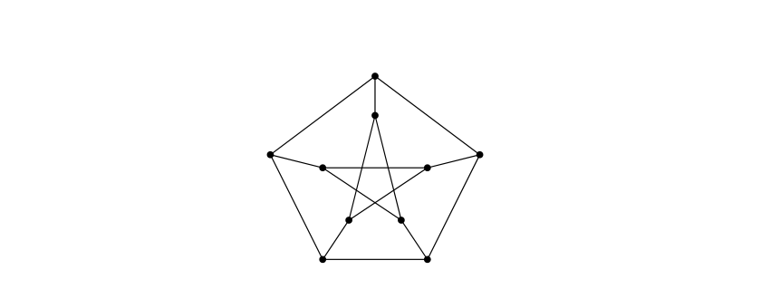
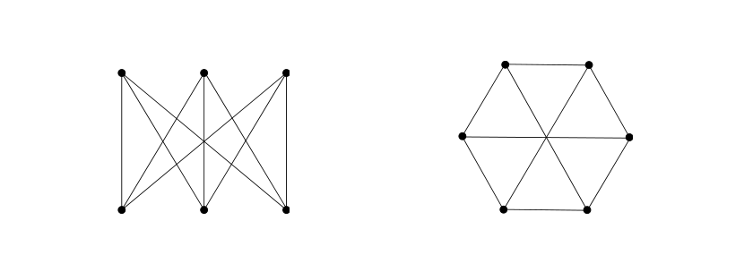
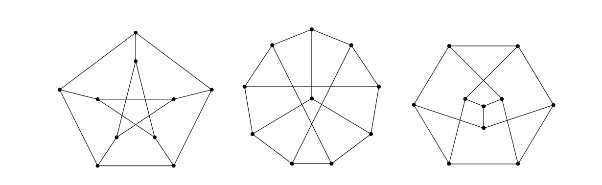
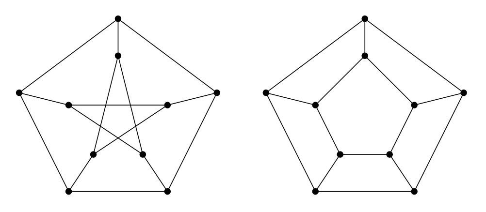
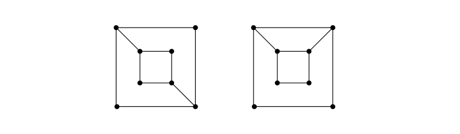
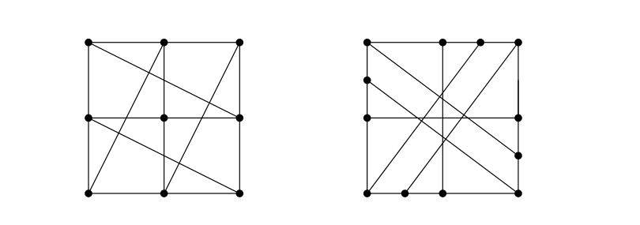
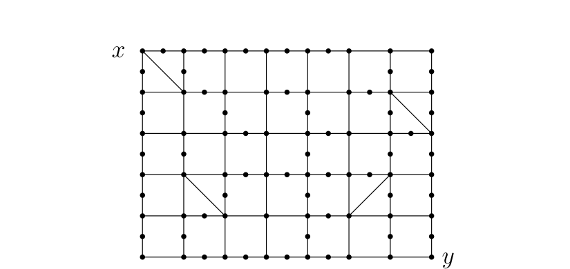
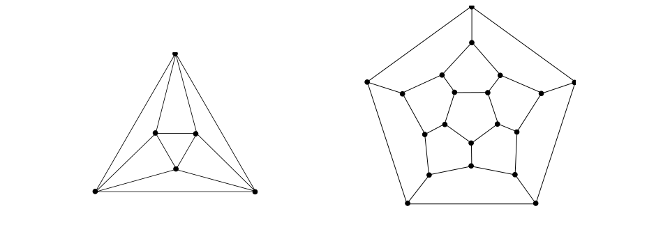

# Feofiloff 2013 - Exercícios selecionados

Exercícios extraídos de `feofiloff2013.pdf`, seguindo a seleção original deste arquivo.

## 1.4 Caminhos e circuitos

### Exercício ◦E 1.58

Seja $V$ o conjunto $\{a,b,c,d,e\}$ e $E$ o conjunto $\{de,bc,ca,be\}$. Verifique que o grafo $(V,E)$ é um caminho. Agora suponha que $F$ é o conjunto $\{bc,bd,ea,ed,ac\}$ e verifique que o grafo $(V,F)$ é um circuito.

### Exercício ◦E 1.62

Exiba as matrizes de adjacências e incidências de um caminho de comprimento 4. Exiba as matrizes de adjacências e incidências de um circuito de comprimento 5.

### Exercício ◦E 1.63

É verdade que o grafo do cavalo 3-por-3 é um circuito?

### Exercício ◦E 1.64

Verifique que a grade $1$-por-$n$ é um caminho de comprimento $n - 1$. Quais grades são circuitos?

### Exercício ◦E 1.65

Suponha que $P$ é um caminho de comprimento $n - 1$ e $O$ um circuito de comprimento $n$. Quanto valem $\delta(P)$, $\Delta(P)$, $\delta(O)$ e $\Delta(O)$?

### Exercício E 1.68

É verdade que todo grafo $2$-regular é um circuito?

### Exercício E 1.69

Seja $G$ um grafo com $n(G) \ge 3$, $\Delta(G) = 2$ e $\delta(G) = 1$. Se $G$ tem exatamente dois vértices de grau $1$, é verdade que $G$ é um caminho?

## 1.6 Grafos planares

### Exercício E 1.81

Mostre que todo $K_4$ é planar. É verdade que todo $K_5$ é planar?

### Exercício E 1.82

Mostre que todo $K_{2,3}$ é planar. É verdade que todo $K_{3,3}$ é planar?

### Exercício E 1.84

O grafo do bispo $t$-por-$t$ (veja exercício 1.10) é planar?

## 1.9 Caminhos e circuitos em grafos

### Exercício E 1.119

Encontre um circuito de comprimento mínimo no grafo de Petersen (veja exercício 1.15 ou figura 1.6). Encontre um circuito de comprimento máximo no grafo de Petersen. Encontre um caminho de comprimento máximo no grafo de Petersen.

### Exercício ◦E 1.120

Verifique que o grafo do cavalo $3$-por-$3$ contém um circuito. Encontre o circuito mais longo que puder no grafo do cavalo $4$-por-$4$.

### Exercício ⊿E 1.126

Seja $G$ um grafo tal que $\delta(G) \ge 2$. Prove que $G$ tem um circuito.

### Exercício E 1.127

Seja $G$ um grafo tal que $\delta(G) \ge 3$. Prove que $G$ tem um circuito de comprimento par.

### Exercício E 1.137

Suponha que $(v_0,\ldots,v_k)$ é um passeio fechado em um grafo $G$. É verdade que $G$ tem um circuito?

## 1.11 Componentes

### Exercício ⋆E 1.183

Seja $x$ um vértice de um grafo $G$. Seja $X$ o conjunto de todos os vértices ligados a $x$. Mostre que $G[X]$ é um componente de $G$.

### Exercício E 1.184

(ALGORITMO) Construa um algoritmo eficiente que receba um vértice $x$ de um grafo $G$ e calcule o conjunto de vértices do componente de $G$ que contém $x$.

### Exercício E 1.185

(ALGORITMO) Construa um algoritmo eficiente que calcule o número de componentes de qualquer grafo dado.

## 1.12 Pontes

### Exercício ◦E 1.194

O grafo do bispo $t$-por-$t$ tem pontes?

### Exercício E 1.200

Que aparência tem um grafo se todas as suas arestas são pontes? Que aparência tem um grafo se cada uma de suas arestas pertence a um circuito?

### Exercício E 1.201

Suponha que todos os vértices de um grafo $G$ têm grau par. Mostre que $G$ não tem pontes.

### Exercício E 1.204

(ALGORITMO) Construa um algoritmo que encontre as pontes de um grafo.

## 1.14 Articulações e grafos biconexos

### Exercício ◦E 1.212

É verdade que todo grafo sem articulações não tem pontes? É verdade que todo grafo sem pontes não tem articulações?

### Exercício ◦E 1.213

Seja $T$ uma árvore e $v$ um vértice de $T$ tal que $d(v) \ge 2$. É verdade que $v$ é uma articulação?

### Exercício E 1.214

(ALGORITMO) Construa um algoritmo que encontre todas as articulações de um grafo.

## 1.15 Florestas e árvores

### Exercício ◦E 1.222

Mostre que todo caminho é uma árvore. Mostre que toda estrela (veja a seção 1.2) é uma árvore.

### Exercício E 1.227

(ALGORITMO) Construa um algoritmo eficiente que decida se um grafo dado é uma árvore.

## Isomorfismo

### Exercício E 2.1

Um grafo $G$ tem conjunto de vértices $\{a,b,c,d\}$ e conjunto de arestas $\{ab,bc,cd,da\}$. Um grafo $H$ tem conjunto de vértices $\{a,b,c,d\}$ e conjunto de arestas $\{ab,bd,dc,ca\}$. Os grafos $G$ e $H$ são iguais?

### Exercício E 2.2

Os grafos $G$ e $H$ descritos a seguir são isomorfos?

$$
V_G = \{a,b,c,d,e,f,g\}, \quad E_G = \{ab,bc,cd,cf,fe,gf,ga,gb\}
$$

$$
V_H = \{h,i,j,k,l,m,n\}, \quad E_H = \{hk,nj,jk,lk,lm,li,ij,in\}
$$

E se trocarmos $hk$ por $hn$ em $E_H$?

### Exercício E 2.3

Os grafos da figura 2.1 são isomorfos?

### Exercício E 2.7

Os grafos da figura 2.2 são isomorfos dois a dois?

### Exercício E 2.8

Os grafos da figura 2.3 são isomorfos? Justifique.

### Exercício E 2.9

Os grafos da figura 2.4 são isomorfos? Justifique.

### Exercício E 2.17

(ALGORITMO) O seguinte algoritmo se propõe a decidir se dois grafos, $G$ e $H$, são isomorfos:

1. Examine todas as bijeções de $V_G$ em $V_H$.
2. Se alguma delas for um isomorfismo, então $G$ é isomorfo a $H$.
3. Caso contrário, $G$ e $H$ não são isomorfos.

Discuta o algoritmo.

## Grafos bicoloráveis

### Exercício E 4.11

Os grafos da figura 4.1 são bicoloráveis?

### Exercício ◦E 4.13

Suponha que um grafo $G$ tem um circuito ímpar. Mostre que $G$ não é bicolorável.

### Exercício E 4.17

(ALGORITMO) Construa um algoritmo eficiente que decida se um grafo dado é bicolorável. O algoritmo deve devolver uma bicoloração do grafo ou um circuito ímpar.

## Coloração de vértices

### Exercício E 8.1

Uma indústria precisa armazenar um conjunto de reagentes químicos. Por razões de segurança, certos pares de reagentes não devem ficar num mesmo compartimento do armazém. Quantos compartimentos o armazém deve ter no mínimo?

### Exercício ◦E 8.2

Mostre que o número cromático é invariante sob isomorfismo. Em outras palavras, se $G$ e $H$ são grafos isomorfos, então $\chi(G) = \chi(H)$.

### Exercício E 8.5

Seja $T_t$ o grafo da torre $t$-por-$t$. Encontre uma coloração mínima dos vértices de $T_t$.

### Exercício E 8.13

Encontre uma coloração mínima dos vértices do grafo de Petersen.

### Exercício E 8.29

(ALGORITMO) O seguinte algoritmo guloso (= greedy) recebe um grafo $G$ e devolve uma coloração dos vértices $X_1,\ldots,X_k$. Cada iteração começa com uma coleção $X_1,\ldots,X_k$ de conjuntos estáveis; a primeira pode começar com a coleção vazia, isto é, com $k = 0$. Cada iteração consiste no seguinte:

CASO 1: $X_1 \cup \cdots \cup X_k = V_G$.

Devolva $X_1,\ldots,X_k$ e pare.

CASO 2: $X_1 \cup \cdots \cup X_k \ne V_G$.

Escolha um vértice $v$ em $V_G \setminus (X_1 \cup \cdots \cup X_k)$.

Se $X_i \cup \{v\}$ é estável para algum $i$ entre $1$ e $k$, então comece nova iteração com $X_i \cup \{v\}$ no papel de $X_i$.

Caso contrário, faça $X_{k+1} = \{v\}$ e comece nova iteração com $k + 1$ no papel de $k$.

Este algoritmo resolve o problema da coloração de vértices?

### Exercício ◦E 8.31

É verdade que $\chi(G) \ge \Delta(G)$ para todo grafo $G$? Em outras palavras, é verdade que toda coloração dos vértices de $G$ usa pelo menos $\Delta(G)$ cores?

### Exercício !! E 8.63

(TEOREMA DAS QUATRO CORES) Mostre que todo grafo planar admite uma coloração de vértices com $4$ ou menos cores. Em outras palavras, mostre que $\chi(G) \le 4$ para todo grafo planar $G$.

## Emparelhamentos

### Exercício ◦E 9.2

Quantas arestas tem um emparelhamento máximo num grafo completo com $n$ vértices?

### Exercício ◦E 9.3

Quantas arestas tem um emparelhamento máximo em um grafo bipartido completo?

### Exercício E 9.14

É verdade que em qualquer árvore todo emparelhamento maximal é máximo?

### Exercício ⋆E 9.24

(TEOREMA DE BERGE) Prove que um emparelhamento $M$ é máximo se e somente se não existe caminho de aumento para $M$. (Segue dos exercícios 9.22 e 9.23.)

### Exercício ! E 9.25

(ALGORITMO) Seja $M$ um emparelhamento em um grafo $G$. Sejam $a$ e $b$ dois vértices não saturados por $M$. Escreva um algoritmo que encontre um caminho alternante com origem $a$ e término $b$ (ou constate que um tal caminho não existe).

## Emparelhamentos em grafos bipartidos

### Exercício E 10.11

Dê uma condição necessária e suficiente para que um grafo bipartido tenha um emparelhamento com $k$ arestas.

### Exercício ⋆E 10.16

(ALGORITMO HÚNGARO) Construa um algoritmo eficiente que receba um grafo bipartido $G$ e devolva um emparelhamento $M$ e uma cobertura $K$ de mesmo tamanho. (Veja o exercício 10.15.) (Esta é a versão algorítmica do exercício 10.6.)

## Caminhos e circuitos mínimos

### Exercício E 14.1

No grafo da figura 14.1, calcule a distância entre o vértice $x$ e cada um dos outros vértices. Em seguida, exiba um caminho mínimo entre $x$ e $y$.

### Exercício E 14.6

(ALGORITMO DE BUSCA EM LARGURA) Construa um algoritmo eficiente que receba dois vértices $v$ e $w$ de um grafo e calcule a distância entre $v$ e $w$. Construa um algoritmo eficiente que encontre um caminho mínimo entre dois vértices dados.

### Exercício E 14.9

A excentricidade (= eccentricity) de um vértice $v$ num grafo é o número $\operatorname{exc}(v) := \max_{w \in V} \operatorname{dist}(v,w)$. Um centro é um vértice de excentricidade mínima. O raio (= radius) do grafo é a excentricidade de um centro. Mostre que toda árvore tem no máximo dois centros e, se tiver dois, então eles são adjacentes.

### Exercício E 14.10

O grafo de Heawood tem conjunto de vértices $\{0,1,2,\ldots,13\}$. Cada vértice $i$ é vizinho de $(i + 1) \bmod 14$ e de $(i + 13) \bmod 14$. Além disso, cada $i$ é vizinho de um terceiro vértice, que depende da paridade de $i$: se $i$ é par, então ele é vizinho de $(i + 5) \bmod 14$; se $i$ é ímpar, então ele é vizinho de $(i + 9) \bmod 14$. Faça uma figura do grafo de Heawood. Encontre um circuito de comprimento mínimo no grafo.

## Circuitos e caminhos hamiltonianos

### Exercício ◦E 17.1

É verdade que todo grafo completo tem um circuito hamiltoniano?

### Exercício ◦E 17.2

Dê condições necessárias e suficientes para que um grafo bipartido completo tenha um circuito hamiltoniano.

### Exercício E 17.3

Encontre um circuito máximo em cada um dos grafos da figura 17.1.

### Exercício E 17.4

Encontre um circuito máximo no grafo de Petersen. Encontre um caminho máximo no grafo de Petersen.

### Exercício E 17.6

Dê uma condição necessária e suficiente para que uma grade tenha um circuito hamiltoniano.

### Exercício ◦E 17.14

Seja $G$ um grafo dotado de circuito hamiltoniano. Mostre que $G$ não tem pontes. Mostre que $G$ não tem articulações.

### Exercício ⋆E 17.26

(CONDIÇÃO SUFICIENTE: TEOREMA DE DIRAC) Seja $G$ um grafo com $3$ ou mais vértices que satisfaz a condição $\delta(G) \ge n(G)/2$. Mostre que $G$ tem um circuito hamiltoniano. (Sugestão: Use o exercício 1.129.)

### Exercício D 17.30

(CONDIÇÃO NECESSÁRIA E SUFICIENTE?) Descubra uma condição necessária e suficiente para que um grafo tenha um circuito hamiltoniano. Descubra uma condição necessária e suficiente para que um grafo tenha um caminho hamiltoniano.

### Exercício D 17.31

(ALGORITMO) Invente um algoritmo rápido que receba um grafo e devolva um circuito hamiltoniano no grafo (ou constate que o grafo não tem um tal circuito).

### Exercício D 17.34

(PROBLEMA DO CAIXEIRO VIAJANTE) Seja $K$ um grafo completo e $\phi$ uma função de $E_K$ em $\{0,1,2,3,\ldots\}$. Para cada aresta $e$ do grafo, diremos que $\phi(e)$ é o custo de $e$. O custo de um subgrafo $H$ de $K$ é $\sum_{e \in E_H} \phi(e)$. Invente um algoritmo para encontrar um circuito hamiltoniano de custo mínimo em $K$.
