# Nicoletti - Exercícios Selecionados

Fonte: Nicoletti, *Fundamentos da Teoria dos Grafos*.

## 3ª Lista de Exercícios

### Exercício 1
Para cada um dos grafos a seguir, dê três exemplos de passeios, trilhas e caminhos.

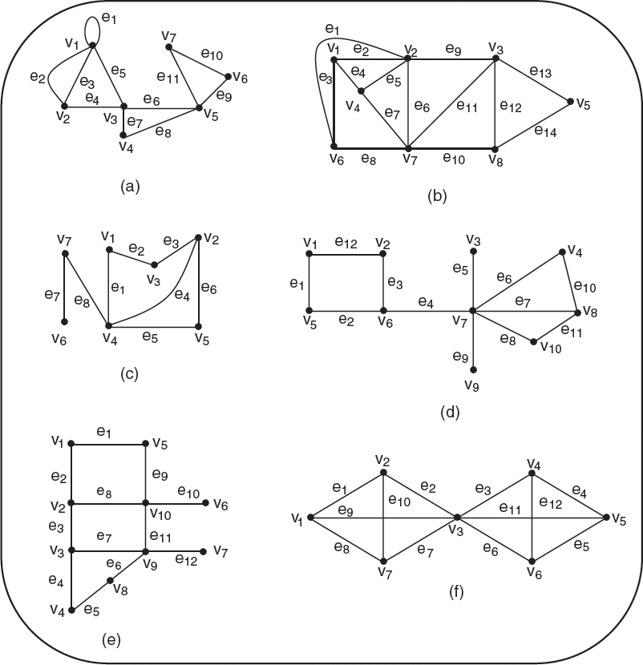

### Exercício 2
Encontre, para o grafo a seguir:

(a) quatro caminhos diferentes de `v1` a `v4`.

(b) quatro diferentes trilhas de `v1` a `v4`, que não sejam caminhos.

(c) quatro diferentes passeios de `v1` a `v4`, que não sejam trilhas.

### Exercício 3
Para o grafo:

(a) quantos caminhos diferentes, de `v1` a `v5`, existem?

(b) quantas trilhas diferentes, de `v1` a `v5`, existem?

### Exercício 4
Considere o grafo a seguir:

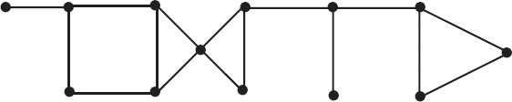

(a) encontre um passeio fechado de comprimento 6. Seu passeio é uma trilha?

(b) encontre um passeio aberto de comprimento 12. Seu passeio é um caminho?

(c) encontre uma trilha fechada de comprimento 6. Sua trilha é um ciclo?

(d) qual o comprimento do mais longo ciclo em `G`?

(e) qual o comprimento do caminho mais longo em `G`? Quantos caminhos em `G` têm esse comprimento?

### Exercício 5
Seja `G` um grafo com 15 vértices e 4 componentes conexos. Prove que `G` tem pelo menos um componente com pelo menos 4 vértices. Qual é o maior número de vértices que um componente de `G` pode ter?

### Exercício 6
Dê um exemplo de um grafo no qual o comprimento do ciclo mais longo é 9 e o comprimento do ciclo mais curto é 4.

### Exercício 7
No grafo de Petersen a seguir:

(a) Encontre uma trilha de comprimento 5.

(b) Encontre um caminho de comprimento 9.

(c) Encontre ciclos de comprimentos 5, 6, 8 e 9.

### Exercício 8
Para quaisquer dois vértices `u` e `v` conectados por um caminho em um grafo `G`, a distância entre `u` e `v`, denotada por `d(u,v)`, é definida como o comprimento do caminho mais curto entre `u` e `v`. Se não existir caminho conectando `u` e `v`, a distância `d(u,v)` é definida como infinito.

(a) prove que, para quaisquer vértices `u`, `v` e `w` em `G`, tem-se: `d(u,w) <= d(u,v) + d(v,w)`.

(b) prove que, se `d(u,v) >= 2`, então existe um vértice `z` em `G`, tal que `d(u,v) = d(u,z) + d(z,v)`.

### Exercício 9
Seja `G` um grafo conectado com o conjunto de vértices `V`.

(a) encontre o raio e o diâmetro dos grafos dos exercícios 1, 4 e 7.

(b) prove que para qualquer grafo conectado `G`, `raio(G) <= diâmetro(G) <= 2 raio(G)`.

(c) quais grafos simples têm diâmetro 1?

### Exercício 10
Mostre que não existe um grafo simples com 12 vértices e 28 arestas no qual:

(a) o grau de cada vértice seja 3 ou 4.

(b) o grau de cada vértice seja 3 ou 6.

### Exercício 11
Mostre que não é possível ter um grupo de sete pessoas tal que cada pessoa no grupo conhece exatamente três outras pessoas no grupo.

### Exercício 12
Seja `G` um grafo simples conectado. O quadrado de `G`, notado por `G²`, é definido como o grafo com o mesmo conjunto de vértices que `G` e no qual dois vértices `u` e `v` são unidos por uma aresta se e somente se em `G` a seguinte desigualdade `1 <= d(u,v) <= 2` é verificada. A figura a seguir mostra `G` e `G²`.

Mostre que o quadrado de `K_{1,3}` é `K_4`. Você consegue encontrar mais dois grafos cujo quadrado seja `K_4`?

### Exercício 13
Quais dos grafos a seguir são bipartidos? Justifique a sua resposta. Redesenhe os grafos que forem bipartidos de maneira a evidenciar esse fato.

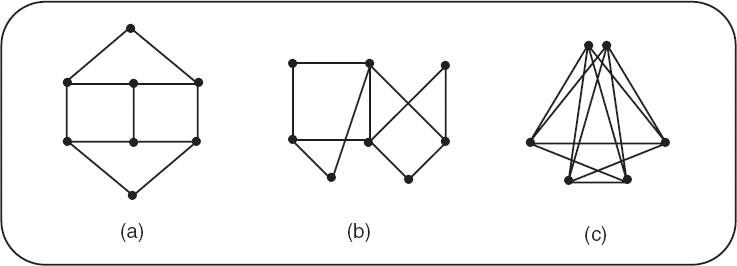

### Exercício 14
Dê um exemplo de um grafo conectado, tal que a remoção de qualquer aresta resulta em um grafo que não é conectado (assuma que a remoção de uma aresta não implica a remoção de qualquer vértice).

### Exercício 15
Seja `G` um grafo conectado. Suponha que uma aresta `e` faça parte de um ciclo. Mostre que `G` com `e` removida é ainda conectado.

### Exercício 16
Encontre o diâmetro do grafo a seguir.

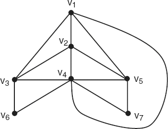

### Exercício 17
Encontre o diâmetro de `K_n`.

### Exercício 18
Seja `G` um grafo. Defina a relação `R` no conjunto de vértices `V` de `G` como: `vRw` se existe um caminho do vértice `v` para o `w`. Prove que `R` é uma relação de equivalência em `V`.

### Exercício 19
Desenhe o grafo bipartido `K_{3,3}` de três maneiras diferentes.

### Exercício 20
Prove o teorema: “Qualquer grafo conectado com `n` vértices deve ter pelo menos `n - 1` arestas.”

## 4ª Lista de Exercícios

### Exercício 2
Prove que qualquer árvore com pelo menos dois vértices é um grafo bipartido.

### Exercício 3
Grafos bipartidos completos `K_{1,n}`, conhecidos como grafos estrelas, são árvores. Prove que grafos estrelas são os únicos grafos bipartidos completos que são árvores.

### Exercício 4
Encontre todas as pontes no grafo a seguir.

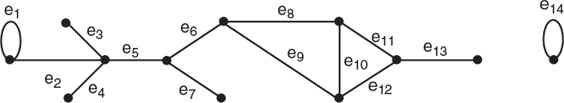

### Exercício 16
Execute os algoritmos de busca em largura em cada um dos três grafos a seguir, de maneira a encontrar o comprimento do caminho mais curto do vértice `a` ao vértice `z`, um de tais caminhos mais curtos e o número desses caminhos mais curtos.

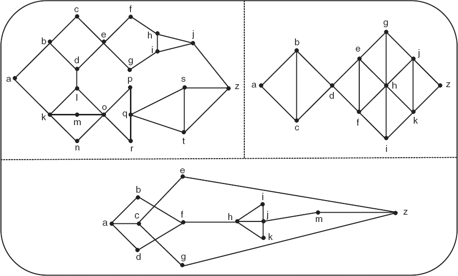

## 5ª Lista de Exercícios

### Exercício 1
Encontre um ciclo hamiltoniano nos grafos (a) e (b) a seguir.

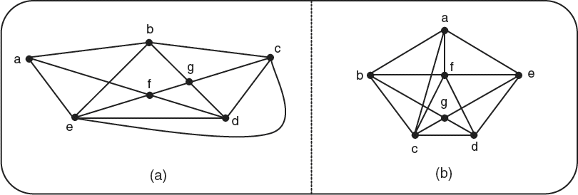

### Exercício 2
Determine se os seguintes grafos são hamiltonianos ou não. Quando forem, encontre um ciclo hamiltoniano no grafo.

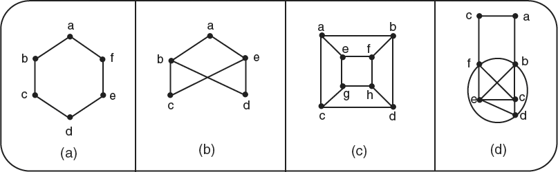

### Exercício 3
O grafo completo `K_n` é hamiltoniano? Explique.

### Exercício 4
O grafo completo bipartido `K_{m,n}` é hamiltoniano? Explique.

### Exercício 5
Desenhe um grafo que seja de Euler, mas não hamiltoniano. Explique.

### Exercício 6
Desenhe um grafo que seja hamiltoniano, mas não de Euler. Explique.

### Exercício 7
Mostre que o ciclo `ebacde` é uma solução para o problema do caixeiro-viajante, para o grafo mostrado a seguir.

### Exercício 8
Resolva o problema do caixeiro-viajante para o grafo a seguir:

### Exercício 9
Resolva o problema do carteiro chinês para cada um os dois grafos a seguir:

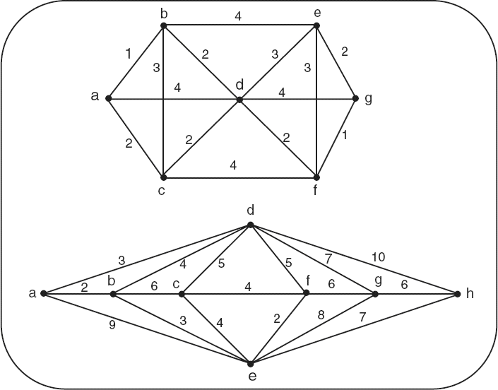

### Exercício 16
Mostre que os grafos em (a) e (b) são isomorfos.

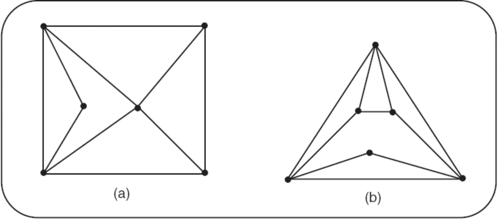

### Exercício 23
Uma firma deseja armazenar sete produtos químicos diferentes, `Q1`, `Q2`, `Q3`, `Q4`, `Q5`, `Q6` e `Q7`. Uma vez que alguns desses produtos não podem ser armazenados juntos, por problema de segurança, são necessários diferentes locais de armazenamento. A tabela a seguir mostra (com um asterisco) quais pares de produtos químicos não podem ser armazenados em um mesmo local. Use coloração de grafo para encontrar o número mínimo de locais necessários e identifique os produtos que podem ser alocados a esses locais, respectivamente.

|   | C1 | C2 | C3 | C4 | C5 | C6 | C7 |
|---|---|---|---|---|---|---|---|
| C1 |   | * |   |   |   | * | * |
| C2 | * |   | * | * |   |   |   |
| C3 |   | * |   | * | * |   |   |
| C4 |   | * | * |   | * | * |   |
| C5 |   |   | * | * |   | * | * |
| C6 | * |   |   | * | * |   | * |
| C7 | * |   |   |   | * | * |   |

### Exercício 24
Determine a coloração de cada um dos três grafos (a), (b) e (c) a seguir, usando o algortimo de coloração sequencial simples.

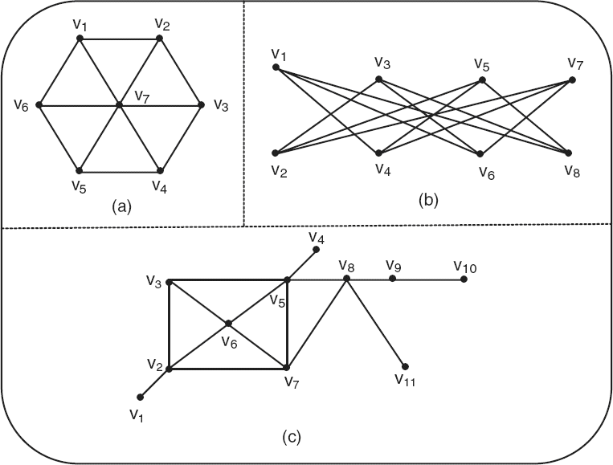
