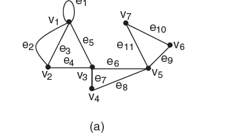
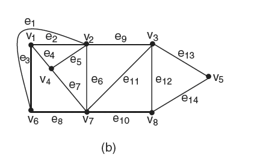
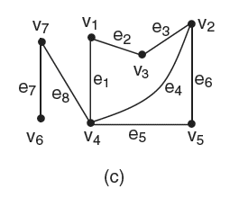
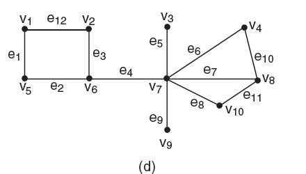
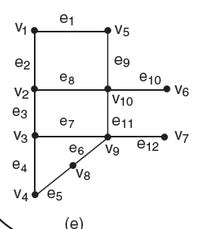
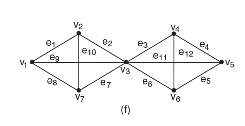

# 3ª Lista - Exercício 1

## 1. Leitura do grafo

O exercício apresenta seis grafos, identificados na figura como (a), (b), (c), (d), (e) e (f). Como a questão pede exemplos de passeios, trilhas e caminhos, a leitura do grafo precisa preservar laços, arestas paralelas e rótulos de arestas quando eles aparecem.

### Grafo (a)



Vértices:
$V = \{v_1, v_2, v_3, v_4, v_5, v_6, v_7\}$

Lista de adjacência proposta:

```text
v1: v1(e1) v2(e2) v2(e3) v3(e5)
v2: v1(e2) v1(e3) v3(e4)
v3: v1(e5) v2(e4) v4(e7) v5(e6)
v4: v3(e7) v5(e8)
v5: v3(e6) v4(e8) v6(e9) v7(e11)
v6: v5(e9) v7(e10)
v7: v5(e11) v6(e10)
```

### Grafo (b)



Vértices:
$V = \{v_1, v_2, v_3, v_4, v_5, v_6, v_7, v_8\}$

Lista de adjacência proposta:

```text
v1: v2(e2) v4(e4) v6(e3)
v2: v1(e2) v3(e9) v4(e5) v6(e1) v7(e6)
v3: v2(e9) v5(e13) v7(e11) v8(e12)
v4: v1(e4) v2(e5) v7(e7)
v5: v3(e13) v8(e14)
v6: v1(e3) v2(e1) v7(e8)
v7: v2(e6) v3(e11) v4(e7) v6(e8) v8(e10)
v8: v3(e12) v5(e14) v7(e10)
```

### Grafo (c)



Vértices:
$V = \{v_1, v_2, v_3, v_4, v_5, v_6, v_7\}$

Lista de adjacência proposta:

```text
v1: v3(e2) v4(e1)
v2: v3(e3) v4(e4) v5(e6)
v3: v1(e2) v2(e3)
v4: v1(e1) v2(e4) v5(e5) v7(e8)
v5: v2(e6) v4(e5)
v6: v7(e7)
v7: v4(e8) v6(e7)
```

### Grafo (d)



Vértices:
$V = \{v_1, v_2, v_3, v_4, v_5, v_6, v_7, v_8, v_9, v_{10}\}$

Lista de adjacência proposta:

```text
v1: v2(e12) v5(e1)
v2: v1(e12) v6(e3)
v3: v7(e5)
v4: v7(e6) v8(e10)
v5: v1(e1) v6(e2)
v6: v2(e3) v5(e2) v7(e4)
v7: v3(e5) v4(e6) v6(e4) v8(e7) v9(e9) v10(e8)
v8: v4(e10) v7(e7) v10(e11)
v9: v7(e9)
v10: v7(e8) v8(e11)
```

### Grafo (e)



Vértices:
$V = \{v_1, v_2, v_3, v_4, v_5, v_6, v_7, v_8, v_9, v_{10}\}$

Lista de adjacência proposta:

```text
v1: v2(e2) v5(e1)
v2: v1(e2) v3(e3) v10(e8)
v3: v2(e3) v4(e4) v9(e7)
v4: v3(e4) v8(e5)
v5: v1(e1) v10(e9)
v6: v10(e10)
v7: v9(e12)
v8: v4(e5) v9(e6)
v9: v3(e7) v7(e12) v8(e6) v10(e11)
v10: v2(e8) v5(e9) v6(e10) v9(e11)
```

### Grafo (f)



Vértices:
$V = \{v_1, v_2, v_3, v_4, v_5, v_6, v_7\}$

Lista de adjacência proposta:

```text
v1: v2(e1) v3(e9) v7(e8)
v2: v1(e1) v3(e2) v7(e10)
v3: v1(e9) v2(e2) v4(e3) v5(e11) v6(e6) v7(e7)
v4: v3(e3) v5(e4) v6(e12)
v5: v3(e11) v4(e4) v6(e5)
v6: v3(e6) v4(e12) v5(e5)
v7: v1(e8) v2(e10) v3(e7)
```

## 2. Estratégia de resolução

Para cada grafo, damos exemplos de acordo com as definições de Nicoletti:

- **passeio**: sequência finita que alterna vértices e arestas; na prática, será indicada pela sequência de vértices quando as adjacências estiverem claras;
- **trilha**: passeio no qual nenhuma aresta aparece mais de uma vez;
- **caminho**: trilha na qual nenhum vértice aparece mais de uma vez, exceto no caso fechado, quando o primeiro e o último vértices podem coincidir.

Como todo caminho é uma trilha e toda trilha é um passeio, escolhemos exemplos que evidenciam as diferenças entre os conceitos. Nos grafos com arestas rotuladas, as arestas entre parênteses indicam qual aresta é usada quando há risco de ambiguidade.

## 3. Resolução detalhada

### Grafo (a)

| Tipo | Três exemplos |
|---|---|
| Passeios | $v_1,v_2,v_1,v_1$; $v_3,v_1,v_2,v_3,v_5,v_3$; $v_5,v_6,v_7,v_5,v_4,v_3,v_1$ |
| Trilhas | $v_1,v_2,v_3,v_5,v_7,v_6$; $v_4,v_3,v_1,v_2,v_3,v_5$; $v_2,v_1,v_1,v_3,v_4,v_5,v_6,v_7$ |
| Caminhos | $v_1,v_2,v_3,v_4$; $v_7,v_6,v_5,v_4,v_3,v_1$; $v_2,v_1,v_3,v_5,v_7$ |

No primeiro passeio, por exemplo, a sequência usa as arestas paralelas entre $v_1$ e $v_2$ e o laço em $v_1$. Esse tipo de exemplo ajuda a visualizar por que o grafo (a) deve ser tratado como multigrafo.

### Grafo (b)

| Tipo | Três exemplos |
|---|---|
| Passeios | $v_1,v_2,v_1,v_6,v_7,v_2$; $v_6,v_1,v_2,v_4,v_1,v_6$; $v_3,v_8,v_5,v_3,v_2,v_3$ |
| Trilhas | $v_1,v_6,v_2,v_7,v_8,v_5,v_3$; $v_6,v_1,v_4,v_2,v_3,v_7,v_4$; $v_5,v_8,v_3,v_2,v_1,v_4,v_7,v_6$ |
| Caminhos | $v_1,v_2,v_3,v_5$; $v_6,v_2,v_7,v_8,v_5$; $v_4,v_1,v_6,v_7,v_3$ |

As trilhas listadas não repetem arestas, embora algumas possam passar por regiões já próximas no desenho. A verificação deve ser feita pelas arestas percorridas, não apenas pela aparência da figura.

### Grafo (c)

| Tipo | Três exemplos |
|---|---|
| Passeios | $v_1,v_4,v_5,v_4,v_2$; $v_7,v_4,v_1,v_4,v_5$; $v_6,v_7,v_6,v_7$ |
| Trilhas | $v_1,v_3,v_2,v_5,v_4,v_7,v_6$; $v_7,v_4,v_2,v_3,v_1$; $v_6,v_7,v_4,v_1,v_3,v_2,v_5$ |
| Caminhos | $v_1,v_3,v_2,v_5$; $v_6,v_7,v_4,v_5,v_2$; $v_7,v_4,v_1,v_3,v_2$ |

O componente formado por $v_6$ e $v_7$ está ligado ao restante do grafo por $v_7v_4$. Isso permite construir caminhos que saem de $v_6$ e entram no bloco principal sem repetir vértices.

### Grafo (d)

| Tipo | Três exemplos |
|---|---|
| Passeios | $v_1,v_2,v_1,v_5,v_6,v_2$; $v_3,v_7,v_3,v_7,v_8$; $v_{10},v_7,v_8,v_{10},v_7$ |
| Trilhas | $v_1,v_2,v_6,v_7,v_8,v_{10}$; $v_3,v_7,v_4,v_8,v_{10},v_7,v_9$; $v_5,v_1,v_2,v_6,v_7,v_{10},v_8,v_4$ |
| Caminhos | $v_1,v_5,v_6,v_7,v_8,v_4$; $v_3,v_7,v_{10},v_8,v_4$; $v_9,v_7,v_6,v_2,v_1,v_5$ |

Os vértices $v_3$ e $v_9$ são pendentes. Eles podem aparecer no início ou no fim de um caminho, mas não no meio de um caminho que continue para outro vértice, pois isso obrigaria retornar pela mesma aresta.

### Grafo (e)

| Tipo | Três exemplos |
|---|---|
| Passeios | $v_1,v_2,v_1,v_5,v_{10},v_2$; $v_6,v_{10},v_9,v_7,v_9$; $v_4,v_8,v_9,v_8$ |
| Trilhas | $v_4,v_3,v_2,v_{10},v_9,v_7$; $v_6,v_{10},v_5,v_1,v_2,v_3,v_9,v_8,v_4$; $v_7,v_9,v_{10},v_2,v_1,v_5$ |
| Caminhos | $v_6,v_{10},v_9,v_3,v_4,v_8$; $v_1,v_5,v_{10},v_9,v_7$; $v_4,v_3,v_2,v_{10},v_6$ |

Neste grafo, $v_6$ e $v_7$ são vértices pendentes. Isso é útil para criar caminhos simples, mas limita a possibilidade de passar por eles e continuar sem repetir arestas.

### Grafo (f)

| Tipo | Três exemplos |
|---|---|
| Passeios | $v_1,v_2,v_1,v_3$; $v_4,v_5,v_3,v_4,v_5$; $v_7,v_3,v_2,v_7,v_3$ |
| Trilhas | $v_1,v_2,v_7,v_3,v_4,v_5,v_6,v_3,v_1$; $v_2,v_3,v_5,v_4,v_6,v_3,v_1,v_7$; $v_7,v_2,v_3,v_6,v_5,v_4,v_3,v_1$ |
| Caminhos | $v_1,v_2,v_3,v_4,v_5$; $v_7,v_2,v_1,v_3,v_6,v_4$; $v_5,v_4,v_3,v_7,v_1$ |

O grafo (f) é bastante rico em ciclos. Por isso, é fácil construir passeios e trilhas longas, mas para garantir que uma sequência seja caminho é preciso verificar que nenhum vértice aparece duas vezes.

## 4. Resposta final

As tabelas acima dão três exemplos de passeios, três exemplos de trilhas e três exemplos de caminhos para cada um dos seis grafos da figura.

## 5. Comentários didáticos

Uma boa forma de verificar cada exemplo é percorrer a sequência em duas passagens:

1. Primeiro, verificar se cada par consecutivo de vértices é adjacente. Se sim, a sequência é pelo menos um passeio.
2. Depois, verificar se alguma aresta foi repetida. Se nenhuma aresta foi repetida, é uma trilha.
3. Por fim, verificar se algum vértice foi repetido. Se nenhum vértice foi repetido, é um caminho. No caso de caminho fechado, admite-se a coincidência entre o primeiro e o último vértices.

No grafo (a), o laço $e_1$ e as arestas paralelas $e_2$ e $e_3$ são o principal ponto de atenção. Em multigrafos, duas passagens entre os mesmos vértices podem usar arestas diferentes. Portanto, a sequência de vértices sozinha nem sempre basta para decidir se houve repetição de aresta; é preciso considerar o rótulo da aresta quando houver paralelismo.
