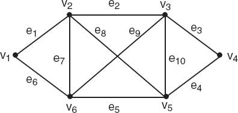

# 3ª Lista - Exercício 2

## 1. Leitura do grafo



Vértices:
$V = \{v_1, v_2, v_3, v_4, v_5, v_6\}$

Lista de adjacência proposta:

```text
v1: v2(e1) v6(e6)
v2: v1(e1) v3(e2) v5(e8) v6(e7)
v3: v2(e2) v4(e3) v5(e10) v6(e9)
v4: v3(e3) v5(e4)
v5: v2(e8) v3(e10) v4(e4) v6(e5)
v6: v1(e6) v2(e7) v3(e9) v5(e5)
```

## 2. Estratégia de resolução

Precisamos listar sequências que começam em $v_1$ e terminam em $v_4$, usando as definições de Nicoletti.

- Um **passeio** é uma sequência finita que alterna vértices e arestas; quando a adjacência é clara, podemos indicar apenas a sequência de vértices.
- Uma **trilha** é um passeio no qual nenhuma aresta aparece mais de uma vez.
- Um **caminho** é uma trilha na qual nenhum vértice aparece mais de uma vez, exceto no caso fechado, quando o primeiro e o último vértices podem coincidir.

Assim, a solução deve separar cuidadosamente três níveis de restrição: primeiro os caminhos, depois trilhas que deixam de ser caminhos por repetirem algum vértice, e por fim passeios que deixam de ser trilhas por repetirem alguma aresta.

## 3. Resolução detalhada

### (a) Quatro caminhos diferentes de $v_1$ a $v_4$

Uma solução possível é:

1. $v_1, v_2, v_3, v_4$.
2. $v_1, v_2, v_5, v_4$.
3. $v_1, v_6, v_5, v_4$.
4. $v_1, v_6, v_3, v_4$.

Em todos eles, nenhum vértice aparece mais de uma vez. Portanto, todos são caminhos.

### (b) Quatro trilhas de $v_1$ a $v_4$ que não são caminhos

Uma solução possível é:

1. $v_1, v_2, v_3, v_5, v_6, v_2, v_5, v_4$.
2. $v_1, v_6, v_2, v_3, v_5, v_6, v_3, v_4$.
3. $v_1, v_2, v_5, v_3, v_6, v_2, v_3, v_4$.
4. $v_1, v_6, v_5, v_3, v_2, v_6, v_3, v_4$.

Essas sequências são trilhas porque nenhuma aresta é repetida em cada sequência. Elas não são caminhos porque repetem pelo menos um vértice.

### (c) Quatro passeios de $v_1$ a $v_4$ que não são trilhas

Uma solução possível é:

1. $v_1, v_2, v_1, v_2, v_3, v_4$.
2. $v_1, v_6, v_1, v_6, v_5, v_4$.
3. $v_1, v_2, v_5, v_2, v_3, v_4$.
4. $v_1, v_6, v_3, v_6, v_5, v_4$.

Todas são passeios válidos, pois cada par consecutivo de vértices é adjacente. Elas não são trilhas porque repetem pelo menos uma aresta.

## 4. Resposta final

As respostas acima fornecem:

- quatro caminhos de $v_1$ a $v_4$;
- quatro trilhas de $v_1$ a $v_4$ que não são caminhos;
- quatro passeios de $v_1$ a $v_4$ que não são trilhas.

## 5. Comentários didáticos

O erro mais comum neste exercício é confundir repetição de vértice com repetição de aresta. Uma trilha pode repetir vértices; o que ela não pode repetir são arestas. Já um caminho é mais restritivo: em caminhos abertos, não há repetição de vértices; em caminhos fechados, o primeiro e o último vértices podem coincidir.

Outro ponto importante é que todo caminho é também uma trilha e todo trilha é também um passeio. Por isso, nos itens (b) e (c), o enunciado acrescenta restrições negativas: no item (b), quer trilhas que **não** sejam caminhos; no item (c), quer passeios que **não** sejam trilhas.
