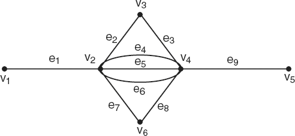

# 3ª Lista - Exercício 3

## 1. Leitura do grafo



Vértices:
$V = \{v_1, v_2, v_3, v_4, v_5, v_6\}$

Lista de adjacência proposta:

```text
v1: v2(e1)
v2: v1(e1) v3(e2) v4(e4) v4(e5) v4(e6) v6(e7)
v3: v2(e2) v4(e3)
v4: v2(e4) v2(e5) v2(e6) v3(e3) v5(e9) v6(e8)
v5: v4(e9)
v6: v2(e7) v4(e8)
```

## 2. Estratégia de resolução

Todo caminho ou trilha de $v_1$ a $v_5$ precisa começar pela aresta $e_1$, pois $v_1$ só é adjacente a $v_2$. Também precisa terminar pela aresta $e_9$, pois $v_5$ só é adjacente a $v_4$.

Portanto, o problema se reduz a contar as formas de ir de $v_2$ a $v_4$ no subgrafo central.

Como há três arestas paralelas entre $v_2$ e $v_4$, consideramos diferentes as soluções que usam arestas paralelas distintas. Essa é a convenção adequada aqui, pois o enunciado mostra explicitamente as arestas $e_4$, $e_5$ e $e_6$.

## 3. Resolução detalhada

### (a) Caminhos diferentes de $v_1$ a $v_5$

Os caminhos possíveis são:

1. $v_1, v_2, v_3, v_4, v_5$, usando $e_1,e_2,e_3,e_9$.
2. $v_1, v_2, v_4, v_5$, usando $e_1,e_4,e_9$.
3. $v_1, v_2, v_4, v_5$, usando $e_1,e_5,e_9$.
4. $v_1, v_2, v_4, v_5$, usando $e_1,e_6,e_9$.
5. $v_1, v_2, v_6, v_4, v_5$, usando $e_1,e_7,e_8,e_9$.

Logo, existem $5$ caminhos diferentes, contando separadamente as três arestas paralelas entre $v_2$ e $v_4$.

### (b) Trilhas diferentes de $v_1$ a $v_5$

Toda trilha de $v_1$ a $v_5$ tem a forma:

$$
v_1 \xrightarrow{e_1} v_2
\quad \text{seguida de uma trilha de } v_2 \text{ a } v_4
\quad \xrightarrow{e_9} v_5.
$$

Assim, basta contar as trilhas de $v_2$ a $v_4$ usando as arestas internas
$e_2,e_3,e_4,e_5,e_6,e_7,e_8$.

A contagem por comprimento da parte interna é:

| Comprimento da trilha interna $v_2$-$v_4$ | Quantidade |
|---:|---:|
| $1$ | $3$ |
| $2$ | $2$ |
| $3$ | $6$ |
| $4$ | $36$ |
| $5$ | $18$ |
| $7$ | $120$ |

Somando:

$$
3+2+6+36+18+120 = 185.
$$

Portanto, existem $185$ trilhas diferentes de $v_1$ a $v_5$.

## 4. Resposta final

- Existem $5$ caminhos diferentes de $v_1$ a $v_5$.
- Existem $185$ trilhas diferentes de $v_1$ a $v_5$.

## 5. Comentários didáticos

Este exercício é um bom exemplo de por que multigrafos exigem cuidado. A sequência de vértices

$$
v_1, v_2, v_4, v_5
$$

representa três caminhos diferentes, pois a passagem de $v_2$ para $v_4$ pode usar $e_4$, $e_5$ ou $e_6$.

Para caminhos abertos, a restrição é não repetir vértices. Para trilhas, a restrição é não repetir arestas. Por isso, a quantidade de trilhas é muito maior: uma trilha pode passar por $v_2$ ou $v_4$ mais de uma vez, desde que use arestas diferentes em cada passagem.
