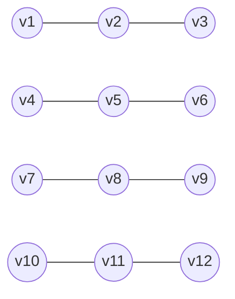
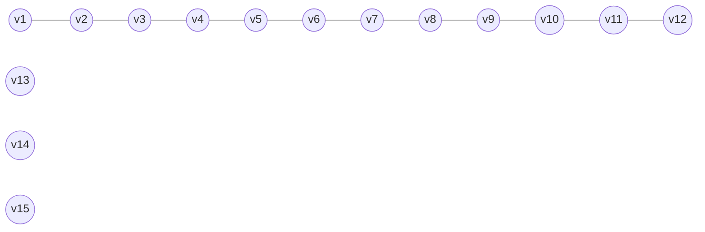

# 3ª Lista - Exercício 5

## 1. Tipo de questão

Questão teórica de prova sobre componentes conexos e distribuição de vértices.

## 2. Estratégia de resolução

Para a primeira pergunta, basta usar a teoria de componentes conexos e uma contagem direta.

Os componentes conexos particionam o conjunto de vértices: cada vértice pertence a exatamente um componente. Portanto, se $G$ tem $15$ vértices e $4$ componentes conexos, os tamanhos desses $4$ componentes devem somar $15$.

Se todos os componentes tivessem no máximo $3$ vértices, o grafo teria no máximo $4\cdot 3=12$ vértices, o que contradiz o enunciado.

Para a segunda pergunta, queremos maximizar o tamanho de um componente. Como existem $4$ componentes conexos, os outros $3$ componentes precisam existir e, portanto, precisam ter pelo menos $1$ vértice cada.

De forma geral, se um grafo com $n$ vértices tem $k$ componentes conexos, então o maior número de vértices que um componente pode ter é $n-k+1$.

## 3. Resolução detalhada

Sejam $C_1,C_2,C_3,C_4$ os quatro componentes conexos de $G$.

Denote por $|C_i|$ o número de vértices do componente $C_i$. Como os componentes particionam o conjunto de vértices de $G$, temos:

$$
|C_1|+|C_2|+|C_3|+|C_4| = 15.
$$

### Prova de que algum componente tem pelo menos $4$ vértices

Suponha, por contradição, que nenhum componente tenha pelo menos $4$ vértices. Então todos os componentes teriam no máximo $3$ vértices:

O desenho acima mostra a maior quantidade de vértices possível se houvesse $4$ componentes e cada um tivesse no máximo $3$ vértices: apenas $12$ vértices.

$$
|C_1| \leq 3,\quad |C_2| \leq 3,\quad |C_3| \leq 3,\quad |C_4| \leq 3.
$$

Somando essas quatro desigualdades:

$$
|C_1|+|C_2|+|C_3|+|C_4| \leq 3+3+3+3 = 12.
$$

Mas o grafo tem $15$ vértices, então a soma dos tamanhos dos componentes deve ser $15$, não no máximo $12$. Isso é uma contradição.

Logo, pelo menos um componente de $G$ tem pelo menos $4$ vértices.

### Maior número possível de vértices em um componente

Como $G$ tem $4$ componentes conexos, além do maior componente precisam existir outros $3$ componentes. Cada componente tem pelo menos $1$ vértice.

Assim, para tornar um componente o maior possível, colocamos apenas $1$ vértice em cada um dos outros três componentes:

$$
1+1+1 = 3.
$$

Sobram:

$$
15-3 = 12
$$

vértices para o maior componente.

Portanto, o maior número possível de vértices em um componente de $G$ é $12$.

Um exemplo que atinge esse limite é um grafo com um componente em forma de caminho com $12$ vértices e três componentes isolados:

Esse grafo tem $4$ componentes conexos: um com $12$ vértices e três componentes isolados com $1$ vértice cada.

## 4. Resposta final

O grafo $G$ tem pelo menos um componente com pelo menos $4$ vértices.

O maior número de vértices que um componente de $G$ pode ter é $12$.

## 5. Comentários didáticos

A teoria subjacente é a decomposição de um grafo em componentes conexos.

Os componentes conexos são partes maximais do grafo nas quais qualquer par de vértices está ligado por algum caminho. Eles formam uma partição de $V(G)$: cada vértice pertence a exatamente um componente.

Nicoletti denota por $\omega(G)$ o número de componentes conexos de $G$. No exercício, temos:

$$
|V(G)|=15
\quad \text{e} \quad
\omega(G)=4.
$$

Como os componentes conexos particionam $V(G)$, a soma dos tamanhos dos componentes deve ser $15$.

Além disso, a observação geral usada na segunda parte é:

$$
\text{maior tamanho possível de um componente} = n-k+1.
$$

Aqui:

$$
n-k+1 = 15-4+1 = 12.
$$

O argumento da primeira parte é uma contagem direta. Quatro componentes com no máximo $3$ vértices cada comportariam no máximo $12$ vértices. Como o grafo tem $15$, essa possibilidade é impossível.

O erro comum é confundir “ter $4$ componentes” com “cada componente ter tamanho parecido”. O enunciado não exige equilíbrio. Os tamanhos poderiam ser, por exemplo:

$$
12,\ 1,\ 1,\ 1.
$$

Essa distribuição mostra que $12$ é atingível como tamanho máximo de um componente.
