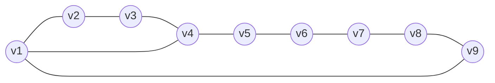

# 3ª Lista - Exercício 6

## 1. Tipo de questão

Questão construtiva: é preciso dar um exemplo de grafo e verificar que ele tem as propriedades pedidas.

## 2. Estratégia de resolução

Queremos um grafo cujo ciclo mais longo tenha comprimento $9$ e cujo ciclo mais curto tenha comprimento $4$.

Uma construção simples é começar com um ciclo de comprimento $9$, isto é, um $C_9$, e adicionar uma corda que crie um ciclo de comprimento $4$, mas sem criar triângulos.

Usaremos o ciclo:

$$
v_1,v_2,v_3,v_4,v_5,v_6,v_7,v_8,v_9,v_1
$$

e adicionaremos a aresta $v_1v_4$.

## 3. Resolução detalhada

Defina:

$$
V(G)=\{v_1,v_2,v_3,v_4,v_5,v_6,v_7,v_8,v_9\}.
$$

O conjunto de arestas será:

$$
E(G)=\{
v_1v_2,\ v_2v_3,\ v_3v_4,\ v_4v_5,\ v_5v_6,\ v_6v_7,\ v_7v_8,\ v_8v_9,\ v_9v_1,\ v_1v_4
\}.
$$

Ou seja, $G$ é o ciclo $C_9$ com a corda $v_1v_4$.

### Verificação do ciclo mais longo

O grafo contém o ciclo:

$$
v_1,v_2,v_3,v_4,v_5,v_6,v_7,v_8,v_9,v_1.
$$

Esse ciclo tem comprimento $9$.

Como o grafo tem apenas $9$ vértices, nenhum ciclo pode ter comprimento maior que $9$. Portanto, o comprimento do ciclo mais longo é $9$.

### Verificação do ciclo mais curto

A corda $v_1v_4$ cria o ciclo:

$$
v_1,v_2,v_3,v_4,v_1.
$$

Esse ciclo tem comprimento $4$.

Agora precisamos verificar que não há ciclo de comprimento menor que $4$. O único comprimento menor possível para um ciclo em grafo simples é $3$, isto é, um triângulo.

O grafo não tem triângulos:

- a corda adicionada é $v_1v_4$;
- para formar triângulo com essa corda, seria necessário um caminho de comprimento $2$ entre $v_1$ e $v_4$ no ciclo original;
- mas, em $C_9$, os caminhos entre $v_1$ e $v_4$ têm comprimentos $3$ e $6$.

Logo, a corda $v_1v_4$ não cria triângulo.

Assim, o menor ciclo tem comprimento $4$.

### Outros ciclos criados

A corda $v_1v_4$ também cria o ciclo:

$$
v_1,v_4,v_5,v_6,v_7,v_8,v_9,v_1.
$$

Esse ciclo tem comprimento $7$. Isso não atrapalha a construção, pois o menor ciclo continua tendo comprimento $4$ e o maior continua tendo comprimento $9$.

## 4. Resposta final

Um exemplo é o grafo com:

$$
V(G)=\{v_1,v_2,v_3,v_4,v_5,v_6,v_7,v_8,v_9\}
$$

e

$$
E(G)=\{
v_1v_2,\ v_2v_3,\ v_3v_4,\ v_4v_5,\ v_5v_6,\ v_6v_7,\ v_7v_8,\ v_8v_9,\ v_9v_1,\ v_1v_4
\}.
$$

Nesse grafo, o ciclo mais longo tem comprimento $9$ e o ciclo mais curto tem comprimento $4$.

## 5. Comentários didáticos

A teoria subjacente é a relação entre ciclos e cordas. Uma corda é uma aresta que liga dois vértices não consecutivos de um ciclo. Ao adicionar uma corda a um ciclo, o ciclo original é dividido em dois ciclos menores.

Neste exemplo, a corda $v_1v_4$ divide o ciclo $C_9$ em dois ciclos:

- um ciclo de comprimento $4$: $v_1,v_2,v_3,v_4,v_1$;
- um ciclo de comprimento $7$: $v_1,v_4,v_5,v_6,v_7,v_8,v_9,v_1$.

O ciclo original de comprimento $9$ continua existindo, então ele garante o comprimento máximo pedido.

O cuidado principal é não adicionar uma corda que crie triângulo. Por exemplo, se adicionássemos $v_1v_3$, obteríamos o ciclo $v_1,v_2,v_3,v_1$, de comprimento $3$, e isso violaria a exigência de que o ciclo mais curto tenha comprimento $4$.
