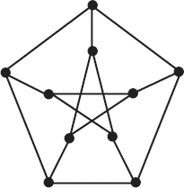

# 3ª Lista - Exercício 7

## 1. Leitura do grafo



A figura não traz rótulos nos vértices. Para tornar a solução verificável, adotamos a rotulação por faixas horizontais: primeiro da esquerda para a direita na linha superior; depois repetimos o mesmo critério nas linhas abaixo, de cima para baixo.

Vértices:
$V=\{v_1,v_2,v_3,v_4,v_5,v_6,v_7,v_8,v_9,v_{10}\}$

Lista de adjacência proposta:

```text
v1: v2 v3 v4
v2: v1 v7 v8
v3: v1 v5 v9
v4: v1 v6 v10
v5: v3 v6 v8
v6: v4 v5 v7
v7: v2 v6 v9
v8: v2 v5 v10
v9: v3 v7 v10
v10: v4 v8 v9
```

## 2. Estratégia de resolução

Usaremos diretamente as definições de Nicoletti:

- uma **trilha** é um passeio no qual nenhuma aresta aparece mais de uma vez;
- um **caminho** é uma trilha sem repetição de vértices, exceto no caso fechado;
- um **ciclo** é um caminho fechado.

Como o exercício pede exemplos, basta apresentar sequências de vértices e verificar que cada par consecutivo é adjacente na lista aprovada.

## 3. Resolução detalhada

### (a) Uma trilha de comprimento $5$

Uma trilha de comprimento $5$ é:

$$
v_1,v_2,v_8,v_5,v_6,v_4.
$$

As arestas usadas são:

$$
v_1v_2,\ v_2v_8,\ v_8v_5,\ v_5v_6,\ v_6v_4.
$$

Nenhuma aresta é repetida. Portanto, a sequência é uma trilha. Como ela usa $5$ arestas, tem comprimento $5$.

### (b) Um caminho de comprimento $9$

Um caminho de comprimento $9$ é:

$$
v_1,v_2,v_7,v_6,v_4,v_{10},v_8,v_5,v_3,v_9.
$$

Essa sequência passa por todos os $10$ vértices do grafo uma única vez. Portanto, é um caminho com $10$ vértices e comprimento:

$$
10-1=9.
$$

### (c) Ciclos de comprimentos $5$, $6$, $8$ e $9$

Um ciclo de comprimento $5$ é:

$$
v_1,v_2,v_8,v_5,v_3,v_1.
$$

Um ciclo de comprimento $6$ é:

$$
v_1,v_2,v_7,v_6,v_5,v_3,v_1.
$$

Um ciclo de comprimento $8$ é:

$$
v_1,v_2,v_8,v_{10},v_9,v_7,v_6,v_4,v_1.
$$

Um ciclo de comprimento $9$ é:

$$
v_1,v_2,v_8,v_5,v_6,v_7,v_9,v_{10},v_4,v_1.
$$

Em cada caso, a sequência começa e termina no mesmo vértice, não repete vértices intermediários e cada par consecutivo de vértices é adjacente. Portanto, são ciclos.

## 4. Resposta final

- (a) Uma trilha de comprimento $5$ é $v_1,v_2,v_8,v_5,v_6,v_4$.
- (b) Um caminho de comprimento $9$ é $v_1,v_2,v_7,v_6,v_4,v_{10},v_8,v_5,v_3,v_9$.
- (c) Ciclos:
  - comprimento $5$: $v_1,v_2,v_8,v_5,v_3,v_1$;
  - comprimento $6$: $v_1,v_2,v_7,v_6,v_5,v_3,v_1$;
  - comprimento $8$: $v_1,v_2,v_8,v_{10},v_9,v_7,v_6,v_4,v_1$;
  - comprimento $9$: $v_1,v_2,v_8,v_5,v_6,v_7,v_9,v_{10},v_4,v_1$.

## 5. Comentários didáticos

A teoria subjacente é a distinção entre trilha, caminho e ciclo.

Para verificar uma trilha, olhamos para as arestas: nenhuma pode ser repetida. Para verificar um caminho, olhamos para os vértices: nenhum vértice intermediário pode se repetir. Para verificar um ciclo, exigimos que a sequência seja fechada e que não haja repetição de vértices intermediários.

O caminho do item (b) é um caminho de comprimento máximo possível em um grafo com $10$ vértices, pois um caminho com $10$ vértices tem comprimento $9$. Isso não significa que exista ciclo de comprimento $10$. O grafo de Petersen é um exemplo clássico em que há caminhos longos, mas a existência de um ciclo hamiltoniano não é garantida.
