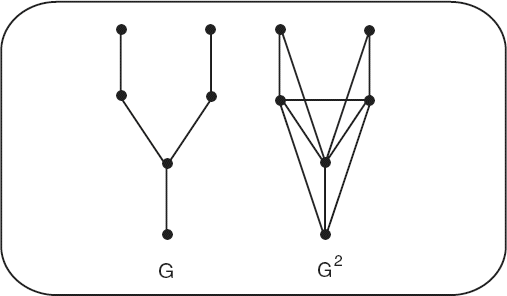
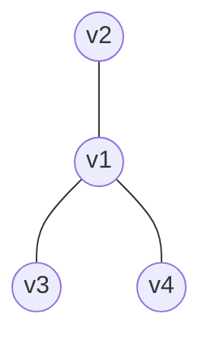
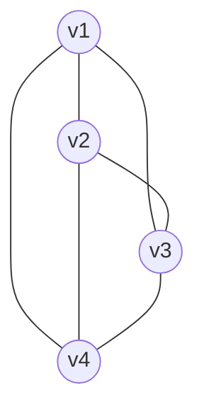
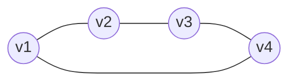
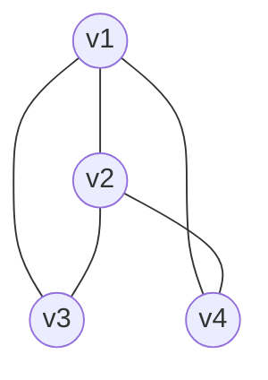

# 3ª Lista - Exercício 12

## 1. Tipo de questão

Questão construtiva sobre quadrado de grafo.

## 2. Estratégia de resolução

Pela definição do enunciado, o quadrado $G^2$ tem o mesmo conjunto de vértices de $G$. Dois vértices distintos ficam adjacentes em $G^2$ quando, em $G$, a distância entre eles é $1$ ou $2$.

Assim, para mostrar que $G^2=K_4$, basta verificar que, no grafo original $G$, qualquer par de vértices distintos está a distância no máximo $2$.

Primeiro verificaremos isso para $K_{1,3}$. Depois construiremos mais dois exemplos: o ciclo $C_4$ e o grafo $K_4-e$, isto é, o grafo completo com $4$ vértices menos uma aresta.

## 3. Resolução detalhada

### O quadrado de $K_{1,3}$

Considere o grafo $K_{1,3}$ com:

$$
V(G)=\{v_1,v_2,v_3,v_4\}
$$

e

$$
E(G)=\{v_1v_2,\ v_1v_3,\ v_1v_4\}.
$$

Nesse grafo, $v_1$ é o vértice central, e $v_2$, $v_3$ e $v_4$ são vértices pendentes.

As distâncias em $G$ são:

- $d(v_1,v_2)=1$, $d(v_1,v_3)=1$ e $d(v_1,v_4)=1$;
- $d(v_2,v_3)=2$, pelo caminho $v_2,v_1,v_3$;
- $d(v_2,v_4)=2$, pelo caminho $v_2,v_1,v_4$;
- $d(v_3,v_4)=2$, pelo caminho $v_3,v_1,v_4$.

Logo, todo par de vértices distintos está a distância $1$ ou $2$ em $G$.

Pela definição de quadrado de grafo, todos esses pares passam a ser adjacentes em $G^2$. Portanto:

$$
G^2=K_4.
$$

Em forma de arestas:

$$
E(G^2)=\{
v_1v_2,\ v_1v_3,\ v_1v_4,\ v_2v_3,\ v_2v_4,\ v_3v_4
\}.
$$

Esse é exatamente o conjunto de arestas de $K_4$.

### Primeiro exemplo adicional: $C_4$

Considere o ciclo $C_4$:

$$
V(H)=\{v_1,v_2,v_3,v_4\}
$$

e

$$
E(H)=\{v_1v_2,\ v_2v_3,\ v_3v_4,\ v_4v_1\}.
$$

No ciclo $C_4$:

- vértices consecutivos estão a distância $1$;
- vértices opostos estão a distância $2$.

Portanto, qualquer par de vértices distintos está a distância $1$ ou $2$. Logo:

$$
H^2=K_4.
$$

### Segundo exemplo adicional: $K_4-e$

Considere agora o grafo $J=K_4-e$, isto é, $K_4$ com uma aresta removida.

Tome:

$$
V(J)=\{v_1,v_2,v_3,v_4\}
$$

e

$$
E(J)=\{v_1v_2,\ v_1v_3,\ v_1v_4,\ v_2v_3,\ v_2v_4\}.
$$

Ou seja, a única aresta ausente em relação a $K_4$ é $v_3v_4$.

Nesse grafo:

- todos os pares, exceto $v_3$ e $v_4$, já estão a distância $1$;
- os vértices $v_3$ e $v_4$ estão a distância $2$, por exemplo pelo caminho $v_3,v_1,v_4$.

Assim, todo par de vértices distintos está a distância $1$ ou $2$ em $J$. Portanto:

$$
J^2=K_4.
$$

## 4. Resposta final

O quadrado de $K_{1,3}$ é $K_4$, pois em $K_{1,3}$ quaisquer dois vértices distintos estão a distância $1$ ou $2$.

Dois outros exemplos de grafos cujo quadrado é $K_4$ são:

$$
C_4
$$

e

$$
K_4-e.
$$

## 5. Comentários didáticos

A teoria subjacente é a definição de quadrado de grafo. O quadrado $G^2$ mantém os mesmos vértices de $G$, mas acrescenta arestas entre vértices que estavam a distância $2$ no grafo original.

Uma forma prática de resolver esse tipo de questão é perguntar: qual é a maior distância entre dois vértices do grafo original? Se o grafo tem $4$ vértices e todo par de vértices distintos está a distância no máximo $2$, então o quadrado será $K_4$.

Em outras palavras, para grafos com $4$ vértices, qualquer grafo conectado de diâmetro no máximo $2$ terá quadrado igual a $K_4$.

No caso de $K_{1,3}$, a confusão comum é pensar que os vértices pendentes continuam sem ligação entre si. Isso é verdade no grafo original, mas não no quadrado. No quadrado, dois vértices pendentes tornam-se adjacentes porque estão a distância $2$ por meio do vértice central.

Outro erro comum é acrescentar vértices ao formar $G^2$. Isso não deve ser feito. O quadrado de um grafo muda o conjunto de arestas, mas preserva exatamente o mesmo conjunto de vértices.
