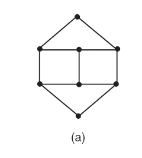
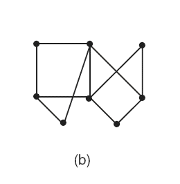
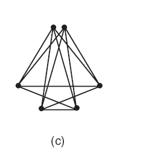
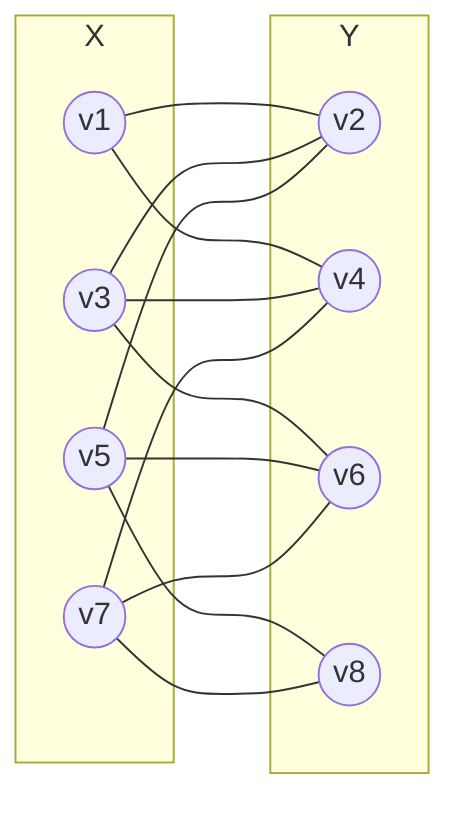
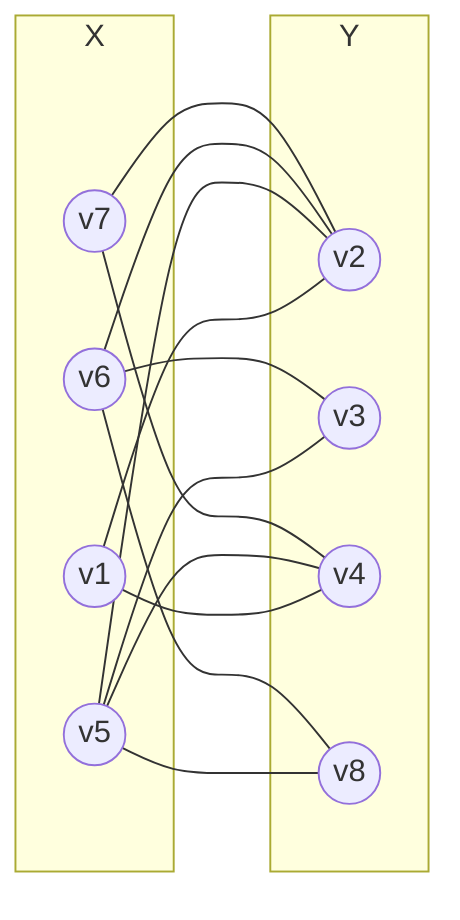

# 3ª Lista - Exercício 13

## 1. Leitura dos grafos

Questão com grafos representados por imagem.

Regra de rotulação adotada: em cada grafo, os vértices foram rotulados por faixas horizontais, primeiro os vértices da linha superior, da esquerda para a direita; depois as linhas abaixo, de cima para baixo, também da esquerda para a direita.

### Grafo (a)



Vértices:

$$
V(G_a)=\{v_1,v_2,v_3,v_4,v_5,v_6,v_7,v_8\}.
$$

Lista de adjacência proposta:

```text
v1: v2 v4
v2: v1 v3 v5
v3: v2 v4 v6
v4: v1 v3 v7
v5: v2 v6 v8
v6: v3 v5 v7
v7: v4 v6 v8
v8: v5 v7
```

### Grafo (b)



Vértices:

$$
V(G_b)=\{v_1,v_2,v_3,v_4,v_5,v_6,v_7,v_8\}.
$$

Lista de adjacência proposta:

```text
v1: v2 v4
v2: v1 v5 v6 v7
v3: v5 v6
v4: v1 v5 v7
v5: v2 v3 v4 v8
v6: v2 v3 v8
v7: v2 v4
v8: v5 v6
```

### Grafo (c)



Vértices:

$$
V(G_c)=\{v_1,v_2,v_3,v_4,v_5,v_6\}.
$$

Lista de adjacência proposta:

```text
v1: v3 v4 v5 v6
v2: v3 v4 v5 v6
v3: v1 v2 v4 v6
v4: v1 v2 v3 v5
v5: v1 v2 v4 v6
v6: v1 v2 v3 v5
```

## 2. Estratégia de resolução

Para decidir se cada grafo é bipartido, tentaremos separar seus vértices em dois conjuntos $X$ e $Y$ de modo que toda aresta tenha uma extremidade em $X$ e a outra em $Y$.

Quando essa separação for possível, o grafo será bipartido, e o redesenho será dado por um diagrama Mermaid com os vértices de $X$ de um lado e os vértices de $Y$ do outro.

Quando essa separação não for possível, basta encontrar um ciclo de comprimento ímpar. Isso prova que o grafo não é bipartido.

## 3. Resolução detalhada

### Grafo (a)

Considere a bipartição:

$$
X=\{v_1,v_3,v_5,v_7\}
$$

e

$$
Y=\{v_2,v_4,v_6,v_8\}.
$$

Verifiquemos as arestas pela lista de adjacência:

- $v_1$ é adjacente a $v_2$ e $v_4$, ambos em $Y$;
- $v_3$ é adjacente a $v_2$, $v_4$ e $v_6$, todos em $Y$;
- $v_5$ é adjacente a $v_2$, $v_6$ e $v_8$, todos em $Y$;
- $v_7$ é adjacente a $v_4$, $v_6$ e $v_8$, todos em $Y$.

Não há aresta ligando dois vértices de $X$ nem dois vértices de $Y$. Portanto, o grafo (a) é bipartido.

Redesenho evidenciando a bipartição:



### Grafo (b)

Considere a bipartição:

$$
X=\{v_1,v_5,v_6,v_7\}
$$

e

$$
Y=\{v_2,v_3,v_4,v_8\}.
$$

Verifiquemos as arestas:

- $v_1$ é adjacente a $v_2$ e $v_4$, ambos em $Y$;
- $v_5$ é adjacente a $v_2$, $v_3$, $v_4$ e $v_8$, todos em $Y$;
- $v_6$ é adjacente a $v_2$, $v_3$ e $v_8$, todos em $Y$;
- $v_7$ é adjacente a $v_2$ e $v_4$, ambos em $Y$.

Assim, todas as arestas ligam um vértice de $X$ a um vértice de $Y$. Portanto, o grafo (b) é bipartido.

Redesenho evidenciando a bipartição:



### Grafo (c)

O grafo (c) não é bipartido, pois contém o ciclo:

$$
v_1,v_3,v_4,v_1.
$$

De fato, pela lista de adjacência:

- $v_1$ é adjacente a $v_3$;
- $v_3$ é adjacente a $v_4$;
- $v_4$ é adjacente a $v_1$.

Logo, existe um ciclo de comprimento $3$.

Como $3$ é ímpar, o grafo (c) contém um ciclo ímpar. Portanto, o grafo (c) não é bipartido.

## 4. Resposta final

- O grafo (a) é bipartido, com bipartição:

$$
X=\{v_1,v_3,v_5,v_7\},\quad
Y=\{v_2,v_4,v_6,v_8\}.
$$

- O grafo (b) é bipartido, com bipartição:

$$
X=\{v_1,v_5,v_6,v_7\},\quad
Y=\{v_2,v_3,v_4,v_8\}.
$$

- O grafo (c) não é bipartido, pois contém o ciclo ímpar:

$$
v_1,v_3,v_4,v_1.
$$

## 5. Comentários didáticos

A teoria subjacente é a definição de grafo bipartido. Um grafo é bipartido quando seu conjunto de vértices pode ser dividido em dois subconjuntos $X$ e $Y$ de modo que toda aresta ligue um vértice de $X$ a um vértice de $Y$.

Essa definição implica que não pode haver arestas dentro de $X$ nem dentro de $Y$. Por isso, quando propomos uma bipartição, a verificação deve olhar para todas as arestas, não apenas para alguns exemplos.

Outro critério importante é: um grafo é bipartido se e somente se não possui ciclo de comprimento ímpar. Esse critério é especialmente útil para provar que um grafo não é bipartido. No grafo (c), basta encontrar o triângulo $v_1,v_3,v_4,v_1$.

Um erro comum é achar que cruzamento visual de arestas impede bipartição. Isso é falso. Arestas cruzadas no desenho não significam que exista um vértice no ponto de cruzamento. O que importa é a lista de adjacência, isto é, quais vértices estão realmente ligados por arestas.

Outro erro comum é confundir “parece separável no desenho” com “é bipartido”. A separação correta precisa colocar todos os vértices em dois conjuntos e garantir que nenhuma aresta fique dentro do mesmo conjunto.
