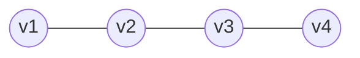

# 3ª Lista - Exercício 14

## 1. Tipo de questão

Questão construtiva: é preciso dar um exemplo de grafo e verificar que ele satisfaz a condição pedida.

## 2. Estratégia de resolução

Queremos um grafo conectado em que a remoção de qualquer aresta torne o grafo desconectado.

Uma forma simples de obter isso é usar uma árvore. Em uma árvore, existe exatamente um caminho entre quaisquer dois vértices. Por isso, se uma aresta é removida, o caminho entre alguns vértices deixa de existir, e o grafo se desconecta.

Usaremos o caminho com $4$ vértices, isto é, o grafo $P_4$.

## 3. Resolução detalhada

Defina o grafo $G$ por:

$$
V(G)=\{v_1,v_2,v_3,v_4\}
$$

e

$$
E(G)=\{v_1v_2,\ v_2v_3,\ v_3v_4\}.
$$

Visualmente:

Esse grafo é conectado, pois existe caminho entre qualquer par de vértices. Por exemplo:

- de $v_1$ até $v_4$, há o caminho $v_1,v_2,v_3,v_4$;
- de $v_1$ até $v_3$, há o caminho $v_1,v_2,v_3$;
- de $v_2$ até $v_4$, há o caminho $v_2,v_3,v_4$.

Agora verificamos o que acontece ao remover cada aresta.

### Removendo $v_1v_2$

Se removemos a aresta $v_1v_2$, o vértice $v_1$ fica isolado dos demais.

O grafo restante tem componentes:

$$
\{v_1\}
\quad\text{e}\quad
\{v_2,v_3,v_4\}.
$$

Logo, o grafo fica desconectado.

### Removendo $v_2v_3$

Se removemos a aresta $v_2v_3$, não há mais caminho entre $v_1$ e $v_4$.

O grafo restante tem componentes:

$$
\{v_1,v_2\}
\quad\text{e}\quad
\{v_3,v_4\}.
$$

Logo, o grafo fica desconectado.

### Removendo $v_3v_4$

Se removemos a aresta $v_3v_4$, o vértice $v_4$ fica isolado dos demais.

O grafo restante tem componentes:

$$
\{v_1,v_2,v_3\}
\quad\text{e}\quad
\{v_4\}.
$$

Logo, o grafo fica desconectado.

Portanto, a remoção de qualquer aresta de $G$ resulta em um grafo desconectado.

## 4. Resposta final

Um exemplo é o caminho $P_4$, com:

$$
V(G)=\{v_1,v_2,v_3,v_4\}
$$

e

$$
E(G)=\{v_1v_2,\ v_2v_3,\ v_3v_4\}.
$$

Esse grafo é conectado, mas a remoção de qualquer uma de suas arestas o torna desconectado.

## 5. Comentários didáticos

A teoria subjacente é a noção de ponte. Uma aresta é chamada ponte quando sua remoção aumenta o número de componentes conexos do grafo. Em particular, se o grafo era conectado, remover uma ponte o torna desconectado.

O exercício pede um grafo em que todas as arestas sejam pontes. Árvores têm exatamente essa propriedade: toda aresta de uma árvore é uma ponte.

O exemplo $P_4$ é uma árvore simples. Ele não tem ciclos. Isso é importante, porque em um ciclo a remoção de uma aresta não desconecta o grafo: ainda é possível contornar pelo restante do ciclo.

Um erro comum seria escolher um ciclo, como $C_4$. Embora $C_4$ seja conectado, remover uma aresta de $C_4$ deixa um caminho com $4$ vértices, que ainda é conectado. Portanto, ciclos não servem para este exercício.

Outro detalhe importante do enunciado é que remover uma aresta não remove seus vértices. Por isso, ao retirar $v_1v_2$, por exemplo, o vértice $v_1$ continua no grafo; ele apenas fica sem ligação com os demais.
