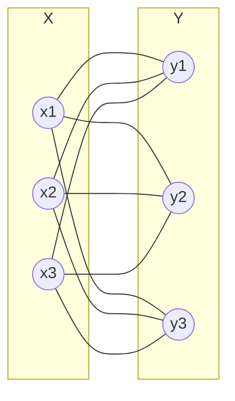
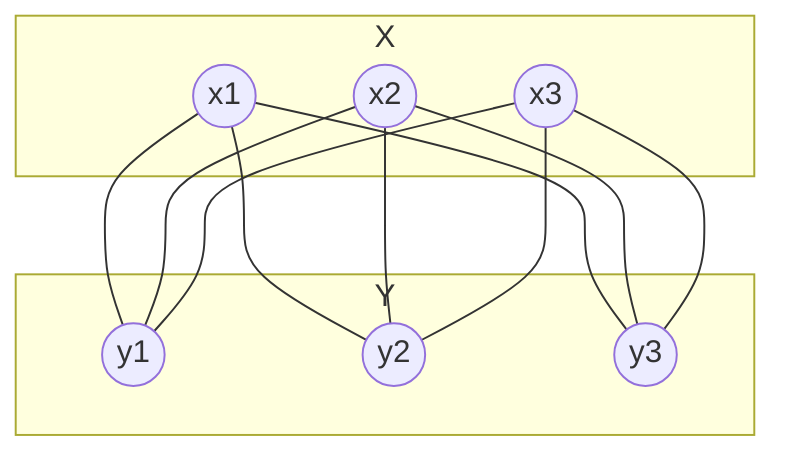
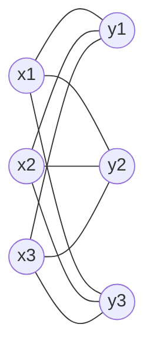

# 3ª Lista - Exercício 19

## 1. Tipo de questão

Questão construtiva: é preciso desenhar o mesmo grafo, $K_{3,3}$, de três maneiras diferentes.

## 2. Estratégia de resolução

O grafo bipartido completo $K_{3,3}$ tem duas partes com $3$ vértices cada uma.

Tomaremos:

$$
X=\{x_1,x_2,x_3\}
$$

e

$$
Y=\{y_1,y_2,y_3\}.
$$

Como o grafo é bipartido completo, cada vértice de $X$ deve estar ligado a todos os vértices de $Y$, e não deve haver arestas dentro de $X$ nem dentro de $Y$.

Portanto:

$$
E(K_{3,3})=
\{
x_1y_1,\ x_1y_2,\ x_1y_3,\ 
x_2y_1,\ x_2y_2,\ x_2y_3,\ 
x_3y_1,\ x_3y_2,\ x_3y_3
\}.
$$

## 3. Resolução detalhada

### Primeiro desenho: bipartição vertical

Neste desenho, colocamos os vértices de $X$ à esquerda e os vértices de $Y$ à direita.

### Segundo desenho: bipartição horizontal

Agora colocamos os vértices de $X$ acima e os vértices de $Y$ abaixo.

### Terceiro desenho: rótulos intercalados

Neste desenho, os vértices são distribuídos de forma diferente, mas as arestas continuam sendo exatamente as mesmas.

Nos três desenhos, o conjunto de vértices é:

$$
V(K_{3,3})=X\cup Y
=\{x_1,x_2,x_3,y_1,y_2,y_3\}.
$$

E o conjunto de arestas é o mesmo:

$$
E(K_{3,3})=
\{
x_1y_1,\ x_1y_2,\ x_1y_3,\ 
x_2y_1,\ x_2y_2,\ x_2y_3,\ 
x_3y_1,\ x_3y_2,\ x_3y_3
\}.
$$

Portanto, os três desenhos representam o mesmo grafo.

## 4. Resposta final

Três desenhos possíveis de $K_{3,3}$ foram dados acima:

- um com bipartição vertical;
- um com bipartição horizontal;
- um com disposição alternativa dos vértices.

Em todos eles, cada vértice de $X=\{x_1,x_2,x_3\}$ está ligado a cada vértice de $Y=\{y_1,y_2,y_3\}$, e não há arestas dentro de uma mesma parte.

## 5. Comentários didáticos

A teoria subjacente é a definição de grafo bipartido completo. O grafo $K_{m,n}$ tem duas partes: uma com $m$ vértices e outra com $n$ vértices. Cada vértice da primeira parte é adjacente a todos os vértices da segunda parte.

No caso de $K_{3,3}$, há $3+3=6$ vértices e:

$$
3\cdot 3=9
$$

arestas.

O ponto didático principal é distinguir grafo e desenho do grafo. O mesmo grafo pode ser desenhado de várias formas. O que define o grafo não é a aparência do desenho, mas seus vértices e suas arestas.

Um erro comum é achar que, se as arestas cruzam no desenho, então surgiu um novo vértice no cruzamento. Isso é falso. Um cruzamento visual de linhas não cria vértice, a menos que o desenho indique explicitamente um ponto/vértice ali.

Outro erro comum é esquecer alguma aresta. Em $K_{3,3}$, cada um dos $3$ vértices de uma parte precisa estar ligado aos $3$ vértices da outra parte. Por isso devem aparecer exatamente $9$ arestas.
