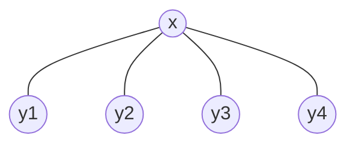

# 4ª Lista - Exercício 3

## 1. Tipo de questão

Questão teórica de caracterização: é preciso provar quais grafos bipartidos completos são árvores.

## 2. Estratégia de resolução

Um grafo bipartido completo $K_{m,n}$ tem duas partes:

$$
X=\{x_1,\ldots,x_m\}
$$

e

$$
Y=\{y_1,\ldots,y_n\}.
$$

Todo vértice de $X$ é adjacente a todo vértice de $Y$, e não há arestas dentro de $X$ nem dentro de $Y$.

Para provar o resultado, faremos duas etapas:

1. mostrar que $K_{1,n}$ é uma árvore;
2. mostrar que se $m\geq 2$ e $n\geq 2$, então $K_{m,n}$ contém um ciclo, logo não é árvore.

## 3. Resolução detalhada

### Primeiro: $K_{1,n}$ é uma árvore

Considere o grafo $K_{1,n}$, com $n\geq 1$.

Ele tem uma parte com apenas um vértice, digamos:

$$
X=\{x\},
$$

e outra parte com $n$ vértices:

$$
Y=\{y_1,y_2,\ldots,y_n\}.
$$

Como o grafo é bipartido completo, o vértice $x$ é adjacente a todos os vértices de $Y$.

Assim:

$$
E(K_{1,n})=\{xy_1,xy_2,\ldots,xy_n\}.
$$

Visualmente, para $n=4$, temos a estrela $K_{1,4}$. O padrão é o mesmo para qualquer $n\geq 1$:

Esse grafo é conectado, pois qualquer vértice $y_i$ se liga ao centro $x$.

Além disso, não há ciclos. Para formar um ciclo, seria necessário sair de um vértice $y_i$, passar por $x$ e retornar por outro caminho. Mas cada $y_i$ só é adjacente a $x$, e não há arestas entre vértices de $Y$.

Portanto, $K_{1,n}$ é conectado e não possui ciclos. Logo, $K_{1,n}$ é uma árvore.

### Segundo: se $m,n\geq 2$, então $K_{m,n}$ não é árvore

Agora considere $K_{m,n}$ com:

$$
m\geq 2
$$

e

$$
n\geq 2.
$$

Então existem dois vértices distintos em $X$, digamos $x_1$ e $x_2$, e dois vértices distintos em $Y$, digamos $y_1$ e $y_2$.

Como o grafo é bipartido completo, todas as seguintes arestas existem:

$$
x_1y_1,\quad x_1y_2,\quad x_2y_1,\quad x_2y_2.
$$

Com essas quatro arestas, obtemos o ciclo:

$$
x_1,y_1,x_2,y_2,x_1.
$$

Esse ciclo tem comprimento $4$.

Portanto, se $m\geq 2$ e $n\geq 2$, o grafo $K_{m,n}$ contém ciclo. Logo, não é uma árvore.

Assim, para que um grafo bipartido completo seja árvore, uma das partes precisa ter exatamente um vértice.

Portanto, os únicos grafos bipartidos completos que são árvores são os grafos da forma:

$$
K_{1,n},\quad n\geq 1,
$$

ou, equivalentemente,

$$
K_{n,1},\quad n\geq 1.
$$

Esses grafos são chamados estrelas.

## 4. Resposta final

Os únicos grafos bipartidos completos que são árvores são os grafos estrelas:

$$
K_{1,n},\quad n\geq 1,
$$

ou, de forma equivalente,

$$
K_{n,1},\quad n\geq 1.
$$

De fato, $K_{1,n}$ é conectado e não possui ciclos. Por outro lado, se $m,n\geq 2$, então $K_{m,n}$ contém o ciclo:

$$
x_1,y_1,x_2,y_2,x_1,
$$

e portanto não é árvore.

## 5. Comentários didáticos

A teoria subjacente é a definição de árvore: um grafo conectado e sem ciclos.

Também usamos a definição de grafo bipartido completo. Em $K_{m,n}$, cada vértice de uma parte está ligado a todos os vértices da outra parte. Essa completude é exatamente o que força a existência de um ciclo quando as duas partes têm pelo menos dois vértices.

O caso $K_{1,n}$ é especial porque há um único vértice central. Todos os demais vértices são folhas, isto é, vértices de grau $1$. Como as folhas só se ligam ao centro, não há como formar ciclo.

Um erro comum é pensar que todo grafo bipartido completo é árvore porque é bipartido. Isso é falso. Grafos bipartidos podem ter ciclos, desde que esses ciclos tenham comprimento par. O grafo $K_{2,2}$, por exemplo, é exatamente um ciclo de comprimento $4$.

Outro erro comum é esquecer que $K_{1,n}$ e $K_{n,1}$ representam o mesmo tipo de grafo, apenas com as duas partes trocadas.
