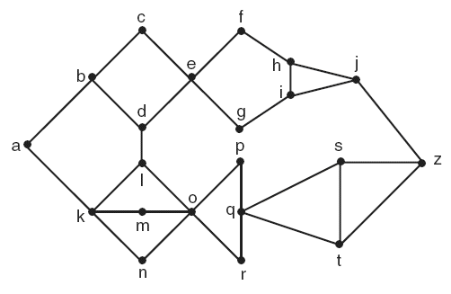
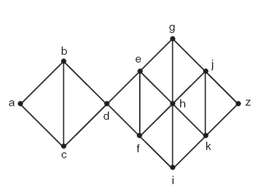
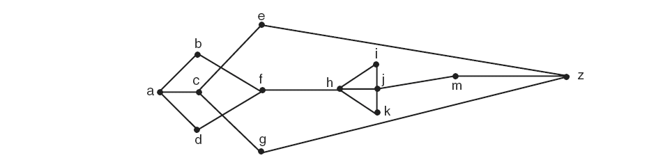

# 4ª Lista - Exercício 16

## 1. Leitura dos grafos

Questão com grafos representados por imagem.

### Grafo (a)



Lista de adjacência proposta:

```text
a: b k
b: a c d
c: b e
d: b e l
e: c d f g
f: e h
g: e i
h: f i j
i: g h j
j: h i z
k: a l m n
l: d k o
m: k o
n: k o
o: l m n p q r
p: o q
q: o p r s t
r: o q
s: q t z
t: q s z
z: j s t
```

### Grafo (b)



Lista de adjacência proposta:

```text
a: b c
b: a c d
c: a b d
d: b c e f
e: d f g h
f: d e h i
g: e h j
h: e f g i j k
i: f h k
j: g h k z
k: h i j z
z: j k
```

### Grafo (c)



Lista de adjacência proposta:

```text
a: b c d
b: a f
c: a e g
d: a f
e: c z
f: b d h
g: c z
h: f i j k
i: h j
j: h i k m
k: h j
m: j z
z: e g m
```

## 2. Estratégia de resolução

Executaremos a busca em largura a partir do vértice $a$.

A busca em largura organiza os vértices em camadas:

- camada $0$: vértice inicial $a$;
- camada $1$: vértices adjacentes a $a$;
- camada $2$: vértices ainda não visitados que são adjacentes à camada $1$;
- e assim por diante.

Quando o vértice $z$ aparece pela primeira vez em uma camada, o número dessa camada é o comprimento do caminho mais curto de $a$ até $z$.

Para contar o número de caminhos mais curtos, contamos quantas formas cada vértice pode ser alcançado pela camada anterior.

## 3. Resolução detalhada

### Grafo (a)

As camadas da busca em largura a partir de $a$ são:

| Camada | Vértices |
|---:|---|
| $0$ | $a$ |
| $1$ | $b,\ k$ |
| $2$ | $c,\ d,\ l,\ m,\ n$ |
| $3$ | $e,\ o$ |
| $4$ | $f,\ g,\ p,\ q,\ r$ |
| $5$ | $h,\ i,\ s,\ t$ |
| $6$ | $j,\ z$ |

O vértice $z$ aparece pela primeira vez na camada $6$. Portanto:

$$
d(a,z)=6.
$$

Um caminho mais curto é:

$$
a,k,l,o,q,s,z.
$$

Agora contamos os caminhos mais curtos até $z$.

Para chegar a $z$ na camada $6$, podemos vir de $s$ ou de $t$, ambos na camada $5$.

Os caminhos mínimos até $s$ e $t$ passam por $q$:

$$
q,s,z
\quad\text{ou}\quad
q,t,z.
$$

O vértice $q$ é alcançado em distância mínima a partir de $o$, e $o$ é alcançado por três possibilidades mínimas:

$$
a,k,l,o,
\quad
a,k,m,o,
\quad
a,k,n,o.
$$

Assim, há $3$ formas mínimas de chegar a $q$ e, a partir de $q$, há $2$ escolhas para chegar a $z$: por $s$ ou por $t$.

Logo, o número de caminhos mais curtos é:

$$
3\cdot 2=6.
$$

Portanto, no grafo (a):

$$
d(a,z)=6
$$

e existem $6$ caminhos mais curtos de $a$ até $z$.

### Grafo (b)

As camadas da busca em largura a partir de $a$ são:

| Camada | Vértices |
|---:|---|
| $0$ | $a$ |
| $1$ | $b,\ c$ |
| $2$ | $d$ |
| $3$ | $e,\ f$ |
| $4$ | $g,\ h,\ i$ |
| $5$ | $j,\ k$ |
| $6$ | $z$ |

O vértice $z$ aparece pela primeira vez na camada $6$. Portanto:

$$
d(a,z)=6.
$$

Um caminho mais curto é:

$$
a,b,d,e,g,j,z.
$$

Agora contamos os caminhos mais curtos.

Até $d$, há duas formas mínimas:

$$
a,b,d
\quad\text{e}\quad
a,c,d.
$$

De $d$, podemos seguir para $e$ ou $f$.

Na camada seguinte:

- $g$ é alcançado por $e$;
- $h$ é alcançado por $e$ ou $f$;
- $i$ é alcançado por $f$.

Depois:

- $j$ é alcançado por $g$ ou $h$;
- $k$ é alcançado por $h$ ou $i$.

Finalmente, $z$ é alcançado por $j$ ou por $k$.

Podemos organizar a contagem assim:

| Vértice | Número de caminhos mínimos desde $a$ |
|---|---:|
| $a$ | $1$ |
| $b,c$ | $1,1$ |
| $d$ | $2$ |
| $e,f$ | $2,2$ |
| $g,h,i$ | $2,4,2$ |
| $j,k$ | $6,6$ |
| $z$ | $12$ |

Logo, no grafo (b):

$$
d(a,z)=6
$$

e existem $12$ caminhos mais curtos de $a$ até $z$.

### Grafo (c)

As camadas da busca em largura a partir de $a$ são:

| Camada | Vértices |
|---:|---|
| $0$ | $a$ |
| $1$ | $b,\ c,\ d$ |
| $2$ | $e,\ f,\ g$ |
| $3$ | $h,\ z$ |
| $4$ | $i,\ j,\ k,\ m$ |

O vértice $z$ aparece pela primeira vez na camada $3$. Portanto:

$$
d(a,z)=3.
$$

Um caminho mais curto é:

$$
a,c,e,z.
$$

Para contar os caminhos mais curtos, observamos que $z$ é alcançado na camada $3$ a partir de $e$ ou de $g$.

Tanto $e$ quanto $g$ são alcançados a partir de $c$:

$$
a,c,e,z
$$

e

$$
a,c,g,z.
$$

Logo, no grafo (c):

$$
d(a,z)=3
$$

e existem $2$ caminhos mais curtos de $a$ até $z$.

## 4. Resposta final

| Grafo | Comprimento do caminho mais curto de $a$ até $z$ | Um caminho mais curto | Número de caminhos mais curtos |
|---|---:|---|---:|
| (a) | $6$ | $a,k,l,o,q,s,z$ | $6$ |
| (b) | $6$ | $a,b,d,e,g,j,z$ | $12$ |
| (c) | $3$ | $a,c,e,z$ | $2$ |

## 5. Comentários didáticos

A teoria subjacente é a busca em largura, ou BFS. A BFS explora primeiro todos os vértices a distância $1$ do vértice inicial, depois todos os vértices a distância $2$, depois distância $3$, e assim por diante.

Por isso, quando $z$ aparece pela primeira vez em uma camada, essa camada fornece a distância mínima $d(a,z)$.

Para contar caminhos mínimos, não basta encontrar um caminho. É preciso acompanhar quantas formas mínimas chegam a cada vértice. A regra é: o número de caminhos mínimos até um vértice é a soma dos números de caminhos mínimos até seus predecessores na camada anterior.

Um erro comum é contar caminhos que chegam a $z$ mas não são mínimos. A BFS evita esse erro porque só considera predecessores vindos da camada imediatamente anterior.

Outro erro comum é parar no primeiro caminho encontrado e esquecer que podem existir outros caminhos de mesmo comprimento. No grafo (b), por exemplo, há muitos caminhos mínimos porque há bifurcações simétricas entre as camadas.
