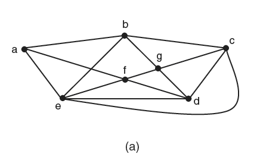
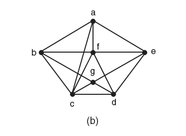

# 5ª Lista - Exercício 1

## 1. Leitura dos grafos

Questão com grafos representados por imagem.

### Grafo (a)



Vértices:

$$
V(G_a)=\{a,b,c,d,e,f,g\}.
$$

Lista de adjacência proposta:

```text
a: b e f
b: a c e g
c: b d e g
d: c e f g
e: a b c d f
f: a d e g
g: b c d f
```

### Grafo (b)



Vértices:

$$
V(G_b)=\{a,b,c,d,e,f,g\}.
$$

Lista de adjacência proposta:

```text
a: b c e f
b: a c f g
c: a b d f g
d: c e f g
e: a d f g
f: a b c d e
g: b c d e
```

## 2. Estratégia de resolução

Um ciclo hamiltoniano é um ciclo que passa por todos os vértices do grafo exatamente uma vez e retorna ao vértice inicial.

Como os dois grafos têm o mesmo conjunto de vértices:

$$
\{a,b,c,d,e,f,g\},
$$

um ciclo hamiltoniano deve conter os $7$ vértices e retornar ao vértice de partida.

Para verificar um ciclo proposto, basta conferir duas coisas:

- cada par consecutivo de vértices no ciclo é adjacente;
- todos os vértices aparecem exatamente uma vez antes do retorno ao vértice inicial.

## 3. Resolução detalhada

### Grafo (a)

Um ciclo hamiltoniano no grafo (a) é:

$$
a,b,c,d,g,f,e,a.
$$

Vamos verificar as adjacências:

- $a$ é adjacente a $b$;
- $b$ é adjacente a $c$;
- $c$ é adjacente a $d$;
- $d$ é adjacente a $g$;
- $g$ é adjacente a $f$;
- $f$ é adjacente a $e$;
- $e$ é adjacente a $a$.

Logo, a sequência é um ciclo.

Além disso, antes de retornar a $a$, a sequência visita exatamente os vértices:

$$
a,b,c,d,g,f,e.
$$

Esse conjunto é igual a:

$$
V(G_a)=\{a,b,c,d,e,f,g\}.
$$

Portanto, o ciclo:

$$
a,b,c,d,g,f,e,a
$$

é hamiltoniano.

### Grafo (b)

Um ciclo hamiltoniano no grafo (b) é:

$$
a,b,c,d,g,e,f,a.
$$

Vamos verificar as adjacências:

- $a$ é adjacente a $b$;
- $b$ é adjacente a $c$;
- $c$ é adjacente a $d$;
- $d$ é adjacente a $g$;
- $g$ é adjacente a $e$;
- $e$ é adjacente a $f$;
- $f$ é adjacente a $a$.

Logo, a sequência é um ciclo.

Além disso, antes de retornar a $a$, a sequência visita exatamente os vértices:

$$
a,b,c,d,g,e,f.
$$

Esse conjunto é igual a:

$$
V(G_b)=\{a,b,c,d,e,f,g\}.
$$

Portanto, o ciclo:

$$
a,b,c,d,g,e,f,a
$$

é hamiltoniano.

## 4. Resposta final

- No grafo (a), um ciclo hamiltoniano é:

$$
a,b,c,d,g,f,e,a.
$$

- No grafo (b), um ciclo hamiltoniano é:

$$
a,b,c,d,g,e,f,a.
$$

## 5. Comentários didáticos

A teoria subjacente é a definição de ciclo hamiltoniano. Um ciclo hamiltoniano deve passar por todos os vértices uma única vez e voltar ao vértice inicial.

Não basta encontrar um ciclo grande. É necessário verificar que todos os vértices aparecem. Também não basta passar por todos os vértices se a sequência não retorna ao ponto inicial por uma aresta válida.

Neste exercício, os dois grafos têm $7$ vértices. Portanto, um ciclo hamiltoniano deve ter comprimento $7$, isto é, deve usar $7$ arestas e retornar ao vértice de partida.

Um erro comum é repetir um vértice intermediário. Se isso acontece, a sequência pode ser um ciclo, mas não é hamiltoniana.

Outro erro comum é confundir cruzamento visual de arestas com vértice. O que determina se a sequência é válida é a lista de adjacência: cada par consecutivo precisa estar ligado por uma aresta do grafo.

Também é possível discutir a existência de ciclos hamiltonianos usando critérios teóricos, como os teoremas de Dirac e Ore.

O Teorema de Dirac diz que, se $G$ é um grafo simples com $n\geq 3$ vértices e

$$
\deg(v)\geq \frac n2
$$

para todo vértice $v$, então $G$ é hamiltoniano.

Neste exercício, os dois grafos têm $n=7$ vértices, então a condição de Dirac exige:

$$
\deg(v)\geq 4
$$

para todo vértice.

No grafo (a), temos $\deg(a)=3$. Portanto, Dirac não se aplica ao grafo (a). Isso não significa que o grafo (a) não seja hamiltoniano; significa apenas que esse teorema não é suficiente para garantir a existência do ciclo.

No grafo (b), todos os vértices têm grau pelo menos $4$. Portanto, o Teorema de Dirac se aplica ao grafo (b), garantindo que ele é hamiltoniano.

O Teorema de Ore diz que, se $G$ é simples, $n\geq 3$, e para todo par de vértices não adjacentes $u,v$ vale

$$
\deg(u)+\deg(v)\geq n,
$$

então $G$ é hamiltoniano.

No grafo (a), embora $\deg(a)=3$, os vértices não adjacentes a $a$ têm grau $4$. Assim, para esses pares:

$$
\deg(a)+\deg(v)=3+4=7.
$$

Como $n=7$, a condição de Ore é satisfeita. Portanto, Ore se aplica ao grafo (a).

No grafo (b), como todo vértice tem grau pelo menos $4$, qualquer par de vértices não adjacentes $u,v$ satisfaz:

$$
\deg(u)+\deg(v)\geq 4+4=8\geq 7.
$$

Logo, Ore também se aplica ao grafo (b).

Em resumo:

| Grafo | Dirac | Ore |
|---|---|---|
| (a) | Não se aplica | Aplica-se |
| (b) | Aplica-se | Aplica-se |

Esses teoremas são critérios suficientes: quando se aplicam, garantem que o grafo é hamiltoniano. Porém, eles não necessariamente constroem o ciclo. Como o enunciado pede para encontrar um ciclo hamiltoniano, ainda é necessário apresentar explicitamente uma sequência de vértices que forme esse ciclo.
