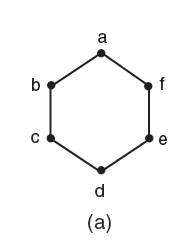
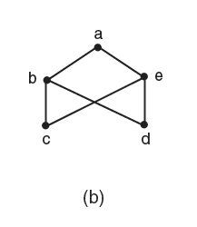
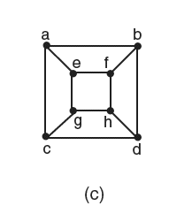
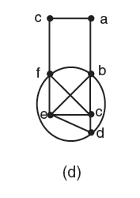

# 5ª Lista - Exercício 2

## 1. Leitura dos grafos

Questão com grafos representados por imagem.

### Grafo (a)



Vértices:

$$
V(G_a)=\{a,b,c,d,e,f\}.
$$

Lista de adjacência proposta:

```text
a: b f
b: a c
c: b d
d: c e
e: d f
f: a e
```

### Grafo (b)



Vértices:

$$
V(G_b)=\{a,b,c,d,e\}.
$$

Lista de adjacência proposta:

```text
a: b e
b: a c d
c: b e
d: b e
e: a c d
```

### Grafo (c)



Vértices:

$$
V(G_c)=\{a,b,c,d,e,f,g,h\}.
$$

Lista de adjacência proposta:

```text
a: b c e
b: a d f
c: a d g
d: b c h
e: a f g
f: b e h
g: c e h
h: d f g
```

### Grafo (d)



Vértices:

$$
V(G_d)=\{a,b,c,d,e,f\}.
$$

Lista de adjacência proposta:

```text
a: b c
b: a c d e f
c: a f
d: b c e f
e: b c d f
f: b c d e
```

## 2. Estratégia de resolução

Para cada grafo, precisamos decidir se existe um ciclo hamiltoniano.

Um ciclo hamiltoniano deve:

- passar por todos os vértices exatamente uma vez;
- retornar ao vértice inicial;
- usar apenas arestas do grafo.

Quando o grafo for hamiltoniano, exibiremos explicitamente um ciclo. Quando não for, daremos uma justificativa estrutural.

## 3. Resolução detalhada

### Grafo (a)

O grafo (a) é o ciclo:

$$
a,b,c,d,e,f,a.
$$

Verificando as adjacências:

- $a$ é adjacente a $b$;
- $b$ é adjacente a $c$;
- $c$ é adjacente a $d$;
- $d$ é adjacente a $e$;
- $e$ é adjacente a $f$;
- $f$ é adjacente a $a$.

Esse ciclo passa por todos os vértices:

$$
\{a,b,c,d,e,f\}.
$$

Logo, o grafo (a) é hamiltoniano.

### Grafo (b)

O grafo (b) não é hamiltoniano.

Observe que ele é bipartido com a seguinte bipartição:

$$
X=\{b,e\}
$$

e

$$
Y=\{a,c,d\}.
$$

Todas as arestas ligam um vértice de $X$ a um vértice de $Y$:

$$
ab,\ ae,\ bc,\ bd,\ ce,\ de.
$$

Assim, o grafo é o bipartido completo $K_{2,3}$.

Em um grafo bipartido, todo ciclo alterna entre as duas partes. Portanto, qualquer ciclo em grafo bipartido usa a mesma quantidade de vértices em cada parte.

Mas um ciclo hamiltoniano no grafo (b) teria que usar todos os $5$ vértices, sendo $2$ vértices de $X$ e $3$ vértices de $Y$.

Isso é impossível, pois um ciclo bipartido não pode usar quantidades diferentes de vértices das duas partes.

Logo, o grafo (b) não é hamiltoniano.

### Grafo (c)

Um ciclo hamiltoniano no grafo (c) é:

$$
a,b,d,c,g,h,f,e,a.
$$

Verificando as adjacências:

- $a$ é adjacente a $b$;
- $b$ é adjacente a $d$;
- $d$ é adjacente a $c$;
- $c$ é adjacente a $g$;
- $g$ é adjacente a $h$;
- $h$ é adjacente a $f$;
- $f$ é adjacente a $e$;
- $e$ é adjacente a $a$.

Esse ciclo passa por todos os vértices:

$$
\{a,b,c,d,e,f,g,h\}.
$$

Logo, o grafo (c) é hamiltoniano.

### Grafo (d)

Um ciclo hamiltoniano no grafo (d) é:

$$
a,b,d,e,f,c,a.
$$

Verificando as adjacências:

- $a$ é adjacente a $b$;
- $b$ é adjacente a $d$;
- $d$ é adjacente a $e$;
- $e$ é adjacente a $f$;
- $f$ é adjacente a $c$;
- $c$ é adjacente a $a$.

Esse ciclo passa por todos os vértices:

$$
\{a,b,c,d,e,f\}.
$$

Logo, o grafo (d) é hamiltoniano.

## 4. Resposta final

| Grafo | Hamiltoniano? | Justificativa |
|---|---|---|
| (a) | Sim | Ciclo $a,b,c,d,e,f,a$ |
| (b) | Não | É $K_{2,3}$; em ciclo bipartido as duas partes aparecem em mesma quantidade |
| (c) | Sim | Ciclo $a,b,d,c,g,h,f,e,a$ |
| (d) | Sim | Ciclo $a,b,d,e,f,c,a$ |

## 5. Comentários didáticos

A teoria subjacente é a definição de ciclo hamiltoniano. Um ciclo hamiltoniano passa por todos os vértices do grafo exatamente uma vez e retorna ao vértice inicial.

Para provar que um grafo é hamiltoniano, basta exibir um ciclo hamiltoniano e verificar suas adjacências.

Para provar que um grafo não é hamiltoniano, não basta dizer que “não encontramos” um ciclo. É preciso apresentar uma razão estrutural.

No grafo (b), a razão estrutural é a bipartição. Como ele é $K_{2,3}$, qualquer ciclo alternaria entre as duas partes. Isso obriga o ciclo a usar o mesmo número de vértices em cada parte. Como as partes têm tamanhos $2$ e $3$, não existe ciclo que use todos os vértices.

Um erro comum é confundir caminho hamiltoniano com ciclo hamiltoniano. Um caminho hamiltoniano passa por todos os vértices uma vez, mas não precisa voltar ao início. Um ciclo hamiltoniano precisa voltar ao vértice inicial por uma aresta válida.

Outro erro comum é concluir que um grafo não é hamiltoniano apenas por tentativa. A ausência de ciclo precisa ser justificada por uma propriedade do grafo, como grau, bipartição, vértices de corte, ou outra restrição estrutural.

Também podemos discutir os teoremas de Dirac e Ore como critérios suficientes de Hamiltonianidade.

O Teorema de Dirac diz que, se $G$ é um grafo simples com $n\geq 3$ vértices e

$$
\deg(v)\geq \frac n2
$$

para todo vértice $v$, então $G$ é hamiltoniano.

O Teorema de Ore diz que, se $G$ é simples, $n\geq 3$, e para todo par de vértices não adjacentes $u,v$ vale

$$
\deg(u)+\deg(v)\geq n,
$$

então $G$ é hamiltoniano.

Esses teoremas são suficientes, não necessários. Portanto, quando uma hipótese falha, não podemos concluir que o grafo não é hamiltoniano. Apenas concluímos que aquele teorema específico não resolve o caso.

Aplicando essa análise aos grafos deste exercício:

| Grafo | Dirac | Ore | Observação |
|---|---|---|---|
| (a) | Não se aplica | Não se aplica | Mesmo assim é hamiltoniano: $a,b,c,d,e,f,a$ |
| (b) | Não se aplica | Não se aplica | Não é hamiltoniano por ser $K_{2,3}$ |
| (c) | Não se aplica | Não se aplica | Mesmo assim é hamiltoniano: $a,b,d,c,g,h,f,e,a$ |
| (d) | Não se aplica | Aplica-se | Também temos o ciclo explícito $a,b,d,e,f,c,a$ |

No grafo (a), que tem $n=6$, Dirac exigiria grau mínimo pelo menos $3$. Porém todos os vértices têm grau $2$, então Dirac não se aplica. Ore também não se aplica, pois há pares não adjacentes com soma de graus $2+2=4<6$.

No grafo (b), temos $n=5$. Dirac exigiria grau mínimo pelo menos $\frac52$, isto é, pelo menos $3$ para graus inteiros. Mas há vértices de grau $2$, então Dirac não se aplica. Ore também falha: dois vértices da parte com três vértices em $K_{2,3}$ têm graus $2+2=4<5$.

No grafo (c), há vértices de grau $3$ e $n=8$. Dirac exigiria grau mínimo pelo menos $4$, então não se aplica. Ore também não se aplica, pois existem pares não adjacentes cuja soma dos graus é menor que $8$.

No grafo (d), usando a lista de adjacência aprovada, temos $n=6$. O Teorema de Dirac exigiria grau mínimo pelo menos:

$$
\frac n2=3.
$$

Mas $\deg(a)=2$ e $\deg(c)=2$. Portanto, Dirac não se aplica.

Para Ore, analisamos os pares de vértices não adjacentes. Pela lista aprovada, os pares não adjacentes relevantes são:

$$
(a,d),\quad (a,e),\quad (a,f).
$$

As somas dos graus são:

$$
\deg(a)+\deg(d)=2+4=6,
$$

$$
\deg(a)+\deg(e)=2+4=6,
$$

e

$$
\deg(a)+\deg(f)=2+4=6.
$$

Como $n=6$, todas essas somas satisfazem:

$$
\deg(u)+\deg(v)\geq n.
$$

Logo, o Teorema de Ore se aplica ao grafo (d), garantindo que ele é hamiltoniano. Além disso, já exibimos explicitamente o ciclo:

$$
a,b,d,e,f,c,a.
$$
