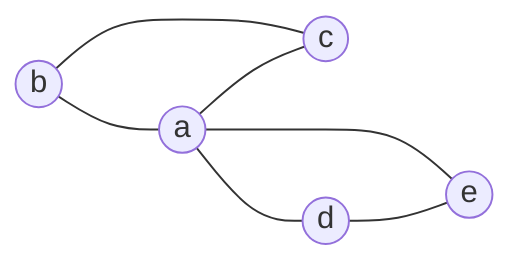

# 5ª Lista - Exercício 5

## 1. Tipo de questão

Questão construtiva: é preciso desenhar um grafo que tenha circuito de Euler, mas não tenha ciclo hamiltoniano.

## 2. Estratégia de resolução

Queremos um grafo que seja de Euler. Para isso, usaremos o critério clássico: um grafo conectado é euleriano quando todos os seus vértices têm grau par.

Ao mesmo tempo, queremos que o grafo não seja hamiltoniano. Uma forma simples de impedir ciclo hamiltoniano é criar um vértice de articulação, isto é, um vértice cuja remoção desconecta o grafo.

Usaremos dois triângulos compartilhando exatamente um vértice.

## 3. Resolução detalhada

Considere o grafo $G$ com:

$$
V(G)=\{a,b,c,d,e\}
$$

e

$$
E(G)=\{ab,bc,ca,ad,de,ea\}.
$$

Visualmente:

Esse grafo é formado por dois ciclos:

$$
a,b,c,a
$$

e

$$
a,d,e,a.
$$

Eles compartilham apenas o vértice $a$.

### Verificação de que o grafo é de Euler

Calculemos os graus:

$$
\deg(a)=4,
$$

pois $a$ é adjacente a $b$, $c$, $d$ e $e$.

Além disso:

$$
\deg(b)=2,\quad \deg(c)=2,\quad \deg(d)=2,\quad \deg(e)=2.
$$

Todos os vértices têm grau par.

O grafo também é conectado, pois todos os vértices podem ser alcançados a partir de $a$.

Logo, $G$ é um grafo de Euler.

Um circuito de Euler é, por exemplo:

$$
a,b,c,a,d,e,a.
$$

Esse circuito começa e termina em $a$ e usa cada aresta exatamente uma vez.

### Construção do circuito por Hierholzer

Também podemos construir o circuito de Euler usando o algoritmo de Hierholzer.

A ideia do algoritmo é começar em um vértice qualquer, percorrer arestas ainda não usadas até voltar ao ponto inicial e, se ainda sobrarem arestas não usadas, inserir novos ciclos no circuito já construído.

Neste grafo, começamos no vértice $a$.

Primeiro, percorremos o ciclo:

$$
a,b,c,a.
$$

Esse ciclo usa as arestas:

$$
ab,\ bc,\ ca.
$$

Ainda restam as arestas:

$$
ad,\ de,\ ea.
$$

Como essas arestas também formam um ciclo que passa por $a$, inserimos esse novo ciclo no ponto $a$ do circuito já obtido:

$$
a,d,e,a.
$$

Costurando os dois ciclos, obtemos:

$$
a,b,c,a,d,e,a.
$$

Esse é exatamente um circuito de Euler, pois todas as arestas aparecem uma única vez:

$$
ab,\ bc,\ ca,\ ad,\ de,\ ea.
$$

### Verificação de que o grafo não é hamiltoniano

O vértice $a$ é uma articulação. Se removemos $a$, sobram duas componentes:

$$
\{b,c\}
$$

e

$$
\{d,e\}.
$$

Isso significa que qualquer percurso que visite vértices dos dois triângulos precisa passar por $a$ para ir de um lado ao outro.

Um ciclo hamiltoniano teria que visitar cada vértice exatamente uma vez e retornar ao início. Para visitar $b$ e $c$, depois visitar $d$ e $e$, seria necessário passar por $a$ mais de uma vez.

Isso é proibido em um ciclo hamiltoniano, pois nenhum vértice pode se repetir, exceto o vértice inicial no final do ciclo.

Portanto, $G$ não é hamiltoniano.

## 4. Resposta final

Um exemplo é o grafo:

$$
V(G)=\{a,b,c,d,e\}
$$

e

$$
E(G)=\{ab,bc,ca,ad,de,ea\}.
$$

Ele é de Euler, pois é conectado e todos os vértices têm grau par.

Ele não é hamiltoniano, pois $a$ é uma articulação: para visitar os dois triângulos em um único ciclo, seria necessário repetir $a$.

## 5. Comentários didáticos

A teoria subjacente envolve duas noções diferentes: circuito de Euler e ciclo hamiltoniano.

Um circuito de Euler percorre todas as arestas exatamente uma vez e retorna ao ponto inicial. Ele pode repetir vértices.

Um ciclo hamiltoniano percorre todos os vértices exatamente uma vez e retorna ao ponto inicial. Ele não exige usar todas as arestas.

Essa diferença é essencial neste exercício. O grafo construído é euleriano porque permite usar todas as arestas exatamente uma vez:

$$
a,b,c,a,d,e,a.
$$

Nesse circuito, o vértice $a$ aparece várias vezes, e isso é permitido em circuito de Euler.

Mas essa repetição não é permitida em ciclo hamiltoniano. Como $a$ é o único ponto de passagem entre os dois triângulos, qualquer tentativa de visitar todos os vértices em um ciclo teria que repetir $a$.

Um erro comum é pensar que, se o grafo tem um circuito fechado que passa por todos os vértices, então ele é hamiltoniano. Isso é falso se algum vértice for repetido.

Outro erro comum é confundir “usar todas as arestas” com “usar todos os vértices”. Euler trata de arestas; Hamilton trata de vértices.

Quando o exercício pede apenas verificar se o grafo é de Euler, o critério dos graus pares é suficiente. Quando o exercício pede construir explicitamente o circuito, o algoritmo de Hierholzer é uma boa escolha porque transforma a ideia teórica em um procedimento: encontrar ciclos e costurá-los até que todas as arestas sejam usadas.

O algoritmo de Fleury também poderia construir um circuito de Euler, mas ele é menos conveniente para resolução manual porque exige evitar pontes sempre que houver alternativa. Neste exemplo pequeno, Fleury funcionaria, mas Hierholzer é mais direto.
