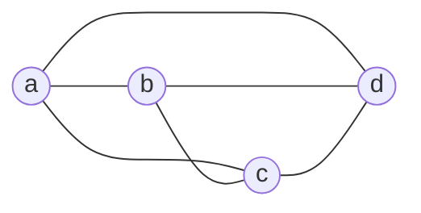

# 5ª Lista - Exercício 6

## 1. Tipo de questão

Questão construtiva: é preciso desenhar um grafo que tenha ciclo hamiltoniano, mas não tenha circuito de Euler.

## 2. Estratégia de resolução

Queremos um grafo hamiltoniano. Para isso, basta construir um grafo que contenha um ciclo passando por todos os vértices.

Ao mesmo tempo, queremos que ele não seja de Euler. Para impedir que um grafo conectado seja euleriano, basta fazer com que pelo menos um vértice tenha grau ímpar.

Um exemplo simples é o grafo completo $K_4$.

## 3. Resolução detalhada

Considere o grafo $G=K_4$ com:

$$
V(G)=\{a,b,c,d\}
$$

e

$$
E(G)=\{ab,ac,ad,bc,bd,cd\}.
$$

Visualmente:

### Verificação de que o grafo é hamiltoniano

O ciclo:

$$
a,b,c,d,a
$$

é um ciclo hamiltoniano.

De fato:

- $a$ é adjacente a $b$;
- $b$ é adjacente a $c$;
- $c$ é adjacente a $d$;
- $d$ é adjacente a $a$.

Além disso, o ciclo passa exatamente uma vez por todos os vértices:

$$
\{a,b,c,d\}.
$$

Logo, $G$ é hamiltoniano.

### Verificação de que o grafo não é de Euler

Agora calculemos os graus.

Em $K_4$, cada vértice é adjacente aos outros três vértices. Portanto:

$$
\deg(a)=\deg(b)=\deg(c)=\deg(d)=3.
$$

Todos os vértices têm grau ímpar.

Pelo critério de Euler, um grafo conectado é de Euler se todos os seus vértices têm grau par.

Como $G$ tem vértices de grau ímpar, $G$ não é de Euler.

### Por que Hierholzer e Fleury não se aplicam aqui

Os algoritmos de Hierholzer e Fleury servem para construir um circuito de Euler quando esse circuito existe.

Neste exercício, porém, o objetivo é justamente construir um grafo que não seja de Euler. Como $K_4$ tem vértices de grau ímpar, não há circuito de Euler a ser construído.

Portanto, tentar aplicar Hierholzer ou Fleury neste grafo levaria necessariamente a um bloqueio antes de usar todas as arestas e retornar ao vértice inicial. O método correto aqui é o critério dos graus: basta identificar que há vértices de grau ímpar para concluir que o grafo não é de Euler.

## 4. Resposta final

Um exemplo é o grafo completo $K_4$, com:

$$
V(G)=\{a,b,c,d\}
$$

e

$$
E(G)=\{ab,ac,ad,bc,bd,cd\}.
$$

Ele é hamiltoniano, pois contém o ciclo:

$$
a,b,c,d,a.
$$

Ele não é de Euler, pois todos os vértices têm grau $3$, que é ímpar.

## 5. Comentários didáticos

A teoria subjacente é a diferença entre condição hamiltoniana e condição euleriana.

Um ciclo hamiltoniano depende dos vértices: ele deve passar por todos os vértices exatamente uma vez e retornar ao ponto inicial.

Um circuito de Euler depende das arestas: ele deve passar por todas as arestas exatamente uma vez e retornar ao ponto inicial.

O grafo $K_4$ é um bom exemplo porque tem muitas arestas, o que facilita encontrar ciclos hamiltonianos, mas seus graus são ímpares, o que impede a existência de circuito de Euler.

Um erro comum é pensar que “ter muitos ciclos” torna o grafo euleriano. Isso é falso. Para ser de Euler, o critério decisivo é o grau dos vértices: todos precisam ser pares.

Outro erro comum é pensar que hamiltoniano implica euleriano, ou que euleriano implica hamiltoniano. Os Exercícios 5 e 6 mostram que essas propriedades são independentes.

Hierholzer e Fleury são algoritmos de construção de circuito euleriano, não critérios para tornar um grafo euleriano. Antes de aplicá-los, é preciso verificar as condições de existência: no caso de grafos não dirigidos conectados, todos os vértices devem ter grau par.
