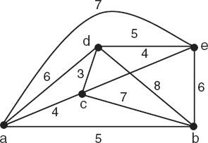

# 5ª Lista - Exercício 7

## 1. Leitura do grafo

Questão com grafo ponderado representado por imagem.



Vértices:

$$
V(G)=\{a,b,c,d,e\}.
$$

Lista de adjacência ponderada:

```text
a: b(5) c(4) d(6) e(7)
b: a(5) c(7) d(8) e(6)
c: a(4) b(7) d(3) e(4)
d: a(6) b(8) c(3) e(5)
e: a(7) b(6) c(4) d(5)
```

## 2. Estratégia de resolução

O problema do caixeiro-viajante, neste contexto, pede um ciclo hamiltoniano de menor custo total.

O enunciado afirma que o ciclo:

$$
e,b,a,c,d,e
$$

é uma solução. Para mostrar isso, precisamos verificar duas coisas:

- ele é um ciclo hamiltoniano, isto é, passa por todos os vértices exatamente uma vez e retorna ao início;
- seu custo total é mínimo entre todos os ciclos hamiltonianos possíveis.

Como o grafo tem apenas $5$ vértices, podemos comparar os custos de todos os ciclos hamiltonianos distintos, considerando ciclos iguais quando diferem apenas por rotação ou sentido de percurso.

## 3. Resolução detalhada

### Verificação de que $e,b,a,c,d,e$ é ciclo hamiltoniano

O ciclo proposto é:

$$
e,b,a,c,d,e.
$$

Ele usa os vértices:

$$
e,\ b,\ a,\ c,\ d
$$

e retorna a $e$.

Portanto, passa por todos os vértices de:

$$
V(G)=\{a,b,c,d,e\}
$$

exatamente uma vez antes de retornar ao início.

Agora verificamos as arestas e os pesos:

- $eb$ tem peso $6$;
- $ba$ tem peso $5$;
- $ac$ tem peso $4$;
- $cd$ tem peso $3$;
- $de$ tem peso $5$.

Logo, o custo total é:

$$
6+5+4+3+5=23.
$$

Assim, o ciclo $e,b,a,c,d,e$ é um ciclo hamiltoniano de custo $23$.

### Verificação de otimalidade

Para provar que esse ciclo é solução do problema do caixeiro-viajante, precisamos mostrar que nenhum outro ciclo hamiltoniano tem custo menor.

Fixando o vértice $a$ como início e eliminando repetições por inversão de sentido, os ciclos hamiltonianos distintos têm os seguintes custos:

| Ciclo | Custo |
|---|---:|
| $a,b,e,d,c,a$ | $23$ |
| $a,b,e,c,d,a$ | $24$ |
| $a,b,d,e,c,a$ | $26$ |
| $a,b,c,d,e,a$ | $27$ |
| $a,b,c,e,d,a$ | $27$ |
| $a,b,d,c,e,a$ | $27$ |
| $a,c,b,e,d,a$ | $28$ |
| $a,c,d,b,e,a$ | $28$ |
| $a,c,e,b,d,a$ | $28$ |
| $a,d,c,b,e,a$ | $29$ |
| $a,c,b,d,e,a$ | $31$ |
| $a,d,b,c,e,a$ | $32$ |

O menor custo encontrado é:

$$
23.
$$

O ciclo da tabela com custo $23$ é:

$$
a,b,e,d,c,a.
$$

Esse ciclo é o mesmo que o ciclo do enunciado, apenas percorrido no sentido inverso e começando em outro vértice:

$$
e,b,a,c,d,e.
$$

Portanto, o ciclo $e,b,a,c,d,e$ tem custo mínimo.

## 4. Resposta final

O ciclo:

$$
e,b,a,c,d,e
$$

é uma solução do problema do caixeiro-viajante.

Seu custo total é:

$$
6+5+4+3+5=23.
$$

Nenhum outro ciclo hamiltoniano tem custo menor que $23$.

## 5. Comentários didáticos

A teoria subjacente é a versão ponderada do problema do caixeiro-viajante. O objetivo não é apenas encontrar um ciclo hamiltoniano, mas encontrar um ciclo hamiltoniano de menor custo total.

Neste problema, cada aresta tem um peso. O custo de um ciclo é a soma dos pesos das arestas percorridas.

Um detalhe importante é que ciclos podem ser escritos de várias formas equivalentes. Por exemplo:

$$
e,b,a,c,d,e
$$

e

$$
a,c,d,e,b,a
$$

representam o mesmo ciclo, apenas começando em vértices diferentes.

Além disso, percorrer o ciclo no sentido inverso não muda o custo:

$$
e,d,c,a,b,e
$$

tem as mesmas arestas e o mesmo custo.

Um erro comum é verificar apenas que o ciclo passa por todos os vértices e esquecer de provar que ele tem custo mínimo. Para o problema do caixeiro-viajante, isso não basta: é preciso comparar custos ou apresentar um argumento que exclua ciclos mais baratos.

Como o grafo tem apenas $5$ vértices, a comparação direta de todos os ciclos hamiltonianos distintos é uma justificativa adequada e transparente.
