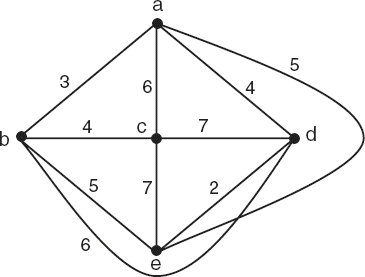

# 5ª Lista - Exercício 8

## 1. Leitura do grafo

Questão com grafo ponderado representado por imagem.



Vértices:

$$
V(G)=\{a,b,c,d,e\}.
$$

Lista de adjacência ponderada:

```text
a: b(3) c(6) d(4) e(5)
b: a(3) c(4) d(6) e(5)
c: a(6) b(4) d(7) e(7)
d: a(4) b(6) c(7) e(2)
e: a(5) b(5) c(7) d(2)
```

## 2. Estratégia de resolução

O problema do caixeiro-viajante pede um ciclo hamiltoniano de menor custo total.

Como o grafo tem $5$ vértices, podemos comparar diretamente todos os ciclos hamiltonianos distintos. Para evitar repetições, fixamos o vértice $a$ como início e consideramos ciclos iguais quando diferem apenas por rotação ou por inversão do sentido.

## 3. Resolução detalhada

Um ciclo hamiltoniano deve passar uma vez por cada vértice:

$$
\{a,b,c,d,e\}
$$

e retornar ao vértice inicial.

Fixando $a$ como ponto inicial, os ciclos hamiltonianos distintos e seus custos são:

| Ciclo | Custo |
|---|---:|
| $a,b,c,e,d,a$ | $20$ |
| $a,b,c,d,e,a$ | $21$ |
| $a,c,b,e,d,a$ | $21$ |
| $a,b,e,d,c,a$ | $23$ |
| $a,c,b,d,e,a$ | $23$ |
| $a,b,d,e,c,a$ | $24$ |
| $a,d,c,b,e,a$ | $25$ |
| $a,b,e,c,d,a$ | $26$ |
| $a,d,b,c,e,a$ | $26$ |
| $a,b,d,c,e,a$ | $28$ |
| $a,c,e,b,d,a$ | $28$ |
| $a,c,d,b,e,a$ | $29$ |

O menor custo é:

$$
20.
$$

Esse custo é obtido pelo ciclo:

$$
a,b,c,e,d,a.
$$

Vamos conferir o cálculo:

- $ab$ tem peso $3$;
- $bc$ tem peso $4$;
- $ce$ tem peso $7$;
- $ed$ tem peso $2$;
- $da$ tem peso $4$.

Logo:

$$
3+4+7+2+4=20.
$$

Portanto, $a,b,c,e,d,a$ é uma solução ótima do problema do caixeiro-viajante.

## 4. Resposta final

Uma solução ótima é o ciclo:

$$
a,b,c,e,d,a.
$$

O custo total é:

$$
20.
$$

## 5. Comentários didáticos

A teoria subjacente é o problema do caixeiro-viajante em grafo ponderado. O objetivo é encontrar, entre todos os ciclos hamiltonianos, aquele com menor soma de pesos.

Neste exercício, o grafo tem apenas $5$ vértices. Por isso, a enumeração direta dos ciclos hamiltonianos distintos é viável e didática.

Dois ciclos que diferem apenas pelo ponto de partida representam a mesma solução. Por exemplo:

$$
a,b,c,e,d,a
$$

e

$$
c,e,d,a,b,c
$$

representam o mesmo ciclo.

Também não precisamos contar separadamente o ciclo percorrido no sentido inverso:

$$
a,d,e,c,b,a.
$$

Ele usa as mesmas arestas e, portanto, tem o mesmo custo.

Um erro comum é escolher o ciclo que parece usar várias arestas pequenas, mas sem comparar com os demais. No problema do caixeiro-viajante, a resposta precisa ser globalmente mínima, não apenas localmente boa.

Outro erro comum é confundir caminho hamiltoniano com ciclo hamiltoniano. A solução precisa retornar ao vértice inicial.
