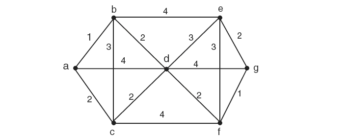
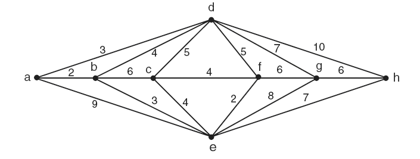

# 5ª Lista - Exercício 9

## 1. Leitura dos grafos

Questão com dois grafos ponderados representados por imagem.

### Grafo (a)



Vértices:

$$
V(G_a)=\{a,b,c,d,e,f,g\}.
$$

Lista de adjacência ponderada proposta:

```text
a: b(1) c(2) d(4)
b: a(1) c(3) d(2) e(4)
c: a(2) b(3) d(2) f(4)
d: a(4) b(2) c(2) e(3) f(2) g(4)
e: b(4) d(3) f(3) g(2)
f: c(4) d(2) e(3) g(1)
g: d(4) e(2) f(1)
```

### Grafo (b)



Vértices:

$$
V(G_b)=\{a,b,c,d,e,f,g,h\}.
$$

Lista de adjacência ponderada proposta:

```text
a: b(2) d(3) e(9)
b: a(2) c(6) d(4) e(3)
c: b(6) d(5) e(4) f(4)
d: a(3) b(4) c(5) f(5) g(7) h(10)
e: a(9) b(3) c(4) f(2) g(8) h(7)
f: c(4) d(5) e(2) g(6)
g: d(7) e(8) f(6) h(6)
h: d(10) e(7) g(6)
```

## 2. Estratégia de resolução

O problema do carteiro chinês pede um percurso fechado de menor custo que passe por todas as arestas do grafo pelo menos uma vez.

Se o grafo já fosse euleriano, bastaria encontrar um circuito de Euler. Quando há vértices de grau ímpar, precisamos repetir algumas arestas para transformar o grafo em um multigrafo euleriano.

O procedimento será:

1. calcular o grau de cada vértice;
2. identificar os vértices de grau ímpar;
3. encontrar o caminho mínimo entre os vértices ímpares;
4. duplicar as arestas desse caminho;
5. construir um circuito de Euler no multigrafo resultante.

Como cada um dos dois grafos tem apenas dois vértices de grau ímpar, não é necessário comparar emparelhamentos diferentes. Basta duplicar um caminho mínimo entre esses dois vértices.

## 3. Resolução detalhada

### Grafo (a)

Primeiro calculamos os graus dos vértices, ignorando os pesos:

$$
\deg(a)=3,\quad \deg(b)=4,\quad \deg(c)=4,\quad \deg(d)=6,
$$

$$
\deg(e)=4,\quad \deg(f)=4,\quad \deg(g)=3.
$$

Os vértices de grau ímpar são:

$$
a \quad \text{e} \quad g.
$$

Portanto, para transformar o grafo em euleriano, devemos duplicar um caminho de menor custo entre $a$ e $g$.

Um caminho mínimo entre $a$ e $g$ é:

$$
a,b,d,f,g.
$$

Seu custo é:

$$
w(ab)+w(bd)+w(df)+w(fg)=1+2+2+1=6.
$$

Logo, duplicamos as arestas:

$$
ab,\ bd,\ df,\ fg.
$$

Agora calculemos o custo de todas as arestas originais do grafo:

$$
1+2+4+3+2+4+2+4+3+2+4+3+2+1=37.
$$

Como precisamos repetir arestas de custo total $6$, o custo mínimo do percurso do carteiro chinês é:

$$
37+6=43.
$$

Um circuito euleriano no multigrafo obtido após a duplicação é:

$$
a,b,d,f,g,f,e,g,d,f,c,d,e,b,d,a,c,b,a.
$$

Vamos verificar a ideia desse circuito. Ele começa e termina em $a$ e percorre todas as arestas originais ao menos uma vez. As arestas repetidas são exatamente as do caminho mínimo duplicado:

$$
ab,\ bd,\ df,\ fg.
$$

Assim, o percurso tem custo total $43$.

### Grafo (b)

Calculamos os graus:

$$
\deg(a)=3,\quad \deg(b)=4,\quad \deg(c)=4,\quad \deg(d)=6,
$$

$$
\deg(e)=6,\quad \deg(f)=4,\quad \deg(g)=4,\quad \deg(h)=3.
$$

Os vértices de grau ímpar são:

$$
a \quad \text{e} \quad h.
$$

Portanto, devemos duplicar um caminho mínimo entre $a$ e $h$.

Um caminho mínimo entre $a$ e $h$ é:

$$
a,b,e,h.
$$

Seu custo é:

$$
w(ab)+w(be)+w(eh)=2+3+7=12.
$$

Logo, duplicamos as arestas:

$$
ab,\ be,\ eh.
$$

O custo total das arestas originais é:

$$
2+3+9+6+4+3+5+4+4+5+7+10+2+8+7+6+6=91.
$$

Como precisamos repetir arestas de custo total $12$, o custo mínimo do percurso do carteiro chinês é:

$$
91+12=103.
$$

Um circuito euleriano no multigrafo obtido após a duplicação é:

$$
a,b,e,h,g,f,e,h,d,g,e,c,f,d,c,b,e,a,d,b,a.
$$

Esse circuito começa e termina em $a$ e percorre todas as arestas originais ao menos uma vez. As arestas repetidas são:

$$
ab,\ be,\ eh.
$$

Assim, o percurso tem custo total $103$.

## 4. Resposta final

Para o grafo (a), uma solução ótima é:

$$
a,b,d,f,g,f,e,g,d,f,c,d,e,b,d,a,c,b,a.
$$

O custo mínimo é:

$$
43.
$$

Para o grafo (b), uma solução ótima é:

$$
a,b,e,h,g,f,e,h,d,g,e,c,f,d,c,b,e,a,d,b,a.
$$

O custo mínimo é:

$$
103.
$$

## 5. Comentários didáticos

O problema do carteiro chinês é diferente do problema do caixeiro-viajante.

No caixeiro-viajante, queremos visitar todos os vértices exatamente uma vez e retornar ao início. A preocupação principal são os vértices.

No carteiro chinês, queremos percorrer todas as arestas pelo menos uma vez e retornar ao início. A preocupação principal são as arestas.

Se um grafo conectado tem todos os vértices de grau par, então ele tem um circuito de Euler. Nesse caso, o carteiro percorre cada aresta exatamente uma vez, e o custo ótimo é simplesmente a soma dos pesos de todas as arestas.

Quando existem vértices de grau ímpar, não há circuito de Euler no grafo original. Para resolver o problema, repetimos algumas arestas. Repetir uma aresta aumenta o grau dos seus dois extremos em $1$. Por isso, o objetivo é escolher repetições que tornem todos os graus pares com o menor custo adicional possível.

Nos dois grafos deste exercício aparecem exatamente dois vértices de grau ímpar. Isso simplifica bastante a solução: basta encontrar o caminho mínimo entre esses dois vértices e duplicar todas as arestas desse caminho.

No grafo (a), os vértices ímpares são $a$ e $g$, e o caminho mínimo escolhido foi:

$$
a,b,d,f,g.
$$

No grafo (b), os vértices ímpares são $a$ e $h$, e o caminho mínimo escolhido foi:

$$
a,b,e,h.
$$

Depois da duplicação, o grafo deixa de ser um grafo simples e passa a ser tratado como multigrafo, pois algumas arestas aparecem duas vezes. Isso não é problema: circuitos de Euler são naturalmente definidos em multigrafos.

Para construir o percurso final, usamos a ideia do algoritmo de Hierholzer: uma vez que todos os graus ficam pares, percorremos ciclos fechados e os costuramos até usar todas as arestas do multigrafo.

Um erro comum é tentar encontrar um caminho que passe por todas as arestas sem repetir nenhuma, mesmo quando há vértices de grau ímpar. Isso é impossível para um percurso fechado. A repetição de arestas não é uma falha da solução; ela é justamente o recurso necessário para tornar o percurso fechado viável.

Outro erro comum é duplicar qualquer caminho entre os vértices ímpares. Para que a solução seja ótima, o caminho duplicado precisa ter custo mínimo.
