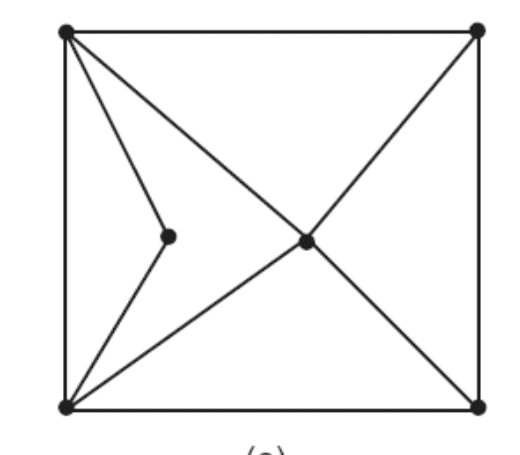
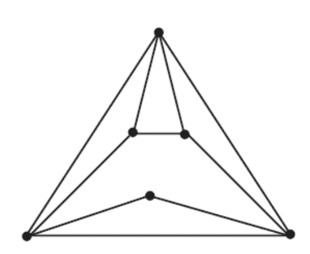

# 5ª Lista - Exercício 16

## 1. Leitura dos grafos

Questão com dois grafos não ponderados representados por imagem.

Como os vértices não estão rotulados na figura, adotamos a seguinte regra de rotulação: primeiro por faixas horizontais, da esquerda para a direita; depois de cima para baixo.

### Grafo (a)



Vértices:

$$
V(G_a)=\{v_1,v_2,v_3,v_4,v_5,v_6\}.
$$

Rotulação adotada:

- $v_1$: vértice superior esquerdo;
- $v_2$: vértice superior direito;
- $v_3$: vértice interno à esquerda;
- $v_4$: vértice interno central;
- $v_5$: vértice inferior esquerdo;
- $v_6$: vértice inferior direito.

Lista de adjacência proposta:

```text
v1: v2 v3 v4 v5
v2: v1 v4 v6
v3: v1 v5
v4: v1 v2 v5 v6
v5: v1 v3 v4 v6
v6: v2 v4 v5
```

### Grafo (b)



Vértices:

$$
V(G_b)=\{u_1,u_2,u_3,u_4,u_5,u_6\}.
$$

Rotulação adotada:

- $u_1$: vértice superior;
- $u_2$: vértice interno superior esquerdo;
- $u_3$: vértice interno superior direito;
- $u_4$: vértice interno inferior;
- $u_5$: vértice inferior esquerdo;
- $u_6$: vértice inferior direito.

Lista de adjacência proposta:

```text
u1: u2 u3 u5 u6
u2: u1 u3 u5
u3: u1 u2 u6
u4: u5 u6
u5: u1 u2 u4 u6
u6: u1 u3 u4 u5
```

## 2. Estratégia de resolução

Para mostrar que dois grafos são isomorfos, precisamos construir uma correspondência bijetiva entre seus vértices que preserve adjacências.

Em outras palavras, procuramos uma função:

$$
\varphi:V(G_a)\to V(G_b)
$$

tal que, para quaisquer vértices $x$ e $y$ de $G_a$:

$$
xy\in E(G_a) \Longleftrightarrow \varphi(x)\varphi(y)\in E(G_b).
$$

Usaremos as listas de adjacência aprovadas para propor uma bijeção e verificar que cada vizinhança é preservada.

## 3. Resolução detalhada

Uma bijeção que preserva as adjacências é:

$$
\varphi(v_1)=u_5,\quad
\varphi(v_2)=u_2,\quad
\varphi(v_3)=u_4,
$$

$$
\varphi(v_4)=u_1,\quad
\varphi(v_5)=u_6,\quad
\varphi(v_6)=u_3.
$$

Vamos verificar pelas listas de adjacência.

No grafo (a), temos:

```text
v1: v2 v3 v4 v5
```

Aplicando $\varphi$, obtemos:

$$
\varphi(v_2)=u_2,\quad
\varphi(v_3)=u_4,\quad
\varphi(v_4)=u_1,\quad
\varphi(v_5)=u_6.
$$

Logo, os vizinhos de $\varphi(v_1)=u_5$ devem ser:

$$
u_2,\ u_4,\ u_1,\ u_6.
$$

Na lista do grafo (b):

```text
u5: u1 u2 u4 u6
```

Portanto, a vizinhança de $v_1$ foi preservada.

Agora verificamos os demais vértices.

Para $v_2$:

```text
v2: v1 v4 v6
```

Aplicando $\varphi$:

$$
\varphi(v_1)=u_5,\quad
\varphi(v_4)=u_1,\quad
\varphi(v_6)=u_3.
$$

Como $\varphi(v_2)=u_2$, conferimos:

```text
u2: u1 u3 u5
```

Para $v_3$:

```text
v3: v1 v5
```

Aplicando $\varphi$:

$$
\varphi(v_1)=u_5,\quad
\varphi(v_5)=u_6.
$$

Como $\varphi(v_3)=u_4$, conferimos:

```text
u4: u5 u6
```

Para $v_4$:

```text
v4: v1 v2 v5 v6
```

Aplicando $\varphi$:

$$
\varphi(v_1)=u_5,\quad
\varphi(v_2)=u_2,\quad
\varphi(v_5)=u_6,\quad
\varphi(v_6)=u_3.
$$

Como $\varphi(v_4)=u_1$, conferimos:

```text
u1: u2 u3 u5 u6
```

Para $v_5$:

```text
v5: v1 v3 v4 v6
```

Aplicando $\varphi$:

$$
\varphi(v_1)=u_5,\quad
\varphi(v_3)=u_4,\quad
\varphi(v_4)=u_1,\quad
\varphi(v_6)=u_3.
$$

Como $\varphi(v_5)=u_6$, conferimos:

```text
u6: u1 u3 u4 u5
```

Para $v_6$:

```text
v6: v2 v4 v5
```

Aplicando $\varphi$:

$$
\varphi(v_2)=u_2,\quad
\varphi(v_4)=u_1,\quad
\varphi(v_5)=u_6.
$$

Como $\varphi(v_6)=u_3$, conferimos:

```text
u3: u1 u2 u6
```

Todas as vizinhanças foram preservadas. Portanto, $\varphi$ é um isomorfismo entre os grafos (a) e (b).

## 4. Resposta final

Os grafos são isomorfos. Um isomorfismo é dado por:

$$
\varphi(v_1)=u_5,\quad
\varphi(v_2)=u_2,\quad
\varphi(v_3)=u_4,
$$

$$
\varphi(v_4)=u_1,\quad
\varphi(v_5)=u_6,\quad
\varphi(v_6)=u_3.
$$

## 5. Comentários didáticos

Dois grafos são isomorfos quando têm a mesma estrutura de adjacência, mesmo que estejam desenhados de formas diferentes.

O desenho pode enganar: no grafo (a), os vértices parecem organizados como um retângulo com diagonais; no grafo (b), parecem organizados como um triângulo com vértices internos. Essa diferença visual não impede o isomorfismo, porque isomorfismo não depende da posição geométrica dos vértices.

O que precisa ser preservado é a relação de adjacência. Se $v_i$ é adjacente a $v_j$ em $G_a$, então $\varphi(v_i)$ deve ser adjacente a $\varphi(v_j)$ em $G_b$.

Uma boa primeira verificação é comparar os graus. No grafo (a), os graus são:

$$
4,3,2,4,4,3.
$$

No grafo (b), os graus também são:

$$
4,3,3,2,4,4.
$$

Ordenando:

$$
2,3,3,4,4,4.
$$

Como as sequências de graus coincidem, o isomorfismo é possível. Isso não prova que os grafos são isomorfos, mas ajuda a orientar a busca.

Depois disso, a prova efetiva é a bijeção $\varphi$ apresentada na resolução. O ponto essencial é que ela preserva todas as vizinhanças.

Um erro comum é tentar provar isomorfismo apenas dizendo que os desenhos “parecem iguais”. Isso não é suficiente. É necessário dar uma correspondência explícita entre os vértices ou justificar formalmente que as adjacências são preservadas.

Outro erro comum é comparar posições no desenho em vez de comparar vizinhos. A mesma estrutura abstrata pode ter desenhos muito diferentes.
