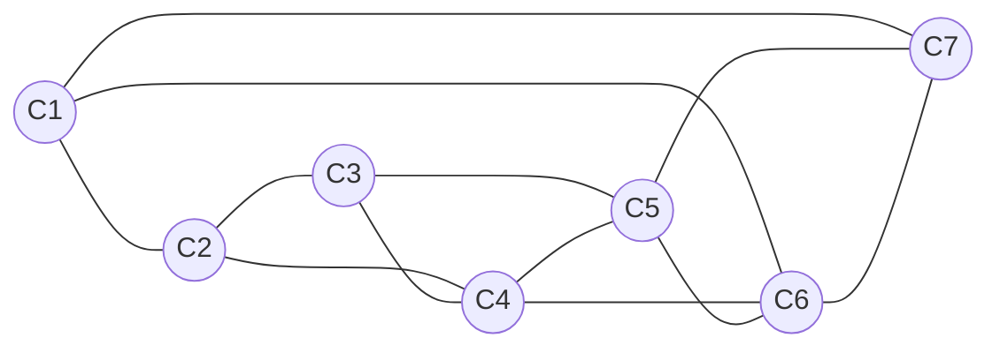

# 5ª Lista - Exercício 23

## 1. Tipo de questão

Questão de modelagem por coloração de grafos.

Cada produto químico será representado por um vértice. Quando dois produtos não puderem ser armazenados no mesmo local, ligamos os vértices correspondentes por uma aresta.

Assim, cada cor representa um local de armazenamento. Produtos com a mesma cor podem ficar no mesmo local; produtos adjacentes precisam receber cores diferentes.

## 2. Estratégia de resolução

Vamos transformar a tabela em um grafo de incompatibilidades.

Depois, faremos duas coisas:

1. aplicar o algoritmo de coloração sequencial simples na ordem natural $C_1,C_2,\ldots,C_7$;
2. justificar que $3$ cores não bastam.

Com isso, concluímos que o número mínimo de locais de armazenamento é $4$.

## 3. Resolução detalhada

Pela tabela, as incompatibilidades são:

$$
C_1C_2,\ C_1C_6,\ C_1C_7,
$$

$$
C_2C_3,\ C_2C_4,
$$

$$
C_3C_4,\ C_3C_5,
$$

$$
C_4C_5,\ C_4C_6,
$$

$$
C_5C_6,\ C_5C_7,
$$

$$
C_6C_7.
$$

Portanto:

$$
V(G)=\{C_1,C_2,C_3,C_4,C_5,C_6,C_7\}
$$

e

$$
E(G)=\{C_1C_2,C_1C_6,C_1C_7,C_2C_3,C_2C_4,C_3C_4,C_3C_5,C_4C_5,C_4C_6,C_5C_6,C_5C_7,C_6C_7\}.
$$

Lista de adjacência do grafo de incompatibilidades:

```text
C1: C2 C6 C7
C2: C1 C3 C4
C3: C2 C4 C5
C4: C2 C3 C5 C6
C5: C3 C4 C6 C7
C6: C1 C4 C5 C7
C7: C1 C5 C6
```

O grafo de incompatibilidades pode ser representado:



Agora aplicamos o algoritmo de coloração sequencial simples.

Usaremos a ordem natural:

$$
C_1,C_2,C_3,C_4,C_5,C_6,C_7.
$$

No algoritmo sequencial simples, percorremos os vértices nessa ordem e atribuímos a cada vértice a menor cor disponível que ainda não aparece em seus vizinhos já coloridos.

| Etapa | Vértice | Vizinhos já coloridos | Cores indisponíveis | Cores disponíveis | Cor escolhida |
|---:|---|---|---|---|---|
| $1$ | $C_1$ | nenhum | $\varnothing$ | $\{1\}$ | Cor $1$ |
| $2$ | $C_2$ | $C_1$ | $\{1\}$ | $\{2\}$ | Cor $2$ |
| $3$ | $C_3$ | $C_2$ | $\{2\}$ | $\{1,3\}$ | Cor $1$ |
| $4$ | $C_4$ | $C_2,C_3$ | $\{1,2\}$ | $\{3\}$ | Cor $3$ |
| $5$ | $C_5$ | $C_3,C_4$ | $\{1,3\}$ | $\{2,4\}$ | Cor $2$ |
| $6$ | $C_6$ | $C_1,C_4,C_5$ | $\{1,2,3\}$ | $\{4\}$ | Cor $4$ |
| $7$ | $C_7$ | $C_1,C_5,C_6$ | $\{1,2,4\}$ | $\{3\}$ | Cor $3$ |

Portanto, a coloração sequencial obtida é:

| Local | Produtos |
|---|---|
| Local 1 | $C_1,\ C_3$ |
| Local 2 | $C_2,\ C_5$ |
| Local 3 | $C_4,\ C_7$ |
| Local 4 | $C_6$ |

Agora precisamos justificar que $3$ locais não bastam.

Suponha, por contradição, que fosse possível usar apenas $3$ cores.

Os vértices $C_1$, $C_6$ e $C_7$ formam um triângulo, pois:

$$
C_1C_6,\quad C_1C_7,\quad C_6C_7 \in E(G).
$$

Logo, eles precisam usar as três cores diferentes.

Agora observe o triângulo formado por $C_5$, $C_6$ e $C_7$. Como $C_5$ é adjacente a $C_6$ e a $C_7$, ele não pode usar as cores de $C_6$ nem de $C_7$. Portanto, com apenas $3$ cores, $C_5$ teria que usar a mesma cor de $C_1$.

Em seguida, considere o triângulo $C_4,C_5,C_6$. Como $C_4$ é adjacente a $C_5$ e a $C_6$, ele não pode usar as cores de $C_5$ nem de $C_6$. Assim, $C_4$ teria que usar a mesma cor de $C_7$.

Agora considere o triângulo $C_3,C_4,C_5$. Como $C_3$ é adjacente a $C_4$ e a $C_5$, ele teria que usar a mesma cor de $C_6$.

Por fim, considere o triângulo $C_2,C_3,C_4$. Como $C_2$ é adjacente a $C_3$ e a $C_4$, ele teria que usar a mesma cor de $C_1$.

Mas $C_1$ e $C_2$ são adjacentes. Portanto, eles não podem ter a mesma cor.

Chegamos a uma contradição. Logo, $3$ cores não bastam.

Como encontramos uma coloração com $4$ cores e provamos que $3$ cores são insuficientes, o número mínimo de locais é:

$$
4.
$$

## 4. Resposta final

São necessários, no mínimo, $4$ locais de armazenamento.

Uma alocação possível é:

| Local | Produtos |
|---|---|
| Local 1 | $C_1,\ C_3$ |
| Local 2 | $C_2,\ C_5$ |
| Local 3 | $C_4,\ C_7$ |
| Local 4 | $C_6$ |

## 5. Comentários didáticos

A teoria subjacente é a coloração de vértices.

Em um problema de coloração de vértices, queremos atribuir cores aos vértices de modo que vértices adjacentes recebam cores diferentes.

Neste exercício, as cores representam locais de armazenamento. Uma aresta representa uma incompatibilidade: se há uma aresta entre dois produtos, eles não podem ficar no mesmo local.

O número cromático $\chi(G)$ é o menor número de cores necessárias para colorir o grafo. Aqui, encontramos:

$$
\chi(G)=4.
$$

A parte mais importante da solução não é apenas executar o algoritmo sequencial e obter uma coloração com $4$ cores. Isso mostra que $4$ locais são suficientes para essa ordem de processamento, mas não mostra sozinho que $4$ é o mínimo.

Para provar que $4$ é o mínimo, precisamos mostrar que $3$ cores não bastam. Neste caso, a impossibilidade de usar $3$ cores vem do encadeamento de triângulos:

$$
C_1C_6C_7,\quad C_5C_6C_7,\quad C_4C_5C_6,\quad C_3C_4C_5,\quad C_2C_3C_4.
$$

Cada triângulo força três cores diferentes, e a sequência dessas restrições acaba obrigando $C_1$ e $C_2$ a terem a mesma cor, embora sejam incompatíveis.

Um erro comum é confundir “encontrei uma coloração com $4$ cores” com “provei que o mínimo é $4$”. A primeira afirmação prova apenas que $4$ é suficiente. Para provar minimalidade, é necessário excluir a possibilidade de usar menos cores.

Outro erro comum é interpretar a tabela ao contrário. O asterisco indica incompatibilidade, portanto vira aresta no grafo. A ausência de asterisco significa que os dois produtos podem ficar no mesmo local, desde que isso não viole outras incompatibilidades.

Também é importante lembrar que a coloração sequencial simples depende da ordem dos vértices. Neste exercício usamos a ordem natural $C_1,C_2,\ldots,C_7$. Em outras ordens, o algoritmo poderia produzir uma coloração diferente. Por isso, a prova de que $3$ cores não bastam continua sendo necessária para justificar que $4$ é realmente o número mínimo.
