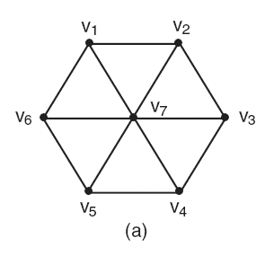
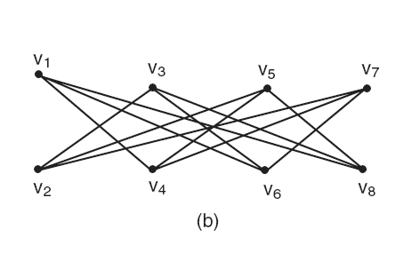
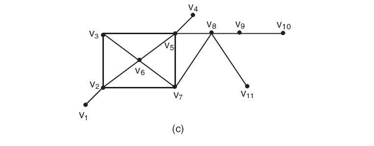

# 5ª Lista - Exercício 24

## 1. Leitura dos grafos

Questão com três grafos não ponderados representados por imagem.

Como os vértices já estão rotulados na figura, usaremos, em cada grafo, a ordem natural dos rótulos para aplicar o algoritmo de coloração sequencial simples:

$$
v_1,v_2,v_3,\ldots
$$

### Grafo (a)



Vértices:

$$
V(G_a)=\{v_1,v_2,v_3,v_4,v_5,v_6,v_7\}.
$$

Ordem sequencial adotada:

$$
v_1,v_2,v_3,v_4,v_5,v_6,v_7.
$$

Lista de adjacência proposta:

```text
v1: v2 v6 v7
v2: v1 v3 v7
v3: v2 v4 v7
v4: v3 v5 v7
v5: v4 v6 v7
v6: v1 v5 v7
v7: v1 v2 v3 v4 v5 v6
```

### Grafo (b)



Vértices:

$$
V(G_b)=\{v_1,v_2,v_3,v_4,v_5,v_6,v_7,v_8\}.
$$

Ordem sequencial adotada:

$$
v_1,v_2,v_3,v_4,v_5,v_6,v_7,v_8.
$$

Lista de adjacência proposta:

```text
v1: v4 v6 v8
v2: v3 v5 v7
v3: v2 v6 v8
v4: v1 v5 v7
v5: v2 v4 v8
v6: v1 v3 v7
v7: v2 v4 v6
v8: v1 v3 v5
```

### Grafo (c)



Vértices:

$$
V(G_c)=\{v_1,v_2,v_3,v_4,v_5,v_6,v_7,v_8,v_9,v_{10},v_{11}\}.
$$

Ordem sequencial adotada:

$$
v_1,v_2,v_3,v_4,v_5,v_6,v_7,v_8,v_9,v_{10},v_{11}.
$$

Lista de adjacência proposta:

```text
v1: v2
v2: v1 v3 v6 v7
v3: v2 v5 v6
v4: v5
v5: v3 v4 v6 v7 v8
v6: v2 v3 v5 v7
v7: v2 v5 v6 v8
v8: v5 v7 v9 v11
v9: v8 v10
v10: v9
v11: v8
```

## 2. Estratégia de resolução

Aplicaremos o algoritmo de coloração sequencial simples em cada grafo.

O procedimento é:

1. percorrer os vértices na ordem natural dos rótulos;
2. em cada vértice, observar as cores já usadas pelos vizinhos previamente coloridos;
3. atribuir a menor cor disponível.

A coloração sequencial simples depende da ordem dos vértices. Portanto, os resultados abaixo valem para as ordens declaradas na leitura dos grafos.

## 3. Resolução detalhada

### Grafo (a)

Ordem:

$$
v_1,v_2,v_3,v_4,v_5,v_6,v_7.
$$

| Etapa | Vértice | Vizinhos já coloridos | Cores indisponíveis | Cores disponíveis | Cor escolhida |
|---:|---|---|---|---|---|
| $1$ | $v_1$ | nenhum | $\varnothing$ | $\{1\}$ | Cor $1$ |
| $2$ | $v_2$ | $v_1$ | $\{1\}$ | $\{2\}$ | Cor $2$ |
| $3$ | $v_3$ | $v_2$ | $\{2\}$ | $\{1,3\}$ | Cor $1$ |
| $4$ | $v_4$ | $v_3$ | $\{1\}$ | $\{2,3\}$ | Cor $2$ |
| $5$ | $v_5$ | $v_4$ | $\{2\}$ | $\{1,3\}$ | Cor $1$ |
| $6$ | $v_6$ | $v_1,v_5$ | $\{1\}$ | $\{2,3\}$ | Cor $2$ |
| $7$ | $v_7$ | $v_1,v_2,v_3,v_4,v_5,v_6$ | $\{1,2\}$ | $\{3\}$ | Cor $3$ |

Coloração obtida:

| Cor | Vértices |
|---|---|
| Cor $1$ | $v_1,v_3,v_5$ |
| Cor $2$ | $v_2,v_4,v_6$ |
| Cor $3$ | $v_7$ |

### Grafo (b)

Ordem:

$$
v_1,v_2,v_3,v_4,v_5,v_6,v_7,v_8.
$$

| Etapa | Vértice | Vizinhos já coloridos | Cores indisponíveis | Cores disponíveis | Cor escolhida |
|---:|---|---|---|---|---|
| $1$ | $v_1$ | nenhum | $\varnothing$ | $\{1\}$ | Cor $1$ |
| $2$ | $v_2$ | nenhum | $\varnothing$ | $\{1,2\}$ | Cor $1$ |
| $3$ | $v_3$ | $v_2$ | $\{1\}$ | $\{2\}$ | Cor $2$ |
| $4$ | $v_4$ | $v_1$ | $\{1\}$ | $\{2,3\}$ | Cor $2$ |
| $5$ | $v_5$ | $v_2,v_4$ | $\{1,2\}$ | $\{3\}$ | Cor $3$ |
| $6$ | $v_6$ | $v_1,v_3$ | $\{1,2\}$ | $\{3,4\}$ | Cor $3$ |
| $7$ | $v_7$ | $v_2,v_4,v_6$ | $\{1,2,3\}$ | $\{4\}$ | Cor $4$ |
| $8$ | $v_8$ | $v_1,v_3,v_5$ | $\{1,2,3\}$ | $\{4,5\}$ | Cor $4$ |

Coloração obtida:

| Cor | Vértices |
|---|---|
| Cor $1$ | $v_1,v_2$ |
| Cor $2$ | $v_3,v_4$ |
| Cor $3$ | $v_5,v_6$ |
| Cor $4$ | $v_7,v_8$ |

### Grafo (c)

Ordem:

$$
v_1,v_2,v_3,v_4,v_5,v_6,v_7,v_8,v_9,v_{10},v_{11}.
$$

| Etapa | Vértice | Vizinhos já coloridos | Cores indisponíveis | Cores disponíveis | Cor escolhida |
|---:|---|---|---|---|---|
| $1$ | $v_1$ | nenhum | $\varnothing$ | $\{1\}$ | Cor $1$ |
| $2$ | $v_2$ | $v_1$ | $\{1\}$ | $\{2\}$ | Cor $2$ |
| $3$ | $v_3$ | $v_2$ | $\{2\}$ | $\{1,3\}$ | Cor $1$ |
| $4$ | $v_4$ | nenhum | $\varnothing$ | $\{1,2,3\}$ | Cor $1$ |
| $5$ | $v_5$ | $v_3,v_4$ | $\{1\}$ | $\{2,3\}$ | Cor $2$ |
| $6$ | $v_6$ | $v_2,v_3,v_5$ | $\{1,2\}$ | $\{3\}$ | Cor $3$ |
| $7$ | $v_7$ | $v_2,v_5,v_6$ | $\{2,3\}$ | $\{1,4\}$ | Cor $1$ |
| $8$ | $v_8$ | $v_5,v_7$ | $\{1,2\}$ | $\{3,4\}$ | Cor $3$ |
| $9$ | $v_9$ | $v_8$ | $\{3\}$ | $\{1,2,4\}$ | Cor $1$ |
| $10$ | $v_{10}$ | $v_9$ | $\{1\}$ | $\{2,3,4\}$ | Cor $2$ |
| $11$ | $v_{11}$ | $v_8$ | $\{3\}$ | $\{1,2,4\}$ | Cor $1$ |

Coloração obtida:

| Cor | Vértices |
|---|---|
| Cor $1$ | $v_1,v_3,v_4,v_7,v_9,v_{11}$ |
| Cor $2$ | $v_2,v_5,v_{10}$ |
| Cor $3$ | $v_6,v_8$ |

## 4. Resposta final

Pelo algoritmo de coloração sequencial simples, nas ordens adotadas:

- grafo (a): $3$ cores;
- grafo (b): $4$ cores;
- grafo (c): $3$ cores.

As classes de cores são:

Grafo (a):

$$
\text{Cor }1=\{v_1,v_3,v_5\},\quad
\text{Cor }2=\{v_2,v_4,v_6\},\quad
\text{Cor }3=\{v_7\}.
$$

Grafo (b):

$$
\text{Cor }1=\{v_1,v_2\},\quad
\text{Cor }2=\{v_3,v_4\},
$$

$$
\text{Cor }3=\{v_5,v_6\},\quad
\text{Cor }4=\{v_7,v_8\}.
$$

Grafo (c):

$$
\text{Cor }1=\{v_1,v_3,v_4,v_7,v_9,v_{11}\},
$$

$$
\text{Cor }2=\{v_2,v_5,v_{10}\},\quad
\text{Cor }3=\{v_6,v_8\}.
$$

## 5. Comentários didáticos

A teoria subjacente é a coloração sequencial simples de vértices.

Esse algoritmo é guloso: em cada etapa, ele toma a menor cor possível para o vértice atual, considerando apenas os vértices que já foram coloridos.

Por isso, a ordem dos vértices é parte essencial do método. A mesma estrutura de grafo pode receber uma coloração diferente se a ordem de processamento mudar.

Nos três grafos, usamos a ordem natural dos rótulos:

$$
v_1,v_2,v_3,\ldots
$$

As colunas de cores indisponíveis e cores disponíveis ajudam a evitar um erro comum: olhar para todos os vizinhos do vértice, inclusive os que ainda não foram coloridos. No algoritmo sequencial, só importam os vizinhos já coloridos.

Outro erro comum é concluir automaticamente que o número de cores encontrado é o número cromático do grafo. Isso nem sempre é verdade. A coloração sequencial simples produz uma coloração válida, mas não garante, em geral, que ela use o menor número possível de cores.

Neste exercício, como o enunciado pede especificamente o uso do algoritmo de coloração sequencial simples, o foco está na execução correta do procedimento na ordem adotada.
