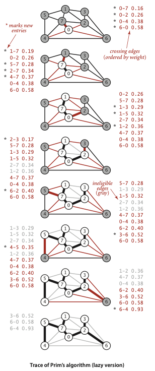
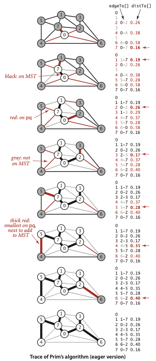
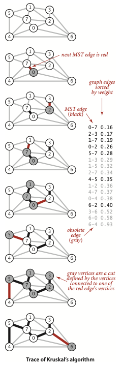
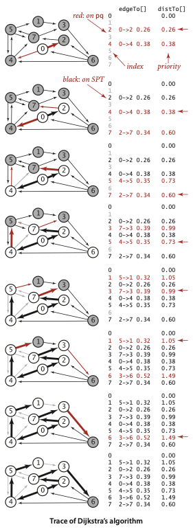
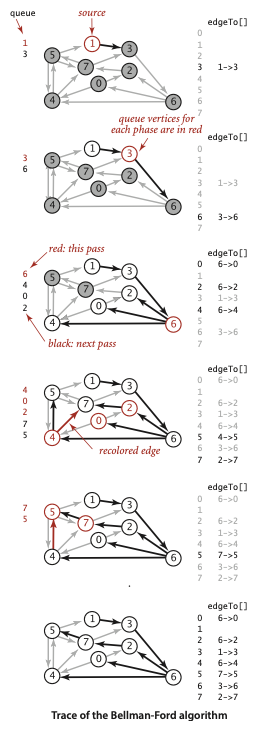
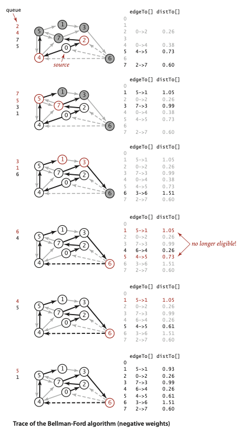
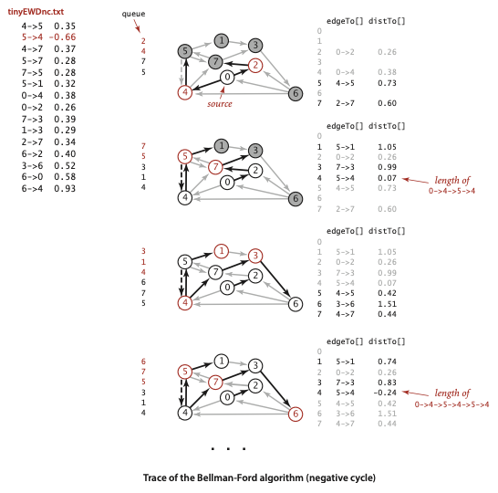
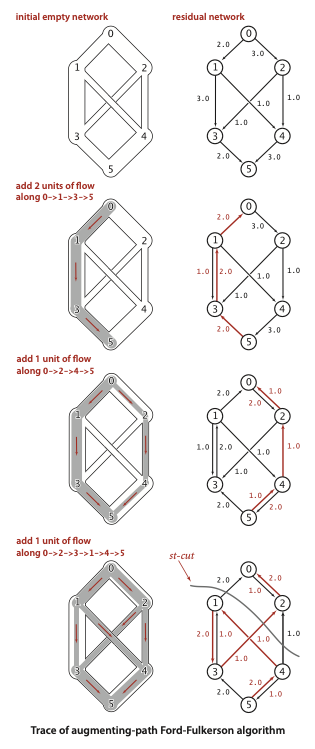
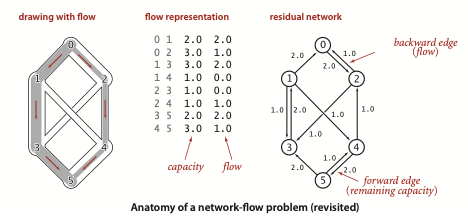

# Árvore Geradora Mínima - MST

## Algoritmo de Prim para MST

O algoritmo de Prim é nosso primeiro método para MST. A ideia é anexar uma nova
aresta a uma única árvore em crescimento a cada passo. Comece com qualquer
vértice como uma árvore de um único vértice; em seguida, adicione `V-1` arestas
a ela, sempre escolhendo em seguida (colorindo de preto) a aresta de peso mínimo
que conecta um vértice na árvore a um vértice que ainda não está na árvore
(uma aresta de cruzamento para o corte definido pelos vértices da árvore).

> **Proposição L.** O algoritmo de Prim calcula a MST de qualquer grafo
> ponderado por arestas e conexo.

> **Prova.** Imediata a partir da Proposição K. A árvore em crescimento define
> um corte sem arestas pretas; o algoritmo escolhe a aresta de cruzamento de
> peso mínimo, portanto colore sucessivamente arestas de preto de acordo com o
> algoritmo guloso.

A descrição em uma frase do algoritmo de Prim dada acima deixa sem resposta uma
questão central: como encontramos, de modo eficiente, a aresta de cruzamento de
peso mínimo? Vários métodos foram propostos; discutiremos alguns deles depois
de desenvolvermos uma solução completa baseada em uma abordagem particularmente
simples.

### Estruturas de dados

Implementamos o algoritmo de Prim com o auxílio de algumas estruturas de dados
simples e familiares. Em particular, representamos os vértices na árvore, as
arestas na árvore e as arestas de cruzamento da seguinte forma:

- Vértices na árvore: usamos um vetor booleano indexado por vértice `marked[]`,
  em que `marked[v]` é verdadeiro se `v` está na árvore.
- Arestas na árvore: usamos uma entre duas estruturas de dados: uma fila `mst`
  para coletar arestas da MST ou um vetor indexado por vértice `edgeTo[]` de
  objetos `Edge`, em que `edgeTo[v]` é a `Edge` que conecta `v` à árvore.
- Arestas de cruzamento: usamos uma fila de prioridade `MinPQ<Edge>` que
  compara arestas por peso (veja a página 610).

Essas estruturas de dados permitem responder diretamente à pergunta básica:
"Qual é a aresta de cruzamento de menor peso?"

### Mantendo o conjunto de arestas de cruzamento

Cada vez que adicionamos uma aresta à árvore, também adicionamos um vértice à
árvore. Para manter o conjunto de arestas de cruzamento, precisamos adicionar à
fila de prioridade todas as arestas desse vértice para qualquer vértice que
ainda não esteja na árvore (usando `marked[]` para identificar tais arestas).
Mas precisamos fazer mais: qualquer aresta que conecte o vértice recém-adicionado
a um vértice da árvore e que já esteja na fila de prioridade torna-se agora
inelegível (ela deixa de ser uma aresta de cruzamento porque conecta dois
vértices da árvore).

Uma implementação ansiosa do algoritmo de Prim removeria tais arestas da fila
de prioridade; primeiro consideramos uma implementação preguiçosa mais simples,
na qual deixamos essas arestas na fila de prioridade e adiamos o teste de
elegibilidade para o momento em que elas forem removidas.

### Trace do Prim preguiçoso em `tinyEWG.txt`

A figura à direita é um trace para nosso pequeno grafo de exemplo
`tinyEWG.txt`. Cada desenho representa o grafo e a fila de prioridade logo após
um vértice ser visitado (adicionado à árvore e ter as arestas de sua lista de
adjacência processadas). O conteúdo da fila de prioridade é mostrado em ordem ao
lado, com novas arestas marcadas com asteriscos.



O algoritmo constrói a MST da seguinte forma:

- Marca e examina `0` como o vértice inicial da árvore, inserindo na fila de
  prioridade todas as arestas de sua lista de adjacência.
- Adiciona `7` e `0-7` à MST e todas as arestas de sua lista de adjacência à
  fila de prioridade.
- Adiciona `1` e `1-7` à MST e todas as arestas de sua lista de adjacência à
  fila de prioridade.
- Adiciona `2` e `0-2` à MST e as arestas `2-3` e `6-2` à fila de prioridade.
  As arestas `2-7` e `1-2` tornam-se inelegíveis.
- Adiciona `3` e `2-3` à MST e a aresta `3-6` à fila de prioridade. A aresta
  `1-3` torna-se inelegível.
- Adiciona `5` e `5-7` à MST e a aresta `4-5` à fila de prioridade. A aresta
  `1-5` torna-se inelegível.
- Remove da fila de prioridade as arestas inelegíveis `1-3`, `1-5` e `2-7`.
- Adiciona `4` e `4-5` à MST e a aresta `6-4` à fila de prioridade. As arestas
  `4-7` e `0-4` tornam-se inelegíveis.
- Remove da fila de prioridade as arestas inelegíveis `1-2`, `4-7` e `0-4`.
- Adiciona `6` e `6-2` à MST. As outras arestas incidentes a `6` tornam-se
  inelegíveis.
- Remove da fila de prioridade as arestas inelegíveis restantes `3-6`, `6-0` e
  `6-4`.

Depois de adicionar `V` vértices (e `V-1` arestas), a MST está completa. Mesmo
assim, a implementação local `algs4.LazyPrimMST` continua seu laço até a fila de
prioridade ficar vazia, removendo e ignorando as arestas inelegíveis restantes.

### Implementação

Com essa preparação, implementar o algoritmo de Prim é direto, como mostrado na
implementação `LazyPrimMST` na página ao lado. Assim como em nossas
implementações de busca em profundidade e busca em largura nas duas seções
anteriores, ele calcula a MST no construtor para que métodos clientes possam
obter propriedades da MST por métodos de consulta.

Usamos um método privado `visit()` que coloca um vértice na árvore, marcando-o
como visitado e então colocando na fila de prioridade todas as suas arestas
incidentes que não são inelegíveis, garantindo assim que a fila de prioridade
contenha as arestas de cruzamento de vértices da árvore para vértices fora da
árvore (talvez também algumas arestas inelegíveis). O laço interno é uma
tradução em código da descrição em uma frase do algoritmo: retiramos uma aresta
da fila de prioridade e (se ela não for inelegível) a adicionamos à árvore, e
também adicionamos à árvore o novo vértice ao qual ela leva, atualizando o
conjunto de arestas de cruzamento chamando `visit()` com esse vértice como
argumento.

O método `weight()` exige iterar pelas arestas da árvore para somar seus pesos
(abordagem preguiçosa) ou manter uma soma acumulada em uma variável de instância
(abordagem ansiosa), e é deixado como Exercício 4.3.31.

### Tempo de execução

Quão rápido é o algoritmo de Prim? Essa pergunta não é difícil de responder,
dado nosso conhecimento das características de comportamento das filas de
prioridade.

> **Proposição M.** A versão preguiçosa do algoritmo de Prim usa espaço
> proporcional a `E` e tempo proporcional a `E log E` (no pior caso) para
> calcular a MST de um grafo ponderado por arestas e conexo com `E` arestas e
> `V` vértices.

> **Prova.** O gargalo do algoritmo é o número de comparações de pesos de
> arestas nos métodos da fila de prioridade `insert()` e `delMin()`. O número
> de arestas na fila de prioridade é no máximo `E`, o que dá o limite de espaço.
> No pior caso, o custo de uma inserção é `~lg E` e o custo de remover o mínimo
> é `~2 lg E` (veja a Proposição Q no Capítulo 2). Como no máximo `E` arestas
> são inseridas e no máximo `E` são removidas, segue o limite de tempo.

Na prática, o limite superior para o tempo de execução é um pouco conservador,
porque o número de arestas na fila de prioridade costuma ser muito menor que
`E`. A existência de um algoritmo tão simples, eficiente e útil para uma tarefa
tão desafiadora é notável. A seguir, discutimos brevemente algumas melhorias.
Como de costume, a avaliação detalhada dessas melhorias em aplicações críticas
de desempenho é tarefa para especialistas.

## Versão ansiosa do algoritmo de Prim

Para melhorar `LazyPrimMST`, poderíamos tentar remover da fila de prioridade as
arestas inelegíveis, de modo que a fila contivesse apenas as arestas de
cruzamento entre vértices da árvore e vértices fora da árvore. Mas podemos
eliminar ainda mais arestas. A chave é observar que nosso único interesse está
na aresta mínima de cada vértice fora da árvore para um vértice da árvore.

Quando adicionamos um vértice `v` à árvore, a única mudança possível em relação
a cada vértice `w` fora da árvore é que adicionar `v` pode aproximar `w` da
árvore em comparação com antes. Em resumo, não precisamos manter na fila de
prioridade todas as arestas de `w` para vértices da árvore; precisamos apenas
acompanhar a aresta de peso mínimo e verificar se a adição de `v` à árvore
exige atualizar esse mínimo (por causa de uma aresta `v-w` com peso menor), o
que podemos fazer ao processar cada aresta na lista de adjacência de `v`.

Em outras palavras, mantemos na fila de prioridade apenas uma aresta para cada
vértice `w` fora da árvore: a aresta mais leve que o conecta à árvore. Qualquer
aresta mais pesada que conecte `w` à árvore se tornará inelegível em algum
momento, portanto não há necessidade de mantê-la na fila de prioridade.

`PrimMST` (Algoritmo 4.7 na página 622) implementa o algoritmo de Prim usando
nosso tipo de dado de fila de prioridade indexada da Seção 2.4 (veja a página
320). Ele substitui a estrutura de dados `mst[]` em `LazyPrimMST` por dois
vetores indexados por vértice, `edgeTo[]` e `distTo[]`, que têm as seguintes
propriedades:

- Se `v` não está na árvore, mas tem pelo menos uma aresta que o conecta à
  árvore, então `edgeTo[v]` é a aresta mais leve que conecta `v` à árvore, e
  `distTo[v]` é o peso dessa aresta.
- Todos esses vértices `v` são mantidos na fila de prioridade indexada, como um
  índice `v` associado ao peso de `edgeTo[v]`.

A implicação central dessas propriedades é que a menor chave na fila de
prioridade é o peso da aresta de cruzamento de peso mínimo, e seu vértice
associado `v` é o próximo a ser adicionado à árvore. Para manter as estruturas
de dados, `PrimMST` retira um vértice `v` da fila de prioridade e então verifica
cada aresta `v-w` em sua lista de adjacência. Se `w` está marcado, a aresta é
inelegível; se ele não está na fila de prioridade ou se o peso da aresta é menor
que a melhor `edgeTo[w]` conhecida, o código atualiza as estruturas de dados
para estabelecer `v-w` como a melhor forma conhecida de conectar `w` à árvore.

### Trace do Prim ansioso em `tinyEWG.txt`

A figura na página ao lado é um trace de `PrimMST` para nosso pequeno grafo de
exemplo `tinyEWG.txt`. O conteúdo dos vetores `edgeTo[]` e `distTo[]` é
mostrado depois que cada vértice é adicionado à MST, com cores para representar
os vértices da MST (índice em preto), os vértices fora da MST (índice em cinza),
as arestas da MST (em preto) e os pares índice/valor da fila de prioridade (em
vermelho). Nos desenhos, a aresta mais leve que conecta cada vértice fora da
MST a um vértice da MST é desenhada em vermelho.



O algoritmo adiciona arestas à MST na mesma ordem da versão preguiçosa; a
diferença está nas operações da fila de prioridade. Ele constrói a MST da
seguinte forma:

- Marca e examina `0` como o vértice inicial da árvore, inserindo cada vértice
  adjacente fora da árvore na fila de prioridade indexada com o peso da aresta
  correspondente como sua chave, pois cada uma dessas arestas é a melhor (única)
  conexão conhecida entre um vértice da árvore e um vértice fora da árvore.
- Adiciona `7` e `0-7` à MST, substitui `0-4` por `4-7` como a aresta mais leve
  de um vértice da árvore para `4`, e insere os vértices `1` e `5` com chaves
  dadas pelas arestas `1-7` e `5-7`. A aresta `2-7` não afeta a fila de
  prioridade porque seu peso não é menor que o peso da conexão conhecida da MST
  para `2`.
- Adiciona `1` e `1-7` à MST e insere o vértice `3` com chave dada pela aresta
  `1-3`.
- Adiciona `2` e `0-2` à MST, substitui `6-0` por `6-2` como a aresta mais leve
  de um vértice da árvore para `6`, e substitui `1-3` por `2-3` como a aresta
  mais leve de um vértice da árvore para `3`.
- Adiciona `3` e `2-3` à MST.
- Adiciona `5` e `5-7` à MST e substitui `4-7` por `4-5` como a aresta mais
  leve de um vértice da árvore para `4`.
- Adiciona `4` e `4-5` à MST.
- Adiciona `6` e `6-2` à MST.

Depois de adicionar `V-1` arestas, a MST está completa e a fila de prioridade
está vazia.

Quando o cliente local `algs4.PrimMST` imprime `edges()`, as arestas aparecem em
ordem de índice de vértice a partir de `edgeTo[]`, não na ordem operacional de
`delMin()` usada no trace.

Um argumento essencialmente idêntico ao da prova da Proposição M prova que a
versão ansiosa do algoritmo de Prim encontra a MST de um grafo ponderado por
arestas e conexo em tempo proporcional a `E log V` e espaço extra proporcional
a `V`.

> **Proposição N.** A versão ansiosa do algoritmo de Prim usa espaço extra
> proporcional a `V` e tempo proporcional a `E log V` (no pior caso) para
> calcular a MST de um grafo ponderado por arestas e conexo com `E` arestas e
> `V` vértices.

> **Prova.** O número de vértices na fila de prioridade é no máximo `V`, e há
> três vetores indexados por vértice, o que implica o limite de espaço. O
> algoritmo usa `V` operações de inserção, `V` operações de remover o mínimo e,
> no pior caso, `E` operações de alteração de prioridade. Esses números,
> combinados com o fato de que nossa implementação baseada em heap da fila de
> prioridade indexada implementa todas essas operações em tempo proporcional a
> `log V` (veja a página 321), implicam o limite de tempo.

Para os grandes grafos esparsos que são típicos na prática, não há diferença
assintótica no limite de tempo (porque `lg E ~ lg V` para grafos esparsos); o
limite de espaço é uma melhoria por fator constante (mas significativa).
Análises e experimentos adicionais são mais apropriados para especialistas que
enfrentam aplicações críticas de desempenho, nas quais muitos fatores entram em
jogo, incluindo as implementações de `MinPQ` e `IndexMinPQ`, a representação do
grafo, propriedades do modelo de grafo da aplicação e assim por diante. Como de
costume, essas melhorias precisam ser consideradas cuidadosamente, pois o aumento
da complexidade do código só se justifica em aplicações nas quais ganhos de
desempenho por fatores constantes são importantes, e pode até ser
contraproducente em sistemas modernos complexos.

O diagrama à direita mostra o algoritmo de Prim em operação em nosso grafo
euclidiano de 250 vértices `mediumEWG.txt`. É um processo dinâmico fascinante
(veja também o Exercício 4.3.27). Na maioria das vezes, a árvore cresce
conectando um novo vértice ao vértice recém-adicionado. Ao alcançar uma região
sem vértices próximos fora da árvore, o crescimento começa a partir de outra
parte da árvore.

## Algoritmo de Kruskal

O segundo algoritmo de MST que consideramos em detalhe processa as arestas em
ordem de seus pesos, da menor para a maior. Ele escolhe para a MST (colorindo de
preto) cada aresta que não forma um ciclo com as arestas já adicionadas, parando
após adicionar `V-1` arestas.

As arestas pretas formam uma floresta de árvores que evolui gradualmente para
uma única árvore, a MST. Esse método é conhecido como algoritmo de Kruskal.

> **Proposição O.** O algoritmo de Kruskal calcula a MST de qualquer grafo
> ponderado por arestas e conexo.

> **Prova.** Imediata a partir da Proposição K. Se a próxima aresta a ser
> considerada não forma um ciclo com as arestas pretas, ela cruza um corte
> definido pelo conjunto de vértices conectados a um dos vértices da aresta por
> arestas pretas (e seu complemento). Como a aresta não cria ciclo, ela é a única
> aresta de cruzamento vista até então; e como consideramos as arestas em ordem
> ordenada, ela é uma aresta de cruzamento de peso mínimo. Assim, o algoritmo
> escolhe sucessivamente uma aresta de cruzamento de peso mínimo, de acordo com
> o algoritmo guloso.

### Relação com o algoritmo de Prim

O algoritmo de Prim constrói a MST uma aresta por vez, encontrando a cada passo
uma nova aresta para anexar a uma única árvore em crescimento. O algoritmo de
Kruskal também constrói a MST uma aresta por vez; mas, em contraste, ele
encontra uma aresta que conecta duas árvores em uma floresta de árvores em
crescimento.

Começamos com uma floresta degenerada de `V` árvores de um único vértice e
executamos a operação de combinar duas árvores (usando a aresta mais leve
possível) até restar apenas uma árvore: a MST.

### Trace de Kruskal em `tinyEWG.txt`

A figura à esquerda mostra um exemplo passo a passo da operação do algoritmo de
Kruskal em `tinyEWG.txt`. O algoritmo considera as arestas em ordem crescente de
peso e usa union-find para decidir se cada aresta conecta dois componentes
diferentes ou se formaria um ciclo.



A implementação local `algs4.KruskalMST` escolhe as seguintes arestas para a
MST:

- Escolhe `0-7`.
- Escolhe `2-3`.
- Escolhe `1-7`.
- Escolhe `0-2`.
- Escolhe `5-7`.
- Determina que `1-3`, `1-5` e `2-7` são inelegíveis.
- Escolhe `4-5`.
- Determina que `1-2`, `4-7` e `0-4` são inelegíveis.
- Escolhe `6-2`.

A MST resultante tem peso `1.81`.

Trace computado das estruturas de dados a partir de `KruskalTrace` usando
[`dataset/tinyEWG.txt`](../../../dataset/tinyEWG.txt):

Este trace segue a implementação local `algs4.KruskalMST`: ela copia todas as
arestas para um vetor, ordena o vetor com `Arrays.sort(edges)` e então percorre
o vetor ordenado até que a MST contenha `V-1` arestas.

**Estado inicial**

- `components`: `{0} {1} {2} {3} {4} {5} {6} {7}`
- `uf.parent[]`: `[0:0; 1:1; 2:2; 3:3; 4:4; 5:5; 6:6; 7:7]`
- `uf.rank[]`: `[0:0; 1:0; 2:0; 3:0; 4:0; 5:0; 6:0; 7:0]`
- `uf.count`: `8`
- `mst`: `[]`
- `weight`: `0.00`

**Passo 0: considerar `0-7 0.16`**

- Decisão: aceita; `find(0)=0` e `find(7)=7`, portanto `union(0,7)` é
  aplicada.
- `components`: `{0,7} {1} {2} {3} {4} {5} {6}`
- `uf.parent[]`: `[0:0; 1:1; 2:2; 3:3; 4:4; 5:5; 6:6; 7:0]`
- `uf.rank[]`: `[0:1; 1:0; 2:0; 3:0; 4:0; 5:0; 6:0; 7:0]`
- `uf.count`: `7`
- `mst`: `[0-7 0.16]`
- `weight`: `0.16`

**Passo 1: considerar `2-3 0.17`**

- Decisão: aceita; `find(2)=2` e `find(3)=3`, portanto `union(2,3)` é
  aplicada.
- `components`: `{0,7} {1} {2,3} {4} {5} {6}`
- `uf.parent[]`: `[0:0; 1:1; 2:2; 3:2; 4:4; 5:5; 6:6; 7:0]`
- `uf.rank[]`: `[0:1; 1:0; 2:1; 3:0; 4:0; 5:0; 6:0; 7:0]`
- `uf.count`: `6`
- `mst`: `[0-7 0.16, 2-3 0.17]`
- `weight`: `0.33`

**Passo 2: considerar `1-7 0.19`**

- Decisão: aceita; `find(1)=1` e `find(7)=0`, portanto `union(1,7)` é
  aplicada.
- `components`: `{0,1,7} {2,3} {4} {5} {6}`
- `uf.parent[]`: `[0:0; 1:0; 2:2; 3:2; 4:4; 5:5; 6:6; 7:0]`
- `uf.rank[]`: `[0:1; 1:0; 2:1; 3:0; 4:0; 5:0; 6:0; 7:0]`
- `uf.count`: `5`
- `mst`: `[0-7 0.16, 2-3 0.17, 1-7 0.19]`
- `weight`: `0.52`

**Passo 3: considerar `0-2 0.26`**

- Decisão: aceita; `find(0)=0` e `find(2)=2`, portanto `union(0,2)` é aplicada.
- `components`: `{0,1,2,3,7} {4} {5} {6}`
- `uf.parent[]`: `[0:0; 1:0; 2:0; 3:0; 4:4; 5:5; 6:6; 7:0]`
- `uf.rank[]`: `[0:2; 1:0; 2:1; 3:0; 4:0; 5:0; 6:0; 7:0]`
- `uf.count`: `4`
- `mst`: `[0-7 0.16, 2-3 0.17, 1-7 0.19, 0-2 0.26]`
- `weight`: `0.78`

**Passo 4: considerar `5-7 0.28`**

- Decisão: aceita; `find(5)=5` e `find(7)=0`, portanto `union(5,7)` é
  aplicada.
- `components`: `{0,1,2,3,5,7} {4} {6}`
- `uf.parent[]`: `[0:0; 1:0; 2:0; 3:0; 4:4; 5:0; 6:6; 7:0]`
- `uf.rank[]`: `[0:2; 1:0; 2:1; 3:0; 4:0; 5:0; 6:0; 7:0]`
- `uf.count`: `3`
- `mst`: `[0-7 0.16, 2-3 0.17, 1-7 0.19, 0-2 0.26, 5-7 0.28]`
- `weight`: `1.06`

**Passo 5: considerar `1-3 0.29`**

- Decisão: ignorada; `find(1)=find(3)=0`, portanto `1-3` criaria um ciclo.
- `components`: `{0,1,2,3,5,7} {4} {6}`
- `uf.parent[]`: `[0:0; 1:0; 2:0; 3:0; 4:4; 5:0; 6:6; 7:0]`
- `uf.rank[]`: `[0:2; 1:0; 2:1; 3:0; 4:0; 5:0; 6:0; 7:0]`
- `uf.count`: `3`
- `mst`: `[0-7 0.16, 2-3 0.17, 1-7 0.19, 0-2 0.26, 5-7 0.28]`
- `weight`: `1.06`

**Passo 6: considerar `1-5 0.32`**

- Decisão: ignorada; `find(1)=find(5)=0`, portanto `1-5` criaria um ciclo.
- `components`: `{0,1,2,3,5,7} {4} {6}`
- `uf.parent[]`: `[0:0; 1:0; 2:0; 3:0; 4:4; 5:0; 6:6; 7:0]`
- `uf.rank[]`: `[0:2; 1:0; 2:1; 3:0; 4:0; 5:0; 6:0; 7:0]`
- `uf.count`: `3`
- `mst`: `[0-7 0.16, 2-3 0.17, 1-7 0.19, 0-2 0.26, 5-7 0.28]`
- `weight`: `1.06`

**Passo 7: considerar `2-7 0.34`**

- Decisão: ignorada; `find(2)=find(7)=0`, portanto `2-7` criaria um ciclo.
- `components`: `{0,1,2,3,5,7} {4} {6}`
- `uf.parent[]`: `[0:0; 1:0; 2:0; 3:0; 4:4; 5:0; 6:6; 7:0]`
- `uf.rank[]`: `[0:2; 1:0; 2:1; 3:0; 4:0; 5:0; 6:0; 7:0]`
- `uf.count`: `3`
- `mst`: `[0-7 0.16, 2-3 0.17, 1-7 0.19, 0-2 0.26, 5-7 0.28]`
- `weight`: `1.06`

**Passo 8: considerar `4-5 0.35`**

- Decisão: aceita; `find(4)=4` e `find(5)=0`, portanto `union(4,5)` é
  aplicada.
- `components`: `{0,1,2,3,4,5,7} {6}`
- `uf.parent[]`: `[0:0; 1:0; 2:0; 3:0; 4:0; 5:0; 6:6; 7:0]`
- `uf.rank[]`: `[0:2; 1:0; 2:1; 3:0; 4:0; 5:0; 6:0; 7:0]`
- `uf.count`: `2`
- `mst`: `[0-7 0.16, 2-3 0.17, 1-7 0.19, 0-2 0.26, 5-7 0.28, 4-5 0.35]`
- `weight`: `1.41`

**Passo 9: considerar `1-2 0.36`**

- Decisão: ignorada; `find(1)=find(2)=0`, portanto `1-2` criaria um ciclo.
- `components`: `{0,1,2,3,4,5,7} {6}`
- `uf.parent[]`: `[0:0; 1:0; 2:0; 3:0; 4:0; 5:0; 6:6; 7:0]`
- `uf.rank[]`: `[0:2; 1:0; 2:1; 3:0; 4:0; 5:0; 6:0; 7:0]`
- `uf.count`: `2`
- `mst`: `[0-7 0.16, 2-3 0.17, 1-7 0.19, 0-2 0.26, 5-7 0.28, 4-5 0.35]`
- `weight`: `1.41`

**Passo 10: considerar `4-7 0.37`**

- Decisão: ignorada; `find(4)=find(7)=0`, portanto `4-7` criaria um ciclo.
- `components`: `{0,1,2,3,4,5,7} {6}`
- `uf.parent[]`: `[0:0; 1:0; 2:0; 3:0; 4:0; 5:0; 6:6; 7:0]`
- `uf.rank[]`: `[0:2; 1:0; 2:1; 3:0; 4:0; 5:0; 6:0; 7:0]`
- `uf.count`: `2`
- `mst`: `[0-7 0.16, 2-3 0.17, 1-7 0.19, 0-2 0.26, 5-7 0.28, 4-5 0.35]`
- `weight`: `1.41`

**Passo 11: considerar `0-4 0.38`**

- Decisão: ignorada; `find(0)=find(4)=0`, portanto `0-4` criaria um ciclo.
- `components`: `{0,1,2,3,4,5,7} {6}`
- `uf.parent[]`: `[0:0; 1:0; 2:0; 3:0; 4:0; 5:0; 6:6; 7:0]`
- `uf.rank[]`: `[0:2; 1:0; 2:1; 3:0; 4:0; 5:0; 6:0; 7:0]`
- `uf.count`: `2`
- `mst`: `[0-7 0.16, 2-3 0.17, 1-7 0.19, 0-2 0.26, 5-7 0.28, 4-5 0.35]`
- `weight`: `1.41`

**Passo 12: considerar `6-2 0.40`**

- Decisão: aceita; `find(6)=6` e `find(2)=0`, portanto `union(6,2)` é
  aplicada. A MST agora tem `V-1` arestas, portanto a implementação local para.
- `components`: `{0,1,2,3,4,5,6,7}`
- `uf.parent[]`: `[0:0; 1:0; 2:0; 3:0; 4:0; 5:0; 6:0; 7:0]`
- `uf.rank[]`: `[0:2; 1:0; 2:1; 3:0; 4:0; 5:0; 6:0; 7:0]`
- `uf.count`: `1`
- `mst`: `[0-7 0.16, 2-3 0.17, 1-7 0.19, 0-2 0.26, 5-7 0.28,
  4-5 0.35, 6-2 0.40]`
- `weight`: `1.81`

### Implementação

O algoritmo de Kruskal também não é difícil de implementar, dados os
instrumentos algorítmicos básicos que consideramos neste livro. Conceitualmente,
precisamos de:

- As arestas em ordem crescente de peso.
- Uma estrutura union-find (Seção 1.5) para identificar arestas que causariam
  ciclos.
- Uma fila (Seção 1.3) para coletar as arestas da MST.

O livro apresenta essa ideia usando uma fila de prioridade (Seção 2.4) para
considerar as arestas em ordem de peso. A implementação local
`algs4.KruskalMST` neste repositório, em vez disso, copia todas as arestas para
um vetor e chama `Arrays.sort(edges)`, depois percorre o vetor ordenado.

Essa diferença não altera a ideia algorítmica nem a MST resultante. Ela afeta a
descrição operacional: localmente, as arestas não são removidas de uma fila de
prioridade; elas são visitadas uma a uma a partir de um vetor ordenado.

Coletar as arestas da MST em uma `Queue` significa que, quando um cliente itera
pelas arestas, ele as obtém na ordem em que Kruskal as aceita, que é a ordem
crescente de peso. O método `weight()` pode iterar pela fila para somar os pesos
das arestas ou manter um total acumulado em uma variável de instância.

### Tempo de execução

Analisar o tempo de execução do algoritmo de Kruskal é simples porque
conhecemos os tempos de execução de suas operações básicas.

> **Proposição N (continuação).** O algoritmo de Kruskal usa espaço
> proporcional a `E` e tempo proporcional a `E log E` (no pior caso) para
> calcular a MST de um grafo ponderado por arestas e conexo com `E` arestas e
> `V` vértices.

> **Prova.** A implementação local ordena todas as arestas por peso, o que dá o
> termo `E log E`. Depois que as arestas são ordenadas, o algoritmo percorre as
> arestas em ordem e usa union-find para decidir se cada aresta conecta dois
> componentes diferentes.
>
> O algoritmo realiza até `E` verificações de conectividade e até `V-1`
> operações de união. Essas operações de union-find não contribuem para a ordem
> de crescimento `E log E` do tempo total de execução (veja a Seção 1.5). O
> vetor de arestas e a fila da MST dão o limite de espaço proporcional a `E`.

Assim como no algoritmo de Prim, o limite de custo é conservador, pois o
algoritmo termina depois de encontrar as `V-1` arestas da MST. A ordem de
crescimento do custo real é `E + E0 log E`, em que `E0` é o número de arestas
cujo peso é menor que o peso da aresta de maior peso da MST.

Apesar dessa vantagem, o algoritmo de Kruskal é em geral mais lento que o
algoritmo de Prim porque precisa realizar uma verificação de conectividade para
cada aresta, além do custo de considerar as arestas em ordem (veja o Exercício
4.3.39).

# Caminhos Mínimos

## Algoritmo de Dijkstra

Na Seção 4.3, discutimos o algoritmo de Prim para encontrar a árvore geradora
mínima (MST) de um grafo não direcionado ponderado por arestas: construímos a
MST anexando uma nova aresta a uma única árvore em crescimento a cada passo. O
algoritmo de Dijkstra é um esquema análogo para calcular uma SPT.

Começamos inicializando `dist[s]` com `0` e todas as outras entradas de
`distTo[]` com infinito positivo; então relaxamos e adicionamos à árvore um
vértice fora da árvore com o menor valor de `distTo[]`, continuando até que
todos os vértices estejam na árvore ou que nenhum vértice fora da árvore tenha
valor finito em `distTo[]`.

> **Proposição R.** O algoritmo de Dijkstra resolve o problema de caminhos
> mínimos de fonte única em digrafos ponderados por arestas com pesos não
> negativos.

> **Prova.** Se `v` é alcançável a partir da fonte, toda aresta `v->w` é
> relaxada exatamente uma vez, quando `v` é relaxado, deixando:

```txt
distTo[w] <= distTo[v] + e.weight()
```

> Essa desigualdade permanece válida até o algoritmo terminar, pois `distTo[w]`
> só pode diminuir (qualquer relaxação só pode diminuir um valor em `distTo[]`)
> e `distTo[v]` nunca muda (porque os pesos das arestas são não negativos e
> escolhemos o menor valor de `distTo[]` a cada passo; nenhuma relaxação
> posterior pode definir qualquer entrada de `distTo[]` com valor menor que
> `distTo[v]`).
>
> Assim, depois que todos os vértices alcançáveis a partir de `s` foram
> adicionados à árvore, as condições de otimalidade de caminhos mínimos são
> satisfeitas, e a Proposição P se aplica.

### Estruturas de dados

Para implementar o algoritmo de Dijkstra, adicionamos às nossas estruturas
`distTo[]` e `edgeTo[]` uma fila de prioridade indexada `pq` para acompanhar os
vértices candidatos a serem os próximos relaxados.

Lembre que uma `IndexMinPQ` nos permite associar índices a chaves (prioridades)
e remover e retornar o índice correspondente à menor chave. Para esta aplicação,
sempre associamos um vértice `v` a `distTo[v]`, e temos uma implementação direta
e imediata do algoritmo de Dijkstra como enunciado. Além disso, é imediato por
indução que as entradas de `edgeTo[]` correspondentes a vértices alcançáveis
formam uma árvore, a SPT.

### Ponto de vista alternativo

Outra forma de compreender a dinâmica do algoritmo deriva da prova. Temos o
invariante de que as entradas de `distTo[]` para vértices da árvore são
distâncias de caminhos mínimos e, para cada vértice `w` na fila de prioridade,
`distTo[w]` é o peso de um caminho mínimo de `s` até `w` que usa apenas
vértices intermediários na árvore e termina na aresta de cruzamento
`edgeTo[w]`.

A entrada `distTo[]` do vértice com a menor prioridade é um peso de caminho
mínimo: não é menor que o peso de caminho mínimo para qualquer vértice já
relaxado e não é maior que o peso de caminho mínimo para qualquer vértice ainda
não relaxado. Esse vértice é o próximo a ser relaxado. Vértices alcançáveis são
relaxados em ordem do peso de seu caminho mínimo a partir de `s`.

### Trace em `tinyEWD.txt`

Arquivo do dataset: [`dataset/tinyEWD.txt`](../../../dataset/tinyEWD.txt)



O trace é mostrado como a evolução das estruturas de dados do algoritmo: a fila
de prioridade (`pq`), as arestas da árvore de caminhos mínimos (`edgeTo[]`) e as
distâncias atualmente conhecidas mais curtas a partir da fonte (`distTo[]`).

Lista de arestas do grafo do trace:

```txt
8
15
4 5 0.35
5 4 0.35
4 7 0.37
5 7 0.28
7 5 0.28
5 1 0.32
0 4 0.38
0 2 0.26
7 3 0.39
1 3 0.29
2 7 0.34
6 2 0.40
3 6 0.52
6 0 0.58
6 4 0.93
```

Trace computado das estruturas de dados a partir de `dataset/tinyEWD.txt`:

**Passo 0: relaxar o vértice `0`**

- Atualizações: `0->2` define `edgeTo[2]` e `distTo[2]=0.26`; `0->4` define
  `edgeTo[4]` e `distTo[4]=0.38`.
- `pq`: `{2:0.26, 4:0.38}`
- `edgeTo[]`: `2:0->2 0.26`; `4:0->4 0.38`
- `distTo[]`: `0:0.00`; `2:0.26`; `4:0.38`

**Passo 1: relaxar o vértice `2`**

- Atualizações: `2->7` define `edgeTo[7]` e `distTo[7]=0.60`.
- `pq`: `{4:0.38, 7:0.60}`
- `edgeTo[]`: `2:0->2 0.26`; `4:0->4 0.38`; `7:2->7 0.34`
- `distTo[]`: `0:0.00`; `2:0.26`; `4:0.38`; `7:0.60`

**Passo 2: relaxar o vértice `4`**

- Atualizações: `4->7` é inelegível; `4->5` define `edgeTo[5]` e
  `distTo[5]=0.73`.
- `pq`: `{7:0.60, 5:0.73}`
- `edgeTo[]`: `2:0->2 0.26`; `4:0->4 0.38`; `5:4->5 0.35`;
  `7:2->7 0.34`
- `distTo[]`: `0:0.00`; `2:0.26`; `4:0.38`; `5:0.73`; `7:0.60`

**Passo 3: relaxar o vértice `7`**

- Atualizações: `7->3` define `edgeTo[3]` e `distTo[3]=0.99`; `7->5` é
  inelegível.
- `pq`: `{5:0.73, 3:0.99}`
- `edgeTo[]`: `2:0->2 0.26`; `3:7->3 0.39`; `4:0->4 0.38`;
  `5:4->5 0.35`; `7:2->7 0.34`
- `distTo[]`: `0:0.00`; `2:0.26`; `3:0.99`; `4:0.38`; `5:0.73`;
  `7:0.60`

**Passo 4: relaxar o vértice `5`**

- Atualizações: `5->1` define `edgeTo[1]` e `distTo[1]=1.05`; `5->7` e `5->4`
  são inelegíveis.
- `pq`: `{3:0.99, 1:1.05}`
- `edgeTo[]`: `1:5->1 0.32`; `2:0->2 0.26`; `3:7->3 0.39`;
  `4:0->4 0.38`; `5:4->5 0.35`; `7:2->7 0.34`
- `distTo[]`: `0:0.00`; `1:1.05`; `2:0.26`; `3:0.99`; `4:0.38`;
  `5:0.73`; `7:0.60`

**Passo 5: relaxar o vértice `3`**

- Atualizações: `3->6` define `edgeTo[6]` e `distTo[6]=1.51`.
- `pq`: `{1:1.05, 6:1.51}`
- `edgeTo[]`: `1:5->1 0.32`; `2:0->2 0.26`; `3:7->3 0.39`;
  `4:0->4 0.38`; `5:4->5 0.35`; `6:3->6 0.52`; `7:2->7 0.34`
- `distTo[]`: `0:0.00`; `1:1.05`; `2:0.26`; `3:0.99`; `4:0.38`;
  `5:0.73`; `6:1.51`; `7:0.60`

**Passo 6: relaxar o vértice `1`**

- Atualizações: `1->3` é inelegível.
- `pq`: `{6:1.51}`
- `edgeTo[]`: `1:5->1 0.32`; `2:0->2 0.26`; `3:7->3 0.39`;
  `4:0->4 0.38`; `5:4->5 0.35`; `6:3->6 0.52`; `7:2->7 0.34`
- `distTo[]`: `0:0.00`; `1:1.05`; `2:0.26`; `3:0.99`; `4:0.38`;
  `5:0.73`; `6:1.51`; `7:0.60`

**Passo 7: relaxar o vértice `6`**

- Atualizações: `6->4`, `6->0` e `6->2` são inelegíveis.
- `pq`: `{}`
- `edgeTo[]`: `1:5->1 0.32`; `2:0->2 0.26`; `3:7->3 0.39`;
  `4:0->4 0.38`; `5:4->5 0.35`; `6:3->6 0.52`; `7:2->7 0.34`
- `distTo[]`: `0:0.00`; `1:1.05`; `2:0.26`; `3:0.99`; `4:0.38`;
  `5:0.73`; `6:1.51`; `7:0.60`

Observação: a imagem mostra `distTo[6]=1.49`, mas o dataset local tem a aresta
`3 6 0.52`, portanto o valor calculado é
`distTo[3] + 0.52 = 0.99 + 0.52 = 1.51`.

A figura à direita é um trace para nosso pequeno grafo de exemplo
`tinyEWD.txt`. Para esse exemplo, o algoritmo constrói a SPT da seguinte forma:

- Adiciona `0` à árvore e seus vértices adjacentes `2` e `4` à fila de
  prioridade.
- Remove `2` da fila de prioridade, adiciona `0->2` à árvore e adiciona `7` à
  fila de prioridade.
- Remove `4` da fila de prioridade, adiciona `0->4` à árvore, testa `4->7`
  como inelegível e adiciona `5` à fila de prioridade por meio de `4->5`.
- Remove `7` da fila de prioridade, adiciona `2->7` à árvore e adiciona `3` à
  fila de prioridade. A aresta `7->5` é inelegível.
- Remove `5` da fila de prioridade, adiciona `4->5` à árvore e adiciona `1` à
  fila de prioridade. As arestas `5->7` e `5->4` são inelegíveis.
- Remove `3` da fila de prioridade, adiciona `7->3` à árvore e adiciona `6` à
  fila de prioridade.
- Remove `1` da fila de prioridade e adiciona `5->1` à árvore. A aresta `1->3`
  é inelegível.
- Remove `6` da fila de prioridade e adiciona `3->6` à árvore.

Os vértices são adicionados à SPT em ordem crescente de sua distância a partir
da fonte, como indicado pelas setas vermelhas na borda direita do diagrama.

## Bellman-Ford baseado em fila

Especificamente, podemos determinar facilmente a priori que numerosas arestas
não levarão a uma relaxação bem-sucedida em uma dada passada: as únicas arestas
que poderiam levar a uma mudança em `distTo[]` são aquelas que saem de um
vértice cujo valor de `distTo[]` mudou na passada anterior. Para acompanhar tais
vértices, usamos uma fila FIFO.

A operação do algoritmo para nosso exemplo padrão com pesos positivos é mostrada
à direita. À esquerda da figura aparecem as entradas da fila para cada passada
(em vermelho), seguidas pelas entradas da fila para a próxima passada (em
preto). Começamos com a fonte na fila e então calculamos a SPT da seguinte
forma:



Trace computado das estruturas de dados a partir de `BellmanFordTrace` usando
[`dataset/tinyEWD.txt`](../../../dataset/tinyEWD.txt), fonte `1`:

Este trace segue a ordem de iteração de adjacência do `EdgeWeightedDigraph`
local em `algs4-java`, portanto vértices com múltiplas arestas de saída são
relaxados na ordem retornada por `adj(v)`.

**Estado inicial**

- `queue`: `[1]`
- `onQueue[]`: `[0:F; 1:T; 2:F; 3:F; 4:F; 5:F; 6:F; 7:F]`
- `edgeTo[]`: `-`
- `distTo[]`: `[0:inf; 1:0.00; 2:inf; 3:inf; 4:inf; 5:inf; 6:inf; 7:inf]`
- `cost`: `0`

**Passo 0: remover `1` da fila e relaxar suas arestas de saída**

- Atualizações: `1->3 0.29` define `distTo[3]=0.29`,
  `edgeTo[3]=1->3 0.29` e enfileira `3`.
- `queue`: `[3]`
- `onQueue[]`: `[0:F; 1:F; 2:F; 3:T; 4:F; 5:F; 6:F; 7:F]`
- `edgeTo[]`: `3:1->3 0.29`
- `distTo[]`: `[0:inf; 1:0.00; 2:inf; 3:0.29; 4:inf; 5:inf; 6:inf; 7:inf]`
- `cost`: `1`

**Passo 1: remover `3` da fila e relaxar suas arestas de saída**

- Atualizações: `3->6 0.52` define `distTo[6]=0.81`,
  `edgeTo[6]=3->6 0.52` e enfileira `6`.
- `queue`: `[6]`
- `onQueue[]`: `[0:F; 1:F; 2:F; 3:F; 4:F; 5:F; 6:T; 7:F]`
- `edgeTo[]`: `3:1->3 0.29`; `6:3->6 0.52`
- `distTo[]`: `[0:inf; 1:0.00; 2:inf; 3:0.29; 4:inf; 5:inf; 6:0.81; 7:inf]`
- `cost`: `2`

**Passo 2: remover `6` da fila e relaxar suas arestas de saída**

- Atualizações: `6->4 0.93` define `distTo[4]=1.74`; `6->0 0.58` define
  `distTo[0]=1.39`; `6->2 0.40` define `distTo[2]=1.21`.
- `queue`: `[4, 0, 2]`
- `onQueue[]`: `[0:T; 1:F; 2:T; 3:F; 4:T; 5:F; 6:F; 7:F]`
- `edgeTo[]`: `0:6->0 0.58`; `2:6->2 0.40`; `3:1->3 0.29`;
  `4:6->4 0.93`; `6:3->6 0.52`
- `distTo[]`: `[0:1.39; 1:0.00; 2:1.21; 3:0.29; 4:1.74; 5:inf; 6:0.81; 7:inf]`
- `cost`: `5`

**Passo 3: remover `4` da fila e relaxar suas arestas de saída**

- Atualizações: `4->7 0.37` define `distTo[7]=2.11`; `4->5 0.35` define
  `distTo[5]=2.09`.
- `queue`: `[0, 2, 7, 5]`
- `onQueue[]`: `[0:T; 1:F; 2:T; 3:F; 4:F; 5:T; 6:F; 7:T]`
- `edgeTo[]`: `0:6->0 0.58`; `2:6->2 0.40`; `3:1->3 0.29`;
  `4:6->4 0.93`; `5:4->5 0.35`; `6:3->6 0.52`; `7:4->7 0.37`
- `distTo[]`: `[0:1.39; 1:0.00; 2:1.21; 3:0.29; 4:1.74; 5:2.09; 6:0.81; 7:2.11]`
- `cost`: `7`

**Passo 4: remover `0` da fila e relaxar suas arestas de saída**

- Atualizações: nenhuma. `0->2 0.26` e `0->4 0.38` são inelegíveis.
- `queue`: `[2, 7, 5]`
- `onQueue[]`: `[0:F; 1:F; 2:T; 3:F; 4:F; 5:T; 6:F; 7:T]`
- `edgeTo[]`: `0:6->0 0.58`; `2:6->2 0.40`; `3:1->3 0.29`;
  `4:6->4 0.93`; `5:4->5 0.35`; `6:3->6 0.52`; `7:4->7 0.37`
- `distTo[]`: `[0:1.39; 1:0.00; 2:1.21; 3:0.29; 4:1.74; 5:2.09; 6:0.81; 7:2.11]`
- `cost`: `9`

**Passo 5: remover `2` da fila e relaxar suas arestas de saída**

- Atualizações: `2->7 0.34` melhora `distTo[7]` de `2.11` para `1.55` e altera
  `edgeTo[7]` para `2->7 0.34`; `7` já está na fila.
- `queue`: `[7, 5]`
- `onQueue[]`: `[0:F; 1:F; 2:F; 3:F; 4:F; 5:T; 6:F; 7:T]`
- `edgeTo[]`: `0:6->0 0.58`; `2:6->2 0.40`; `3:1->3 0.29`;
  `4:6->4 0.93`; `5:4->5 0.35`; `6:3->6 0.52`; `7:2->7 0.34`
- `distTo[]`: `[0:1.39; 1:0.00; 2:1.21; 3:0.29; 4:1.74; 5:2.09; 6:0.81; 7:1.55]`
- `cost`: `10`

**Passo 6: remover `7` da fila e relaxar suas arestas de saída**

- Atualizações: `7->5 0.28` melhora `distTo[5]` de `2.09` para `1.83` e altera
  `edgeTo[5]` para `7->5 0.28`; `5` já está na fila. `7->3 0.39` é inelegível.
- `queue`: `[5]`
- `onQueue[]`: `[0:F; 1:F; 2:F; 3:F; 4:F; 5:T; 6:F; 7:F]`
- `edgeTo[]`: `0:6->0 0.58`; `2:6->2 0.40`; `3:1->3 0.29`;
  `4:6->4 0.93`; `5:7->5 0.28`; `6:3->6 0.52`; `7:2->7 0.34`
- `distTo[]`: `[0:1.39; 1:0.00; 2:1.21; 3:0.29; 4:1.74; 5:1.83; 6:0.81; 7:1.55]`
- `cost`: `12`

**Passo 7: remover `5` da fila e relaxar suas arestas de saída**

- Atualizações: nenhuma. `5->1 0.32`, `5->7 0.28` e `5->4 0.35` são
  inelegíveis.
- `queue`: `[]`
- `onQueue[]`: `[0:F; 1:F; 2:F; 3:F; 4:F; 5:F; 6:F; 7:F]`
- `edgeTo[]`: `0:6->0 0.58`; `2:6->2 0.40`; `3:1->3 0.29`;
  `4:6->4 0.93`; `5:7->5 0.28`; `6:3->6 0.52`; `7:2->7 0.34`
- `distTo[]`: `[0:1.39; 1:0.00; 2:1.21; 3:0.29; 4:1.74; 5:1.83; 6:0.81; 7:1.55]`
- `cost`: `15`

- Relaxa `1->3` e coloca `3` na fila.
- Relaxa `3->6` e coloca `6` na fila.
- Relaxa `6->4`, `6->0` e `6->2` e coloca `4`, `0` e `2` na fila.
- Relaxa `4->7` e `4->5` e coloca `7` e `5` na fila. Depois relaxa `0->4` e
  `0->2`, que são inelegíveis. Depois relaxa `2->7` (e recolore `4->7`).
- Relaxa `7->3`, que é inelegível. Depois relaxa `7->5` (e recolore `4->5`),
  mas não coloca `5` na fila (ele já está lá). Depois relaxa `5->1`, `5->7` e
  `5->4`, que são inelegíveis, deixando a fila vazia.

### Implementação

Implementar o algoritmo de Bellman-Ford seguindo essas linhas exige
surpreendentemente pouco código, como mostrado no Algoritmo 4.11. Ele é baseado
em duas estruturas de dados adicionais:

- Uma fila `queue` de vértices a serem relaxados.
- Um vetor booleano indexado por vértice `onQ[]` que indica quais vértices estão
  na fila, para evitar duplicatas.

Começamos colocando a fonte `s` na fila; depois entramos em um laço no qual
retiramos um vértice da fila e o relaxamos. Para adicionar vértices à fila,
aumentamos nossa implementação de `relax()` da página 648 para colocar na fila
o vértice apontado por qualquer aresta que relaxe com sucesso, como mostrado no
código abaixo. As estruturas de dados garantem que:

- Apenas uma cópia de cada vértice apareça na fila.
- Todo vértice cujos valores de `edgeTo[]` e `distTo[]` mudem em alguma passada
  seja processado na próxima passada.

Para completar a implementação, precisamos garantir que o algoritmo termine
após `V` passadas. Uma forma de conseguir isso é acompanhar explicitamente as
passadas. Nossa implementação `BellmanFordSP` (Algoritmo 4.11) usa uma abordagem
diferente, que consideraremos em detalhe na página 677: ela verifica ciclos
negativos no subconjunto de arestas do digrafo em `edgeTo[]` e termina se
encontrar um.

> **Proposição Y.** A implementação baseada em fila do algoritmo de
> Bellman-Ford resolve o problema de caminhos mínimos de fonte única a partir de
> uma fonte dada `s` (ou encontra um ciclo negativo alcançável a partir de `s`)
> para qualquer digrafo ponderado por arestas com `E` arestas e `V` vértices, em
> tempo proporcional a `EV` e espaço extra proporcional a `V`, no pior caso.

> **Prova.** Se não houver ciclo negativo alcançável a partir de `s`, o
> algoritmo termina depois das relaxações correspondentes à `(V-1)`-ésima
> passada do algoritmo genérico descrito na Proposição X (pois todos os caminhos
> mínimos têm menos de `V` arestas). Se houver um ciclo negativo alcançável a
> partir de `s`, a fila nunca esvazia (veja o Exercício 4.4.46).
>
> Se alguma aresta é relaxada durante a `V`-ésima passada do algoritmo genérico
> descrito na Proposição X, então o vetor `edgeTo[]` tem um ciclo direcionado, e
> qualquer ciclo assim é um ciclo negativo (veja o Exercício 4.4.47). No pior
> caso, o algoritmo imita o algoritmo genérico e relaxa todas as `E` arestas em
> cada uma das `V` passadas.

O algoritmo de Bellman-Ford baseado em fila é um método efetivo e eficiente para
resolver o problema de caminhos mínimos e é amplamente usado na prática, mesmo
no caso em que os pesos das arestas são positivos. Por exemplo, como mostrado no
diagrama à direita, nosso exemplo de 250 vértices termina em 14 passadas e exige
menos comparações de comprimento de caminho que o algoritmo de Dijkstra para o
mesmo problema.

### Pesos negativos

O exemplo na próxima página acompanha o progresso do algoritmo de Bellman-Ford
em um digrafo com pesos negativos. Começamos com a fonte `s` na fila e então
calculamos a SPT da seguinte forma:



Trace computado das estruturas de dados a partir de `BellmanFordTrace` usando
[`dataset/tinyEWDn.txt`](../../../dataset/tinyEWDn.txt), fonte `0`:

Este trace segue a ordem de iteração de adjacência do `EdgeWeightedDigraph`
local em `algs4-java`, portanto vértices com múltiplas arestas de saída são
relaxados na ordem retornada por `adj(v)`.

**Estado inicial**

- `queue`: `[0]`
- `onQueue[]`: `[0:T; 1:F; 2:F; 3:F; 4:F; 5:F; 6:F; 7:F]`
- `edgeTo[]`: `-`
- `distTo[]`: `[0:0.00; 1:inf; 2:inf; 3:inf; 4:inf; 5:inf; 6:inf; 7:inf]`
- `cost`: `0`

**Passo 0: remover `0` da fila e relaxar suas arestas de saída**

- Atualizações: `0->2 0.26` define `distTo[2]=0.26`; `0->4 0.38` define
  `distTo[4]=0.38`.
- `queue`: `[2, 4]`
- `onQueue[]`: `[0:F; 1:F; 2:T; 3:F; 4:T; 5:F; 6:F; 7:F]`
- `edgeTo[]`: `2:0->2 0.26`; `4:0->4 0.38`
- `distTo[]`: `[0:0.00; 1:inf; 2:0.26; 3:inf; 4:0.38; 5:inf; 6:inf; 7:inf]`
- `cost`: `2`

**Passo 1: remover `2` da fila e relaxar suas arestas de saída**

- Atualizações: `2->7 0.34` define `distTo[7]=0.60`.
- `queue`: `[4, 7]`
- `onQueue[]`: `[0:F; 1:F; 2:F; 3:F; 4:T; 5:F; 6:F; 7:T]`
- `edgeTo[]`: `2:0->2 0.26`; `4:0->4 0.38`; `7:2->7 0.34`
- `distTo[]`: `[0:0.00; 1:inf; 2:0.26; 3:inf; 4:0.38; 5:inf; 6:inf; 7:0.60]`
- `cost`: `3`

**Passo 2: remover `4` da fila e relaxar suas arestas de saída**

- Atualizações: `4->7 0.37` é inelegível; `4->5 0.35` define `distTo[5]=0.73`.
- `queue`: `[7, 5]`
- `onQueue[]`: `[0:F; 1:F; 2:F; 3:F; 4:F; 5:T; 6:F; 7:T]`
- `edgeTo[]`: `2:0->2 0.26`; `4:0->4 0.38`; `5:4->5 0.35`;
  `7:2->7 0.34`
- `distTo[]`: `[0:0.00; 1:inf; 2:0.26; 3:inf; 4:0.38; 5:0.73; 6:inf; 7:0.60]`
- `cost`: `5`

**Passo 3: remover `7` da fila e relaxar suas arestas de saída**

- Atualizações: `7->3 0.39` define `distTo[3]=0.99`; `7->5 0.28` é
  inelegível.
- `queue`: `[5, 3]`
- `onQueue[]`: `[0:F; 1:F; 2:F; 3:T; 4:F; 5:T; 6:F; 7:F]`
- `edgeTo[]`: `2:0->2 0.26`; `3:7->3 0.39`; `4:0->4 0.38`;
  `5:4->5 0.35`; `7:2->7 0.34`
- `distTo[]`: `[0:0.00; 1:inf; 2:0.26; 3:0.99; 4:0.38; 5:0.73; 6:inf; 7:0.60]`
- `cost`: `7`

**Passo 4: remover `5` da fila e relaxar suas arestas de saída**

- Atualizações: `5->1 0.32` define `distTo[1]=1.05`; `5->7 0.28` e
  `5->4 0.35` são inelegíveis.
- `queue`: `[3, 1]`
- `onQueue[]`: `[0:F; 1:T; 2:F; 3:T; 4:F; 5:F; 6:F; 7:F]`
- `edgeTo[]`: `1:5->1 0.32`; `2:0->2 0.26`; `3:7->3 0.39`;
  `4:0->4 0.38`; `5:4->5 0.35`; `7:2->7 0.34`
- `distTo[]`: `[0:0.00; 1:1.05; 2:0.26; 3:0.99; 4:0.38; 5:0.73; 6:inf; 7:0.60]`
- `cost`: `10`

**Passo 5: remover `3` da fila e relaxar suas arestas de saída**

- Atualizações: `3->6 0.52` define `distTo[6]=1.51`.
- `queue`: `[1, 6]`
- `onQueue[]`: `[0:F; 1:T; 2:F; 3:F; 4:F; 5:F; 6:T; 7:F]`
- `edgeTo[]`: `1:5->1 0.32`; `2:0->2 0.26`; `3:7->3 0.39`;
  `4:0->4 0.38`; `5:4->5 0.35`; `6:3->6 0.52`; `7:2->7 0.34`
- `distTo[]`: `[0:0.00; 1:1.05; 2:0.26; 3:0.99; 4:0.38; 5:0.73; 6:1.51; 7:0.60]`
- `cost`: `11`

**Passo 6: remover `1` da fila e relaxar suas arestas de saída**

- Atualizações: nenhuma. `1->3 0.29` é inelegível.
- `queue`: `[6]`
- `onQueue[]`: `[0:F; 1:F; 2:F; 3:F; 4:F; 5:F; 6:T; 7:F]`
- `edgeTo[]`: `1:5->1 0.32`; `2:0->2 0.26`; `3:7->3 0.39`;
  `4:0->4 0.38`; `5:4->5 0.35`; `6:3->6 0.52`; `7:2->7 0.34`
- `distTo[]`: `[0:0.00; 1:1.05; 2:0.26; 3:0.99; 4:0.38; 5:0.73; 6:1.51; 7:0.60]`
- `cost`: `12`

**Passo 7: remover `6` da fila e relaxar suas arestas de saída**

- Atualizações: `6->4 -1.25` melhora `distTo[4]` de `0.38` para `0.26` e
  altera `edgeTo[4]` para `6->4 -1.25`; `6->0 -1.40` e `6->2 -1.20` são
  inelegíveis.
- `queue`: `[4]`
- `onQueue[]`: `[0:F; 1:F; 2:F; 3:F; 4:T; 5:F; 6:F; 7:F]`
- `edgeTo[]`: `1:5->1 0.32`; `2:0->2 0.26`; `3:7->3 0.39`;
  `4:6->4 -1.25`; `5:4->5 0.35`; `6:3->6 0.52`; `7:2->7 0.34`
- `distTo[]`: `[0:0.00; 1:1.05; 2:0.26; 3:0.99; 4:0.26; 5:0.73; 6:1.51; 7:0.60]`
- `cost`: `15`

**Passo 8: remover `4` da fila e relaxar suas arestas de saída**

- Atualizações: `4->7 0.37` é inelegível; `4->5 0.35` melhora `distTo[5]` de
  `0.73` para `0.61`.
- `queue`: `[5]`
- `onQueue[]`: `[0:F; 1:F; 2:F; 3:F; 4:F; 5:T; 6:F; 7:F]`
- `edgeTo[]`: `1:5->1 0.32`; `2:0->2 0.26`; `3:7->3 0.39`;
  `4:6->4 -1.25`; `5:4->5 0.35`; `6:3->6 0.52`; `7:2->7 0.34`
- `distTo[]`: `[0:0.00; 1:1.05; 2:0.26; 3:0.99; 4:0.26; 5:0.61; 6:1.51; 7:0.60]`
- `cost`: `17`

**Passo 9: remover `5` da fila e relaxar suas arestas de saída**

- Atualizações: `5->1 0.32` melhora `distTo[1]` de `1.05` para `0.93`;
  `5->7 0.28` e `5->4 0.35` são inelegíveis.
- `queue`: `[1]`
- `onQueue[]`: `[0:F; 1:T; 2:F; 3:F; 4:F; 5:F; 6:F; 7:F]`
- `edgeTo[]`: `1:5->1 0.32`; `2:0->2 0.26`; `3:7->3 0.39`;
  `4:6->4 -1.25`; `5:4->5 0.35`; `6:3->6 0.52`; `7:2->7 0.34`
- `distTo[]`: `[0:0.00; 1:0.93; 2:0.26; 3:0.99; 4:0.26; 5:0.61; 6:1.51; 7:0.60]`
- `cost`: `20`

**Passo 10: remover `1` da fila e relaxar suas arestas de saída**

- Atualizações: nenhuma. `1->3 0.29` é inelegível.
- `queue`: `[]`
- `onQueue[]`: `[0:F; 1:F; 2:F; 3:F; 4:F; 5:F; 6:F; 7:F]`
- `edgeTo[]`: `1:5->1 0.32`; `2:0->2 0.26`; `3:7->3 0.39`;
  `4:6->4 -1.25`; `5:4->5 0.35`; `6:3->6 0.52`; `7:2->7 0.34`
- `distTo[]`: `[0:0.00; 1:0.93; 2:0.26; 3:0.99; 4:0.26; 5:0.61; 6:1.51; 7:0.60]`
- `cost`: `21`

- Relaxa `0->2` e `0->4` e coloca `2` e `4` na fila.
- Relaxa `2->7` e coloca `7` na fila. Depois relaxa `4->7`, que é inelegível.
  Depois relaxa `4->5` e coloca `5` na fila.
- Relaxa `7->3` e `5->1` e coloca `3` e `1` na fila. Depois relaxa `5->7` e
  `5->4`, que são inelegíveis.
- Relaxa `3->6` e coloca `6` na fila. Depois relaxa `1->3`, que é inelegível.
- Relaxa `6->4` e coloca `4` na fila. Essa aresta de peso negativo dá um caminho
  mais curto para `4`, portanto suas arestas precisam ser relaxadas novamente
  (elas foram relaxadas pela primeira vez na passada 2). As distâncias para `5`
  e para `1` deixam de ser válidas, mas serão corrigidas em passadas
  posteriores.
- Relaxa `4->7`, que ainda é inelegível. Depois relaxa `4->5` e coloca `5` na
  fila.
- Relaxa `5->1` e coloca `1` na fila. Depois relaxa `5->7` e `5->4`, que ainda
  são inelegíveis.
- Relaxa `1->3`, que ainda é inelegível, deixando a fila vazia.

A árvore de caminhos mínimos deste exemplo é um único caminho longo de `0` até
`1`. As arestas que saem de `4`, `5` e `1` são todas relaxadas duas vezes neste
exemplo. Reler a prova da Proposição X no contexto deste exemplo é uma boa forma
de compreendê-la melhor.

### Detecção de ciclo negativo

Nossa implementação `BellmanFordSP` verifica ciclos negativos para evitar um
laço infinito. Podemos aplicar o código que faz essa verificação para fornecer
aos clientes a capacidade de verificar e extrair ciclos negativos também. Fazemos
isso adicionando os seguintes métodos à API de SP da página 644:

| Método | Descrição |
| --- | --- |
| `boolean hasNegativeCycle()` | há um ciclo negativo? |
| `Iterable<DirectedEdge> negativeCycle()` | um ciclo negativo (`null` se não houver ciclos negativos) |

Extensões da API de caminhos mínimos para tratar ciclos negativos.

Implementar esses métodos não é difícil, como mostrado no código abaixo. Depois
de executar o construtor em `BellmanFordSP`, a prova da Proposição Y nos diz que
o digrafo tem um ciclo negativo alcançável a partir da fonte se, e somente se, a
fila não estiver vazia depois da `V`-ésima passada por todas as arestas. Além
disso, o subgrafo de arestas no nosso vetor `edgeTo[]` deve conter um ciclo
negativo.

Assim, para implementar `negativeCycle()` construímos um digrafo ponderado por
arestas a partir das arestas em `edgeTo[]` e procuramos um ciclo nesse digrafo.
Para encontrar o ciclo, usamos uma versão de `DirectedCycle` da Seção 4.2,
adaptada para funcionar em digrafos ponderados por arestas (veja o Exercício
4.4.12). Amortizamos o custo dessa verificação por meio de:

- Adicionar uma variável de instância `cycle` e um método privado
  `findNegativeCycle()` que define `cycle` como um iterador para as arestas de
  um ciclo negativo se um for encontrado (e como `null` se nenhum for
  encontrado).
- Chamar `findNegativeCycle()` a cada `V` relaxações de aresta.

Essa abordagem garante que o laço no construtor termine. Além disso, clientes
podem chamar `hasNegativeCycle()` para saber se há um ciclo negativo alcançável
a partir da fonte e `negativeCycle()` para obter tal ciclo. Adicionar a
capacidade de detectar qualquer ciclo negativo no digrafo também é uma extensão
simples (veja o Exercício 4.4.43).

O exemplo abaixo acompanha o progresso do algoritmo de Bellman-Ford em um
digrafo com ciclo negativo. As passadas 0 (não mostrada) e 1 são as mesmas de
`tinyEWDn.txt`. Na passada 2, depois de relaxar `7->3` e `5->1` e colocar `3` e
`1` na fila, ele testa `5->7`, que é inelegível, e então relaxa a aresta de peso
negativo `5->4`. Essa relaxação define `edgeTo[4]` como `5->4`, o que corta o
vértice `4` da fonte `0` em `edgeTo[]`, criando assim um ciclo `4->5->4`.

A partir desse ponto, o algoritmo gira pelo ciclo, reduzindo as distâncias de
todos os vértices tocados, até terminar quando o ciclo é detectado, com a fila
não vazia. O ciclo está no vetor `edgeTo[]`, para descoberta por
`findNegativeCycle()`. Usando a estratégia de detecção de ciclo descrita na
página anterior, o algoritmo termina quando o vértice `6` é relaxado durante a
passada 4.



Trace computado das estruturas de dados a partir de `BellmanFordTrace` usando
[`dataset/tinyEWDnc.txt`](../../../dataset/tinyEWDnc.txt), fonte `0`:

Este trace segue a ordem de iteração de adjacência do `EdgeWeightedDigraph`
local em `algs4-java`, portanto vértices com múltiplas arestas de saída são
relaxados na ordem retornada por `adj(v)`.

O algoritmo detecta o ciclo negativo da seguinte forma:

- Relaxa `0->2` e `0->4`, colocando `2` e `4` na fila.
- Relaxa `2->7`, colocando `7` na fila.
- Testa `4->7`, que é inelegível; depois relaxa `4->5`, colocando `5` na fila.
- Relaxa `7->3`, colocando `3` na fila; `7->5` é inelegível.
- Relaxa `5->1`, colocando `1` na fila. Depois ignora `5->7`, que é
  inelegível. Por fim, relaxa a aresta de peso negativo `5->4`, que melhora
  `distTo[4]` de `0.38` para `0.07` e altera `edgeTo[4]` para `5->4 -0.66`.
- Nesse ponto, `edgeTo[4]=5->4` e `edgeTo[5]=4->5`, portanto `edgeTo[]` contém
  o ciclo direcionado `4->5->4`.
- Relaxa `3->6`, colocando `6` na fila. Depois relaxa `1->3`, que é
  inelegível.
- Relaxa `4->7` e `4->5`, reduzindo distâncias alcançáveis a partir do ciclo e
  colocando `7` e `5` na fila.
- Quando `6` é relaxado, a implementação completou outro múltiplo de `V`
  relaxações de arestas (`cost=16`). Nesse ponto, `edgeTo[]` contém o ciclo
  negativo, e o algoritmo mostra o ciclo `4->5->4`, com custo total `-0.31`.

**Estado inicial**

- `queue`: `[0]`
- `onQueue[]`: `[0:T; 1:F; 2:F; 3:F; 4:F; 5:F; 6:F; 7:F]`
- `edgeTo[]`: `-`
- `distTo[]`: `[0:0.00; 1:inf; 2:inf; 3:inf; 4:inf; 5:inf; 6:inf; 7:inf]`
- `cost`: `0`

**Passo 0: remover `0` da fila e relaxar suas arestas de saída**

- Atualizações: `0->2 0.26` define `distTo[2]=0.26`; `0->4 0.38` define
  `distTo[4]=0.38`.
- `queue`: `[2, 4]`
- `onQueue[]`: `[0:F; 1:F; 2:T; 3:F; 4:T; 5:F; 6:F; 7:F]`
- `edgeTo[]`: `2:0->2 0.26`; `4:0->4 0.38`
- `distTo[]`: `[0:0.00; 1:inf; 2:0.26; 3:inf; 4:0.38; 5:inf; 6:inf; 7:inf]`
- `cost`: `2`

**Passo 1: remover `2` da fila e relaxar suas arestas de saída**

- Atualizações: `2->7 0.34` define `distTo[7]=0.60`.
- `queue`: `[4, 7]`
- `onQueue[]`: `[0:F; 1:F; 2:F; 3:F; 4:T; 5:F; 6:F; 7:T]`
- `edgeTo[]`: `2:0->2 0.26`; `4:0->4 0.38`; `7:2->7 0.34`
- `distTo[]`: `[0:0.00; 1:inf; 2:0.26; 3:inf; 4:0.38; 5:inf; 6:inf; 7:0.60]`
- `cost`: `3`

**Passo 2: remover `4` da fila e relaxar suas arestas de saída**

- Atualizações: `4->7 0.37` é inelegível; `4->5 0.35` define `distTo[5]=0.73`.
- `queue`: `[7, 5]`
- `onQueue[]`: `[0:F; 1:F; 2:F; 3:F; 4:F; 5:T; 6:F; 7:T]`
- `edgeTo[]`: `2:0->2 0.26`; `4:0->4 0.38`; `5:4->5 0.35`;
  `7:2->7 0.34`
- `distTo[]`: `[0:0.00; 1:inf; 2:0.26; 3:inf; 4:0.38; 5:0.73; 6:inf; 7:0.60]`
- `cost`: `5`

**Passo 3: remover `7` da fila e relaxar suas arestas de saída**

- Atualizações: `7->3 0.39` define `distTo[3]=0.99`; `7->5 0.28` é
  inelegível.
- `queue`: `[5, 3]`
- `onQueue[]`: `[0:F; 1:F; 2:F; 3:T; 4:F; 5:T; 6:F; 7:F]`
- `edgeTo[]`: `2:0->2 0.26`; `3:7->3 0.39`; `4:0->4 0.38`;
  `5:4->5 0.35`; `7:2->7 0.34`
- `distTo[]`: `[0:0.00; 1:inf; 2:0.26; 3:0.99; 4:0.38; 5:0.73; 6:inf; 7:0.60]`
- `cost`: `7`

**Passo 4: remover `5` da fila e relaxar suas arestas de saída**

- Atualizações: `5->1 0.32` define `distTo[1]=1.05`; `5->7 0.28` é
  inelegível; `5->4 -0.66` melhora `distTo[4]` de `0.38` para `0.07` e altera
  `edgeTo[4]` para `5->4 -0.66`.
- `queue`: `[3, 1, 4]`
- `onQueue[]`: `[0:F; 1:T; 2:F; 3:T; 4:T; 5:F; 6:F; 7:F]`
- `edgeTo[]`: `1:5->1 0.32`; `2:0->2 0.26`; `3:7->3 0.39`;
  `4:5->4 -0.66`; `5:4->5 0.35`; `7:2->7 0.34`
- `distTo[]`: `[0:0.00; 1:1.05; 2:0.26; 3:0.99; 4:0.07; 5:0.73; 6:inf; 7:0.60]`
- `cost`: `10`

**Passo 5: remover `3` da fila e relaxar suas arestas de saída**

- Atualizações: `3->6 0.52` define `distTo[6]=1.51`.
- `queue`: `[1, 4, 6]`
- `onQueue[]`: `[0:F; 1:T; 2:F; 3:F; 4:T; 5:F; 6:T; 7:F]`
- `edgeTo[]`: `1:5->1 0.32`; `2:0->2 0.26`; `3:7->3 0.39`;
  `4:5->4 -0.66`; `5:4->5 0.35`; `6:3->6 0.52`; `7:2->7 0.34`
- `distTo[]`: `[0:0.00; 1:1.05; 2:0.26; 3:0.99; 4:0.07; 5:0.73; 6:1.51; 7:0.60]`
- `cost`: `11`

**Passo 6: remover `1` da fila e relaxar suas arestas de saída**

- Atualizações: nenhuma. `1->3 0.29` é inelegível.
- `queue`: `[4, 6]`
- `onQueue[]`: `[0:F; 1:F; 2:F; 3:F; 4:T; 5:F; 6:T; 7:F]`
- `edgeTo[]`: `1:5->1 0.32`; `2:0->2 0.26`; `3:7->3 0.39`;
  `4:5->4 -0.66`; `5:4->5 0.35`; `6:3->6 0.52`; `7:2->7 0.34`
- `distTo[]`: `[0:0.00; 1:1.05; 2:0.26; 3:0.99; 4:0.07; 5:0.73; 6:1.51; 7:0.60]`
- `cost`: `12`

**Passo 7: remover `4` da fila e relaxar suas arestas de saída**

- Atualizações: `4->7 0.37` melhora `distTo[7]` de `0.60` para `0.44`;
  `4->5 0.35` melhora `distTo[5]` de `0.73` para `0.42`.
- `queue`: `[6, 7, 5]`
- `onQueue[]`: `[0:F; 1:F; 2:F; 3:F; 4:F; 5:T; 6:T; 7:T]`
- `edgeTo[]`: `1:5->1 0.32`; `2:0->2 0.26`; `3:7->3 0.39`;
  `4:5->4 -0.66`; `5:4->5 0.35`; `6:3->6 0.52`; `7:4->7 0.37`
- `distTo[]`: `[0:0.00; 1:1.05; 2:0.26; 3:0.99; 4:0.07; 5:0.42; 6:1.51; 7:0.44]`
- `cost`: `14`

**Passo 8: remover `6` da fila e relaxar suas arestas de saída**

- Atualizações: nenhuma antes da detecção do ciclo. `6->4 0.93` e `6->0 0.58`
  são inelegíveis.
- `queue`: `[7, 5]`
- `onQueue[]`: `[0:F; 1:F; 2:F; 3:F; 4:F; 5:T; 6:F; 7:T]`
- `edgeTo[]`: `1:5->1 0.32`; `2:0->2 0.26`; `3:7->3 0.39`;
  `4:5->4 -0.66`; `5:4->5 0.35`; `6:3->6 0.52`; `7:4->7 0.37`
- `distTo[]`: `[0:0.00; 1:1.05; 2:0.26; 3:0.99; 4:0.07; 5:0.42; 6:1.51; 7:0.44]`
- `cost`: `16`
- Ciclo negativo detectado: `4->5 0.35`; `5->4 -0.66`.

# Algoritmos de fluxo em redes

## Algoritmo de Ford-Fulkerson

Uma abordagem efetiva para resolver problemas de fluxo máximo foi desenvolvida
por L. R. Ford e D. R. Fulkerson em 1962. Ela é um método genérico para
aumentar fluxos incrementalmente ao longo de caminhos da fonte ao sorvedouro e
serve como base para uma família de algoritmos.

Na literatura clássica, ela é conhecida como algoritmo de Ford-Fulkerson; o
termo mais descritivo algoritmo de caminhos aumentantes também é amplamente
usado.

Considere qualquer caminho direcionado da fonte ao sorvedouro em uma rede de
fluxo st. Seja `x` o mínimo das capacidades não utilizadas das arestas no
caminho. Podemos aumentar o valor do fluxo da rede em pelo menos `x` aumentando
o fluxo em todas as arestas do caminho por essa quantidade.

Iterando essa ação, obtemos uma primeira tentativa para calcular fluxo em uma
rede: encontrar outro caminho, aumentar o fluxo ao longo desse caminho e
continuar até que todos os caminhos da fonte ao sorvedouro tenham pelo menos uma
aresta cheia (de modo que não possamos mais aumentar o fluxo dessa forma). Esse
algoritmo calcula o fluxo máximo em alguns casos, mas fica aquém em outros. O
exemplo introdutório da página 886 é um desses casos.

Para melhorar o algoritmo de modo que ele sempre encontre um fluxo máximo,
consideramos uma forma mais geral de aumentar o fluxo, ao longo de um caminho da
fonte ao sorvedouro pelo grafo não direcionado subjacente da rede. As arestas em
qualquer caminho desse tipo são de dois tipos:

- Arestas diretas, que vão no sentido do fluxo. Quando percorremos o caminho da
  fonte ao sorvedouro, percorremos a aresta de seu vértice de origem para seu
  vértice de destino.
- Arestas reversas, que vão contra o fluxo. Quando percorremos o caminho da
  fonte ao sorvedouro, percorremos a aresta de seu vértice de destino para seu
  vértice de origem.

Para qualquer caminho da fonte ao sorvedouro sem arestas diretas cheias e sem
arestas reversas vazias, podemos aumentar a quantidade de fluxo na rede
aumentando o fluxo nas arestas diretas e diminuindo o fluxo nas arestas
reversas.

A quantidade pela qual o fluxo pode ser aumentado é limitada pelo mínimo entre:

- as capacidades não utilizadas nas arestas diretas;
- os fluxos nas arestas reversas.

Tal caminho é chamado de caminho aumentante. No novo fluxo, pelo menos uma das
arestas diretas ao longo do caminho fica cheia ou pelo menos uma das arestas
reversas ao longo do caminho fica vazia.

O processo recém-esboçado é a base do algoritmo clássico de Ford-Fulkerson para
fluxo máximo (método dos caminhos aumentantes).

> **Algoritmo de Ford-Fulkerson para fluxo máximo.** Comece com fluxo zero em
> todos os lugares. Aumente o fluxo ao longo de qualquer caminho aumentante da
> fonte ao sorvedouro (sem arestas diretas cheias nem arestas reversas vazias),
> continuando até que não existam tais caminhos na rede.

Notavelmente (sob certas condições técnicas sobre propriedades numéricas do
fluxo), esse método sempre encontra um fluxo máximo, independentemente de como
escolhemos os caminhos. Assim como o algoritmo guloso de MST discutido na Seção
4.3 e o método genérico de caminhos mínimos discutido na Seção 4.4, ele é um
algoritmo genérico útil porque estabelece a corretude de toda uma família de
algoritmos mais específicos.

Somos livres para usar qualquer método para escolher o caminho. Vários
algoritmos que calculam sequências de caminhos aumentantes foram desenvolvidos,
todos levando a um fluxo máximo. Os algoritmos diferem no número de caminhos
aumentantes que calculam e nos custos de encontrar cada caminho, mas todos
implementam o algoritmo de Ford-Fulkerson e encontram um fluxo máximo.

## Teorema fluxo máximo-corte mínimo

Para mostrar que qualquer fluxo calculado por qualquer implementação do
algoritmo de Ford-Fulkerson é de fato um fluxo máximo, provamos um fato central
conhecido como teorema fluxo máximo-corte mínimo. Compreender esse teorema é um
passo crucial para compreender algoritmos de fluxo em redes.

Como seu nome sugere, o teorema se baseia em uma relação direta entre fluxos e
cortes em redes; portanto, começamos definindo termos relacionados a cortes.
Lembre da Seção 4.3 que um corte em um grafo é uma partição dos vértices em dois
conjuntos disjuntos, e uma aresta de cruzamento é uma aresta que conecta um
vértice de um conjunto a um vértice do outro conjunto. Para redes de fluxo,
refinamos essas definições da seguinte forma.

> **Definição.** Um corte st é um corte que coloca o vértice `s` em um de seus
> conjuntos e o vértice `t` no outro.

Cada aresta de cruzamento correspondente a um corte st é:

- uma aresta st, que vai de um vértice no conjunto que contém `s` para um
  vértice no conjunto que contém `t`;
- uma aresta ts, que vai na outra direção.

Às vezes chamamos o conjunto de arestas st de cruzamento de conjunto de corte. A
capacidade de um corte st em uma rede de fluxo é a soma das capacidades das
arestas st desse corte, e o fluxo através de um corte st é a diferença entre:

- a soma dos fluxos nas arestas st desse corte;
- a soma dos fluxos nas arestas ts desse corte.

Remover todas as arestas st (o conjunto de corte) em um corte st de uma rede
elimina qualquer caminho de `s` para `t`, mas adicionar qualquer uma delas de
volta poderia criar tal caminho. Cortes são a abstração apropriada para muitas
aplicações.

Para o modelo de fluxo de óleo, um corte fornece uma forma de interromper
completamente o fluxo de óleo da fonte ao sorvedouro. Se vemos a capacidade do
corte como o custo de fazer isso, interromper o fluxo da forma mais econômica é
resolver o seguinte problema.

### Corte st mínimo

Dada uma rede st, encontrar um corte st tal que a capacidade de nenhum outro
corte seja menor. Por brevidade, chamamos tal corte de mincut e o problema de
encontrar um em uma rede de problema do mincut.

O enunciado do problema do mincut não menciona fluxos, e essas definições podem
parecer uma digressão em relação à nossa discussão do algoritmo de caminhos
aumentantes. À primeira vista, calcular um mincut (um conjunto de arestas) parece
mais fácil do que calcular um fluxo máximo (uma atribuição de pesos a todas as
arestas).

Ao contrário, os problemas de fluxo máximo e corte mínimo são intimamente
relacionados. O próprio método dos caminhos aumentantes fornece uma prova. Essa
prova se apoia na seguinte relação básica entre fluxos e cortes, que fornece
imediatamente:

- uma prova de que o equilíbrio local em um fluxo st implica também equilíbrio
  global;
- um limite superior para o valor de qualquer fluxo st.

> **Proposição E.** Para qualquer fluxo st, o fluxo através de cada corte st é
> igual ao valor do fluxo.

> **Prova.** Seja `Cs` o conjunto de vértices contendo `s` e `Ct` o conjunto de
> vértices contendo `t`. Esse fato segue imediatamente por indução no tamanho de
> `Ct`.
>
> A propriedade é verdadeira por definição quando `Ct` é `t`; quando um vértice
> é movido de `Cs` para `Ct`, o equilíbrio local nesse vértice implica que a
> propriedade enunciada é preservada. Qualquer corte st pode ser criado movendo
> vértices dessa forma.

> **Corolário.** O fluxo de saída de `s` é igual ao fluxo de entrada em `t` (o
> valor do fluxo st).
>
> **Prova.** Seja `Cs` igual a `{s}`.

> **Corolário.** O valor de nenhum fluxo st pode exceder a capacidade de qualquer
> corte st.

> **Proposição F (teorema fluxo máximo-corte mínimo).** Seja `f` um fluxo st. As
> três condições a seguir são equivalentes:
>
> 1. Existe um corte st cuja capacidade é igual ao valor do fluxo `f`.
> 2. `f` é um fluxo máximo.
> 3. Não há caminho aumentante em relação a `f`.
>
> **Prova.** A condição 1 implica a condição 2 pelo corolário da Proposição E. A
> condição 2 implica a condição 3 porque a existência de um caminho aumentante
> implica a existência de um fluxo com valor maior, contradizendo a maximalidade
> de `f`.
>
> Resta provar que a condição 3 implica a condição 1. Seja `Cs` o conjunto de
> todos os vértices que podem ser alcançados a partir de `s` por um caminho não
> direcionado que não contenha aresta direta cheia nem aresta reversa vazia, e
> seja `Ct` o conjunto dos vértices restantes. Então `t` deve estar em `Ct`,
> portanto `(Cs, Ct)` é um corte st cujo conjunto de corte consiste inteiramente
> em arestas diretas cheias ou arestas reversas vazias.
>
> O fluxo através desse corte é igual à capacidade do corte (pois as arestas
> diretas estão cheias e as arestas reversas estão vazias) e também ao valor do
> fluxo (pela Proposição E).

> **Corolário (propriedade de integralidade).** Quando as capacidades são
> inteiras, existe um fluxo máximo com valores inteiros, e o algoritmo de
> Ford-Fulkerson o encontra.
>
> **Prova.** Cada caminho aumentante aumenta o fluxo por um inteiro positivo: o
> mínimo das capacidades não utilizadas nas arestas diretas e dos fluxos nas
> arestas reversas, todos sempre inteiros positivos.

## Rede residual

O algoritmo genérico de Ford-Fulkerson não especifica nenhum método particular
para encontrar um caminho aumentante. Como podemos encontrar um caminho sem
arestas diretas cheias e sem arestas reversas vazias? Para esse fim, começamos
com a seguinte definição.

> **Definição.** Dada uma rede de fluxo st e um fluxo st, a rede residual para o
> fluxo tem os mesmos vértices da rede original e uma ou duas arestas na rede
> residual para cada aresta da rede original, definidas da seguinte forma: para
> cada aresta `e` de `v` para `w` na rede original, seja `fe` seu fluxo e `ce`
> sua capacidade. Se `fe` é positivo, inclua uma aresta `w->v` na residual com
> capacidade `fe`; e, se `fe` é menor que `ce`, inclua uma aresta `v->w` na
> residual com capacidade `ce - fe`.



Se uma aresta `e` de `v` para `w` está vazia (`fe` é igual a `0`), há uma única
aresta correspondente `v->w` com capacidade `ce` na residual. Se ela está cheia
(`fe` é igual a `ce`), há uma única aresta correspondente `w->v` com capacidade
`fe` na residual. Se ela não está vazia nem cheia, tanto `v->w` quanto `w->v`
estão na residual, com suas respectivas capacidades.

No início, a representação da rede residual é um pouco confusa porque as arestas
correspondentes ao fluxo vão na direção oposta ao próprio fluxo:

- Arestas diretas representam a capacidade restante, a quantidade de fluxo que
  podemos adicionar ao percorrer essa aresta.
- Arestas reversas representam o fluxo, a quantidade de fluxo que podemos
  remover ao percorrer essa aresta.

O código da página 896 fornece os métodos da classe `FlowEdge` de que precisamos
para implementar a abstração de rede residual. Com essas implementações, nossos
algoritmos trabalham com a rede residual, mas na verdade examinam capacidades e
alteram fluxo (por meio de referências a arestas) nas arestas do cliente.

Os métodos `from()` e `other()` nos permitem processar arestas em qualquer
orientação: `e.other(v)` retorna a extremidade de `e` que não é `v`. Os métodos
`residualCapacityTo()` e `addResidualFlowTo()` implementam a rede residual.

Redes residuais permitem usar busca em grafo para encontrar um caminho
aumentante, pois qualquer caminho da fonte ao sorvedouro na rede residual
corresponde diretamente a um caminho aumentante na rede original. Aumentar o
fluxo ao longo do caminho implica fazer mudanças na rede residual: por exemplo,
pelo menos uma aresta no caminho fica cheia ou vazia, portanto pelo menos uma
aresta na rede residual muda de direção ou desaparece.

Como nossa implementação usa uma rede residual abstrata, ela apenas verifica
capacidade residual positiva e não precisa realmente inserir e remover arestas.

## Método do caminho aumentante mais curto

Talvez a implementação mais simples de Ford-Fulkerson seja usar um caminho
aumentante mais curto, medido pelo número de arestas no caminho, não por fluxo
ou capacidade. Esse método foi sugerido por J. Edmonds e R. Karp em 1972.

Nesse caso, a busca por um caminho aumentante equivale à busca em largura (BFS)
na rede residual, exatamente como descrito na Seção 4.1. A implementação
`hasAugmentingPath()` abaixo pode ser comparada à implementação de busca em
largura no Algoritmo 4.2 da página 540. O grafo residual é um digrafo, e esse é
fundamentalmente um algoritmo de processamento de digrafos, como mencionado na
página 685.

Esse método forma a base da implementação completa no Algoritmo 6.3 na próxima
página, uma implementação concisa baseada nas ferramentas que desenvolvemos. Por
brevidade, chamamos esse método de algoritmo de fluxo máximo pelo caminho
aumentante mais curto. Um trace para o exemplo é mostrado em detalhe na página
899.



O exemplo usa a rede de fluxo em `dataset/tinyFN.txt`, com fonte `0` e
sorvedouro `5`:

```txt
6
8
0 1 2.0
0 2 3.0
1 3 3.0
1 4 1.0
2 3 1.0
2 4 1.0
3 5 2.0
4 5 3.0
```

Trace computado das estruturas de dados a partir da implementação de caminho
aumentante mais curto em `algs4.FordFulkerson` usando
`mat-didatico/exercicios/und3/FordFulkerson/FordFulkersonTrace.java`. Como o caminho aumentante é
encontrado por BFS na rede residual, essa implementação segue a estratégia de
Edmonds-Karp.

O `main()` original em `algs4.FordFulkerson` constrói uma rede de fluxo aleatória
a partir de `V` e `E`. Para este trace reprodutível, o helper local lê
`dataset/tinyFN.txt` e espelha a implementação: cada iteração executa BFS na
rede residual, registra `edgeTo[]` e `marked[]`, calcula o gargalo, chama
`addResidualFlowTo()` ao longo do caminho e atualiza o valor do fluxo.

A ordem local de adjacência importa. `FlowNetwork.addEdge()` insere cada aresta
nas bags de adjacência correspondentes, e a BFS percorre essas bags em sua ordem
de iteração. Com esta implementação, os caminhos aumentantes são:

- `0->2->4->5`
- `0->2->3->5`
- `0->1->4->5`
- `0->1->3->5`

**Estado inicial**

- `flows`: `[0->1 0.00/2.00; 0->2 0.00/3.00; 1->3 0.00/3.00; 1->4 0.00/1.00;
  2->3 0.00/1.00; 2->4 0.00/1.00; 3->5 0.00/2.00; 4->5 0.00/3.00]`
- `value`: `0.00`

**Passo 0: aumentar ao longo de `0->2->4->5`**

- A BFS começa em `0`, visita `2` e `1`, depois alcança `4` a partir de `2` e
  `5` a partir de `4`.
- `marked[]`: `[0:T; 1:T; 2:T; 3:T; 4:T; 5:T]`
- `edgeTo[]`: `1:0->1 0.00/2.00`; `2:0->2 0.00/3.00`; `3:2->3 0.00/1.00`;
  `4:2->4 0.00/1.00`; `5:4->5 0.00/3.00`
- `bottleneck`: `1.00`
- Mudanças de fluxo: adiciona `1.00` em `4->5`, `2->4` e `0->2`.
- `flows`: `[0->1 0.00/2.00; 0->2 1.00/3.00; 1->3 0.00/3.00; 1->4 0.00/1.00;
  2->3 0.00/1.00; 2->4 1.00/1.00; 3->5 0.00/2.00; 4->5 1.00/3.00]`
- `value`: `1.00`

**Passo 1: aumentar ao longo de `0->2->3->5`**

- A BFS começa em `0`, visita `2` e `1`, ignora `2->4` cheio, alcança `3` a
  partir de `2` e alcança `5` a partir de `3`.
- `marked[]`: `[0:T; 1:T; 2:T; 3:T; 4:T; 5:T]`
- `edgeTo[]`: `1:0->1 0.00/2.00`; `2:0->2 1.00/3.00`; `3:2->3 0.00/1.00`;
  `4:1->4 0.00/1.00`; `5:3->5 0.00/2.00`
- `bottleneck`: `1.00`
- Mudanças de fluxo: adiciona `1.00` em `3->5`, `2->3` e `0->2`.
- `flows`: `[0->1 0.00/2.00; 0->2 2.00/3.00; 1->3 0.00/3.00; 1->4 0.00/1.00;
  2->3 1.00/1.00; 2->4 1.00/1.00; 3->5 1.00/2.00; 4->5 1.00/3.00]`
- `value`: `2.00`

**Passo 2: aumentar ao longo de `0->1->4->5`**

- A BFS começa em `0`, visita `2` e `1`; a partir de `2`, ambas as capacidades
  residuais diretas para `4` e `3` são zero, então a BFS continua por `1`,
  alcança `4` e depois `5`.
- `marked[]`: `[0:T; 1:T; 2:T; 3:T; 4:T; 5:T]`
- `edgeTo[]`: `1:0->1 0.00/2.00`; `2:0->2 2.00/3.00`; `3:1->3 0.00/3.00`;
  `4:1->4 0.00/1.00`; `5:4->5 1.00/3.00`
- `bottleneck`: `1.00`
- Mudanças de fluxo: adiciona `1.00` em `4->5`, `1->4` e `0->1`.
- `flows`: `[0->1 1.00/2.00; 0->2 2.00/3.00; 1->3 0.00/3.00; 1->4 1.00/1.00;
  2->3 1.00/1.00; 2->4 1.00/1.00; 3->5 1.00/2.00; 4->5 2.00/3.00]`
- `value`: `3.00`

**Passo 3: aumentar ao longo de `0->1->3->5`**

- A BFS começa em `0`, visita `2` e `1`; a partir de `2`, as capacidades
  residuais diretas para `4` e `3` são zero; a partir de `1`, `1->4` está cheia,
  então a BFS alcança `3` e depois `5`.
- `marked[]`: `[0:T; 1:T; 2:T; 3:T; 4:F; 5:T]`
- `edgeTo[]`: `1:0->1 1.00/2.00`; `2:0->2 2.00/3.00`; `3:1->3 0.00/3.00`;
  `5:3->5 1.00/2.00`
- `bottleneck`: `1.00`
- Mudanças de fluxo: adiciona `1.00` em `3->5`, `1->3` e `0->1`.
- `flows`: `[0->1 2.00/2.00; 0->2 2.00/3.00; 1->3 1.00/3.00; 1->4 1.00/1.00;
  2->3 1.00/1.00; 2->4 1.00/1.00; 3->5 2.00/2.00; 4->5 2.00/3.00]`
- `value`: `4.00`

**BFS final: não resta caminho aumentante**

- A BFS começa em `0`, alcança `2` pela capacidade residual restante em `0->2`,
  mas não consegue alcançar `1`, `3`, `4` ou `5`.
- `marked[]`: `[0:T; 1:F; 2:T; 3:F; 4:F; 5:F]`
- Lado da fonte do mincut: `{0,2}`
- Valor final do fluxo máximo: `4.00`

### Desempenho

Um exemplo maior é mostrado na figura acima. Como fica evidente na figura, os
comprimentos dos caminhos aumentantes formam uma sequência não decrescente. Esse
fato é uma primeira chave para analisar o desempenho do algoritmo.

> **Proposição G.** O número de caminhos aumentantes necessários na
> implementação de caminho aumentante mais curto do algoritmo de Ford-Fulkerson
> para fluxo máximo em uma rede de fluxo com `V` vértices e `E` arestas é no
> máximo `EV/2`.
>
> **Esboço de prova.** Todo caminho aumentante tem uma aresta crítica: uma
> aresta que é removida da rede residual porque corresponde a uma aresta direta
> que fica cheia até sua capacidade ou a uma aresta reversa que fica vazia. Cada
> vez que uma aresta é crítica, o comprimento do caminho aumentante que passa por
> ela deve aumentar em 2 (veja o Exercício 6.39). Como um caminho aumentante tem
> comprimento no máximo `V`, cada aresta pode estar em no máximo `V/2` caminhos
> aumentantes, e o número total de caminhos aumentantes é no máximo `EV/2`.

> **Corolário.** A implementação de caminho aumentante mais curto do algoritmo
> de Ford-Fulkerson para fluxo máximo leva tempo proporcional a `VE^2` no pior
> caso.
>
> **Prova.** A busca em largura examina no máximo `E` arestas.

O limite superior da Proposição G é muito conservador. Por exemplo, o grafo
mostrado na figura no topo da página 900 tem 14 vértices e 27 arestas, portanto
o limite diz que o algoritmo usa no máximo 189 caminhos aumentantes. Na verdade,
ele usa 14.
