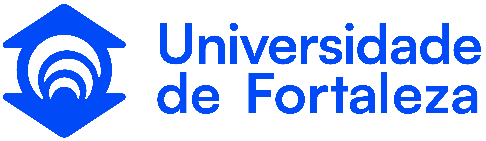

# Resolução de Problemas com Grafos

Orientador: Prof. Me Ricardo Carubbi

# Trabalho Prático 3

## Tema

Otimização em grafos ponderados e redes.

## Objetivo

Cada grupo deverá resolver um problema de otimização, adaptar a implementação de referência em Python ou Java, obter `Accepted`, manter um repositório autocontido e apresentar como a modelagem conduz ao algoritmo escolhido.

O T3 é uma única AP organizada em três classes de otimização. Cada classe possui dez opções, totalizando trinta problemas:

- árvore geradora mínima;
- caminhos mínimos;
- fluxo máximo.

Em cada oferta, aproximadamente dez problemas serão atribuídos aos grupos. As regras de acompanhamento, entrega, apresentação e pontuação pertencem a este documento.

## Problemas

`*` **Desafio avançado:** exige maior transferência de conhecimentos, combinação de conceitos ou carga de adaptação.

### Árvore geradora mínima

#### Problema A — UVA 11747 Heavy Cycle Edges

- **Link oficial:** <https://onlinejudge.org/external/117/11747.pdf>.

#### Problema B — Kattis Island Hopping

- **Link oficial:** <https://open.kattis.com/problems/islandhopping>.

#### Problema C* — Kattis Treehouses

- **Link oficial:** <https://open.kattis.com/problems/treehouses>.

#### Problema D* — Kattis Arctic Network

- **Link oficial:** <https://open.kattis.com/problems/arcticnetwork>.

#### Problema E — UVA 11631 Dark Roads

- **Link oficial:** <https://onlinejudge.org/external/116/11631.pdf>.

#### Problema F* — UVA 1235 Anti Brute Force Lock

- **Link oficial:** <https://onlinejudge.org/external/12/1235.pdf>.

#### Problema G* — UVA 11228 Transportation System

- **Link oficial:** <https://onlinejudge.org/external/112/11228.pdf>.

#### Problema H — Kattis Lost Map

- **Link oficial:** <https://open.kattis.com/problems/lostmap>.

#### Problema I — Kattis Minimum Spanning Tree

- **Link oficial:** <https://open.kattis.com/problems/minimumspanningtree>.

#### Problema J* — UVA 10600 ACM Contest and Blackout

- **Link oficial:** <https://onlinejudge.org/external/106/10600.pdf>.

### Caminhos mínimos

#### Problema A — CSES Shortest Routes I

- **Link oficial:** <https://cses.fi/problemset/task/1671>.

#### Problema B — Codeforces 20C Dijkstra?

- **Link oficial:** <https://codeforces.com/problemset/problem/20/C>.

#### Problema C — SPOJ SHPATH The Shortest Path

- **Link oficial:** <https://www.spoj.com/problems/SHPATH/>.

#### Problema D — UVA 929 Number Maze

- **Link oficial:** <https://onlinejudge.org/external/9/929.pdf>.

#### Problema E* — UVA 11833 Route Change

- **Link oficial:** <https://onlinejudge.org/external/118/11833.pdf>.

#### Problema F* — Codeforces 449B Jzzhu and Cities

- **Link oficial:** <https://codeforces.com/problemset/problem/449/B>.

#### Problema G* — CSES Flight Discount

- **Link oficial:** <https://cses.fi/problemset/task/1195>.

#### Problema H* — UVA 12047 Highest Paid Toll

- **Link oficial:** <https://onlinejudge.org/external/120/12047.pdf>.

#### Problema I* — UVA 12144 Almost Shortest Path

- **Link oficial:** <https://onlinejudge.org/external/121/12144.pdf>.

#### Problema J* — CSES Flight Routes

- **Link oficial:** <https://cses.fi/problemset/task/1196>.

### Fluxo máximo

#### Problema A — CSES Download Speed

- **Link oficial:** <https://cses.fi/problemset/task/1694>.

#### Problema B* — CSES Police Chase

- **Link oficial:** <https://cses.fi/problemset/task/1695>.

#### Problema C* — CSES School Dance

- **Link oficial:** <https://cses.fi/problemset/task/1696>.

#### Problema D* — CSES Distinct Routes

- **Link oficial:** <https://cses.fi/problemset/task/1711>.

#### Problema E* — UVA 10080 Gopher II

- **Link oficial:** <https://onlinejudge.org/external/100/10080.pdf>.

#### Problema F — UVA 820 Internet Bandwidth

- **Link oficial:** <https://onlinejudge.org/external/8/820.pdf>.

#### Problema G* — UVA 259 Software Allocation

- **Link oficial:** <https://onlinejudge.org/external/2/259.pdf>.

#### Problema H* — UVA 10092 The Problem with the Problem Setter

- **Link oficial:** <https://onlinejudge.org/external/100/10092.pdf>.

#### Problema I — UVA 11045 My T-shirt Suits Me

- **Link oficial:** <https://onlinejudge.org/external/110/11045.pdf>.

#### Problema J* — Kattis Waif Until Dark

- **Link oficial:** <https://open.kattis.com/problems/waif>.

## Acompanhamento processual

Todos os encontros práticos oferecidos antes da apresentação serão usados para acompanhamento. Cada grupo deverá manter evidências curtas e progressivas no repositório. A implementação de referência, as alterações e suas justificativas deverão ser registradas.

### Marco 1 — Formulação

- resumir o problema em linguagem própria;
- identificar entrada, saída, objetivo e restrições;
- definir vértices, arestas, direção e pesos ou capacidades;
- criar uma instância pequena.

### Marco 2 — Representação e validação

- justificar a representação computacional;
- representar a instância pequena;
- validar entrada e saída esperada;
- identificar preliminarmente a família do problema: árvore geradora mínima, caminho mínimo ou fluxo.

### Marco 3 — Escolha do algoritmo

- justificar Kruskal/Prim, Dijkstra ou Ford-Fulkerson/Edmonds-Karp conforme a classe;
- enunciar as condições de aplicabilidade;
- apresentar o invariante, propriedade ou operação central;
- estimar a complexidade.

Esse marco somente será exigido depois que cada família algorítmica for ensinada.

### Marco 4 — Adaptação e integração

Este marco ocorrerá depois do marco 3 da respectiva classe.

- integrar e adaptar a implementação de referência em Python ou Java;
- justificar as alterações realizadas;
- manter no repositório todas as dependências diretas;
- não usar biblioteca externa que resolva o problema;
- registrar uma execução reproduzível.

### Marco 5 — Testes e análise

- testar a instância pequena;
- testar casos-limite e casos de impossibilidade quando aplicáveis;
- diagnosticar divergências entre resultado esperado e produzido;
- revisar complexidade de tempo e memória.

### Marco 6 — Submissão e comunicação

- obter `Accepted` na plataforma;
- finalizar o `README.md`;
- disponibilizar evidência da submissão;
- preparar e ensaiar a apresentação.

## Progressão dos marcos por classe

- semana 14: marco 3 de MST;
- semana 15: marco 4 de MST; marcos 3 e 4 de caminhos mínimos;
- semana 16: marcos 3 e 4 de fluxo máximo;
- semana 17: marco 5 de todas as classes; marco 6 das turmas de quinta-feira;
- semana 18: marco 6 das turmas de quarta-feira.

## Entrega

A entrega será feita por um link de repositório público no GitHub informado no AVA/Moodle. A estrutura específica poderá seguir o banco da classe, mas deverá conter:

```text
T3/
├── README.md
├── acompanhamento/
│   └── marcos.md
├── src/
│   ├── Main.java | main.py
│   └── classes ou módulos necessários
├── evidencias/
│   └── accepted.png | accepted.pdf
├── apresentacao/
│   └── apresentacao.pdf | apresentacao.md | link_google_docs.txt
└── dados/
    └── casos-de-teste.txt
```

O `README.md` deverá explicar problema, integrantes, linguagem, execução, modelagem, algoritmo, implementação de referência, alterações, justificativas, correção esperada, complexidade, casos especiais e evidência do `Accepted`.

A linguagem escolhida deverá contar com implementação de referência disponibilizada na disciplina.

## Apresentação

Cada grupo terá até 5 minutos:

- até 1 minuto para problema e modelagem;
- até 2 minutos para estratégia algorítmica;
- até 1 minuto para complexidade e casos especiais;
- até 1 minuto para testes, resultado e conclusão.

O grupo não deverá ler código linha por linha. A apresentação deverá priorizar as decisões de modelagem e o raciocínio algorítmico.

## Avaliação da AP3

A AP3 será avaliada em escala de 0 a 10 e terá ponderação de 30% na AV3:

- **4,0 pontos:** acompanhamento processual e evidências dos seis marcos;
- **2,0 pontos:** solução adaptada, `Accepted`, organização e reprodutibilidade;
- **4,0 pontos:** apresentação, incluindo modelagem, estratégia, complexidade, casos especiais e comunicação.

A avaliação pelos alunos ouvintes terá função pedagógica e integrará o critério de comunicação, sem substituir a nota do professor.

O uso de IA deverá ser declarado no `README.md`. Cada integrante deverá compreender, justificar, testar e adaptar os artefatos utilizados.

## Equivalência entre classes

Um grupo não será avaliado por conteúdos específicos de outra classe, mas todos deverão demonstrar o mesmo nível de domínio em modelagem, adaptação, análise e comunicação.
