# Goldbarg 2012 - Exercícios Selecionados Para UND2

Fonte: `livros/Goldbarg2012.pdf`.

## Critérios de extração

- Seleção alinhada aos assuntos de `mat/exs/und2/orientacao_estudo.md`, seção `Assuntos Para Estudar`.
- Páginas de soluções no final do PDF foram evitadas.
- Cada exercício inclui texto extraído e crop da região do exercício quando disponível, para preservar figuras, tabelas e dados gráficos.
- Quando a extração textual apresentar ruído de OCR/fonte, priorizar o crop como dado visual de conferência.

## Resumo da extração

- Exercícios detectados nas faixas analisadas: 67.
- Exercícios selecionados: 37.
- Exercícios descartados: 30.

## Capítulo 1 - Exercício no 1

- Fonte: `livros/Goldbarg2012.pdf`, página 81.
- Assuntos relacionados: Classificação de percursos, Componentes / alcançabilidade, Euler, Hamilton.
- Tipo de entrada: texto, imagem/tabela.
- Dependências incluídas: sim.
- Referências internas detectadas: Figura.

Enunciado:

```text
Exercício no 1:
1) Para os grafos da Figura 1 determinar:
1. Os vértices adjacentes ao vértice 7.
2.  O fecho transitivo do vértice 1.
3.  Um passeio ou percurso com 5 vértices e 7 arestas distintas.
4.  Um caminho de comprimento 11 a partir do vértice 2.
5.  A distância entre os vértices 1 e 11.
6.  O índice de Wiener do vértice 1.
7.  Um ciclo com cinco vértices.
8.  Uma cadeia euleriana no subgrafo induzido pelo conjunto de vértices {1,2,3,7}.
9.  Um ciclo hamiltoniano no subgrafo induzido pelo conjunto de vértices {2,3,4,6,7,8,10,11,12}.
2) Para o grafo da Figura 2 determinar:
10. A cintura, circunferência, excentricidade do vértice 5, raio e diâmetro.
11. d(G) e D(G).
3) Para o grafo da Figura 3 determinar:
12. Um percurso pré-hamiltoniano e um pré-euleriano.
```

Imagens / dados gráficos:

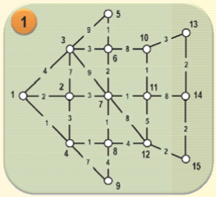

## Capítulo 1 - Exercício no 3

- Fonte: `livros/Goldbarg2012.pdf`, página 82.
- Assuntos relacionados: Componentes / pontes / articulações.
- Tipo de entrada: texto, imagem/tabela.
- Dependências incluídas: sim.

Enunciado:

```text
Exercício no 3:
Para o grafo da fi gura abaixo, determine um conjunto de corte de arestas, um conjunto de corte em vér-
tices, uma ponte, um conjunto de articulação que não seja um corte e dois blocos.
```

Imagens / dados gráficos:

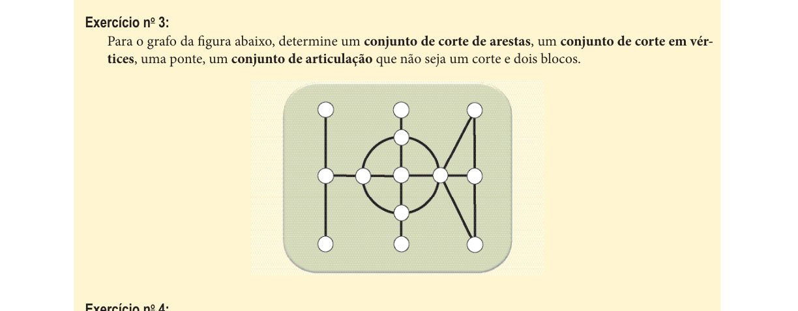

## Capítulo 1 - Exercício no 10

- Fonte: `livros/Goldbarg2012.pdf`, página 83.
- Assuntos relacionados: DFS / conectividade.
- Tipo de entrada: texto, imagem/tabela, algoritmo.
- Dependências incluídas: sim.
- Referências internas detectadas: Algoritmo.

Enunciado:

```text
Exercício no 10:
Dado um grafo G com n vértices e m arestas, criar um algoritmo O(m+n) que determine se o grafo G é
conexo.
```

Imagens / dados gráficos:


## Capítulo 1 - Exercício no 15

- Fonte: `livros/Goldbarg2012.pdf`, página 85.
- Assuntos relacionados: Alcançabilidade / conectividade.
- Tipo de entrada: texto, imagem/tabela.
- Dependências incluídas: sim.
- Referências internas detectadas: Figura.

Enunciado:

```text
Exercício no 15:
Uma mineradora procura explorar uma jazida do raro e valioso acrônio. O minério está alojado no solo, de
forma que deve ser escavado. A jazida é dividida em i blocos de exploração, que estão distribuídos em pro-
fundidade em até k camadas, sendo bi
k o i-ésimo bloco da mina localizado na camada k. Para que o bloco
bi
k seja explorado, é necessário que certos blocos da camada k-1 sejam removidos para que exista o acesso
físico ao bloco. A fi gura do exercício mostra a distribuição dos blocos em uma dada mina de acrônio. Os
blocos em destaque – blocos 8 e 21 – são os que contêm o minério. Os demais blocos somente deverão ser
removidos caso isso seja necessário para o acesso aos blocos do minério. Formular o problema da remoção
do menor número possível de blocos dessa mina de forma a permitir a retirada dos blocos com o acrônio.
Solucionar o problema para o caso apresentado neste exercício.

(1) Perfi l da mina
(2) Planta das camadas e numeração dos blocos
Figura do exercício com a mina e a localização dos blocos de acrônio.
```

Imagens / dados gráficos:

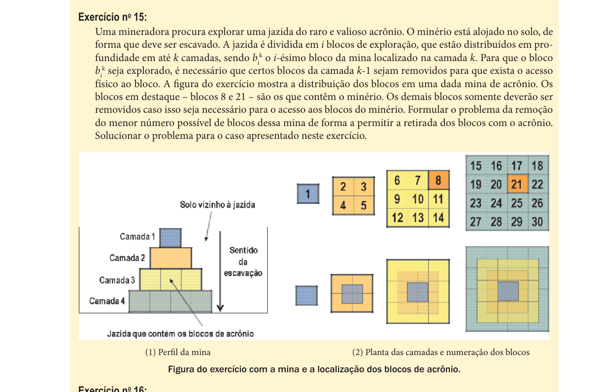

## Capítulo 1 - Exercício no 16

- Fonte: `livros/Goldbarg2012.pdf`, página 85.
- Assuntos relacionados: Isomorfismo.
- Tipo de entrada: texto, imagem/tabela.
- Dependências incluídas: sim.

Enunciado:

```text
Exercício no 16:
Dê dois exemplos de grafos que possuem a mesma sequência de graus e a mesma sequência de ciclos (uma
sequência de ciclos é a lista do número de ciclos de mesmo comprimento) e não são isomórfi cos.
```

Imagens / dados gráficos:

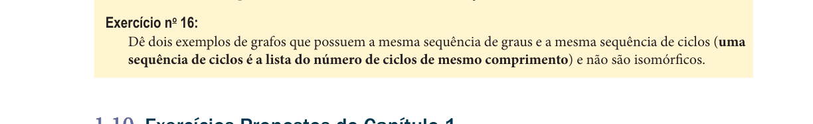

## Capítulo 4 - Exercício no 1

- Fonte: `livros/Goldbarg2012.pdf`, página 269.
- Assuntos relacionados: Caminho mínimo.
- Tipo de entrada: texto, imagem/tabela.
- Dependências incluídas: sim.

Enunciado:

```text
Exercício no 1:
Provar que o caminho mais curto em grafos ponderados em arestas e vértices admite solução polinomial.
```

Imagens / dados gráficos:


## Capítulo 4 - Exercício no 3

- Fonte: `livros/Goldbarg2012.pdf`, página 269.
- Assuntos relacionados: Euler, Hamilton.
- Tipo de entrada: texto, imagem/tabela.
- Dependências incluídas: sim.

Enunciado:

```text
Exercício no 3:
Encontrar as condições que fazem um grafo bipartido completo Kn,m ser: 1. Euleriano; 2. Hamiltoniano.
```

Imagens / dados gráficos:


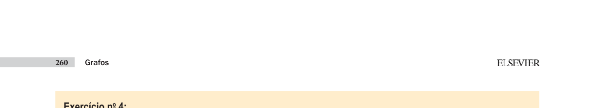

## Capítulo 4 - Exercício no 5

- Fonte: `livros/Goldbarg2012.pdf`, página 270.
- Assuntos relacionados: Algoritmos eulerianos, Hierholzer.
- Tipo de entrada: texto, imagem/tabela, algoritmo.
- Dependências incluídas: sim.
- Referências internas detectadas: Algoritmo.

Enunciado:

```text
Exercício no 5:
Mostre como o algoritmo de Hierholzer pode ser implementado em O(m).
```

Imagens / dados gráficos:


## Capítulo 4 - Exercício no 6

- Fonte: `livros/Goldbarg2012.pdf`, página 270.
- Assuntos relacionados: Hamilton, conectividade.
- Tipo de entrada: texto, imagem/tabela.
- Dependências incluídas: sim.

Enunciado:

```text
Exercício no 6:
Demonstre que se G não é 2-conexo, então G não é hamiltoniano.
```

Imagens / dados gráficos:


## Capítulo 4 - Exercício no 7

- Fonte: `livros/Goldbarg2012.pdf`, página 270.
- Assuntos relacionados: Caminho mínimo, conectividade.
- Tipo de entrada: texto, imagem/tabela.
- Dependências incluídas: sim.

Enunciado:

```text
Exercício no 7:
Dado G = (N,M) conexo e ponderado, mostre que:
a)  o subgrafo H de G, de cardinalidade mínima em arestas, tal que a distância entre um vértice v  N e
todos os outros vértices do grafo é mínima é uma árvore. (Tal grafo é chamado de árvore de caminho
mais curto de v).
b)  Mostre que árvore geradora mínima e árvore de caminho mais curto não são conceitos equivalentes.
```

Imagens / dados gráficos:

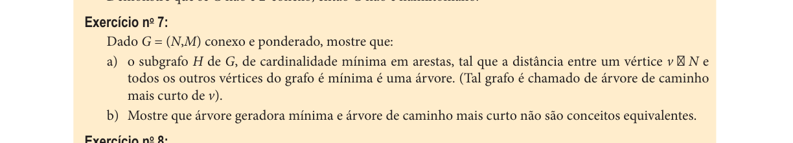

## Capítulo 4 - Exercício no 8

- Fonte: `livros/Goldbarg2012.pdf`, página 270.
- Assuntos relacionados: Hamilton.
- Tipo de entrada: texto, imagem/tabela.
- Dependências incluídas: sim.

Enunciado:

```text
Exercício no 8:
Mostre que o grafo célula de abelha de Kirkman não é hamiltoniano.
```

Imagens / dados gráficos:

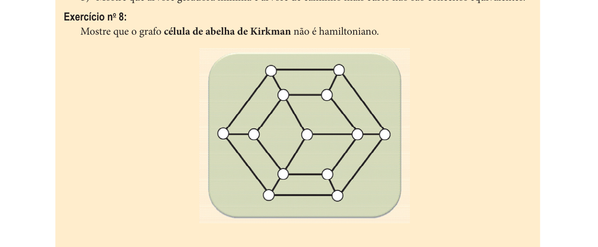

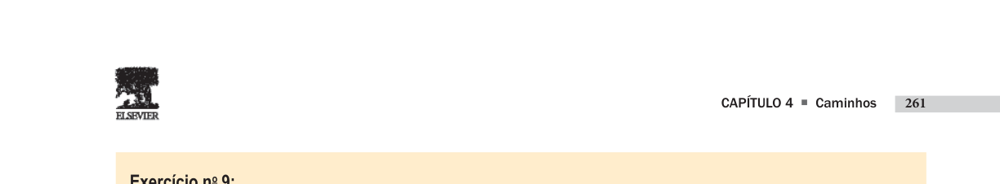

## Capítulo 4 - Exercício no 9

- Fonte: `livros/Goldbarg2012.pdf`, página 271.
- Assuntos relacionados: Hamilton, algoritmos em DAG.
- Tipo de entrada: texto, imagem/tabela, algoritmo.
- Dependências incluídas: sim.
- Referências internas detectadas: Algoritmo.

Enunciado:

```text
Exercício no 9:
Faça um algoritmo efi ciente para determinar se um grafo G direcionado acíclico possui caminho hamilto-
niano e, em caso positivo, exibir o caminho.
```

Imagens / dados gráficos:


## Capítulo 4 - Exercício no 10

- Fonte: `livros/Goldbarg2012.pdf`, página 271.
- Assuntos relacionados: Euler, Hamilton, grafo de linha.
- Tipo de entrada: texto, imagem/tabela.
- Dependências incluídas: sim.

Enunciado:

```text
Exercício no 10:
Dado G um grafo e L(G) seu grafo de linha, mostre que:
1)  se G é euleriano, então L(G) é hamiltoniano.
2)  se L(G) é hamiltoniano, G não é necessariamente euleriano.
```

Imagens / dados gráficos:


## Capítulo 4 - Exercício no 16

- Fonte: `livros/Goldbarg2012.pdf`, página 273.
- Assuntos relacionados: Hamilton.
- Tipo de entrada: texto, imagem/tabela.
- Dependências incluídas: sim.
- Referências internas detectadas: Exemplo.

Enunciado:

```text
Exercício no 16:
Grafo hipo-hamiltoniano – Sabendo-se que um grafo hipo-hamiltoniano é defi nido como se segue, dê um
exemplo de um grafo hipo-hamiltoniano.
Um grafo é dito hipo-hamiltoniano quando não é hamiltoniano, mas todo sub-
grafo formado pela remoção de um único vértice de G é hamiltoniano.
Grafo Hipohamiltoniano
```

Imagens / dados gráficos:

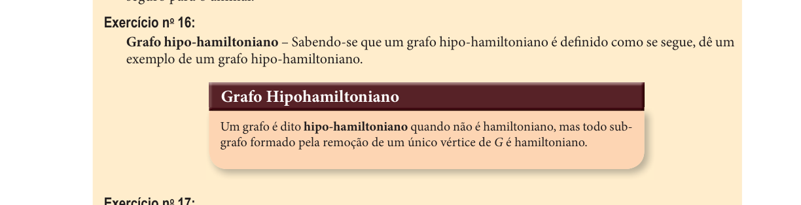

## Capítulo 4 - Exercício no 17

- Fonte: `livros/Goldbarg2012.pdf`, página 273.
- Assuntos relacionados: Hamilton, grafos grade.
- Tipo de entrada: texto, imagem/tabela.
- Dependências incluídas: sim.

Enunciado:

```text
Exercício no 17:
Um grafo grade 5 × 5 é hamiltoniano? E um grafo grid n × n para qualquer n.
```

Imagens / dados gráficos:


## Capítulo 4 - Exercício no 18

- Fonte: `livros/Goldbarg2012.pdf`, página 273.
- Assuntos relacionados: Conectividade.
- Tipo de entrada: texto, imagem/tabela.
- Dependências incluídas: sim.

Enunciado:

```text
Exercício no 18:
Demonstre que para todo grafo conexo G=(N,M) com mais de dois vértices sempre possui um vértice x tal
G# =(N#,M) com N# = N \ {x} é um grafo conexo.
```

Imagens / dados gráficos:

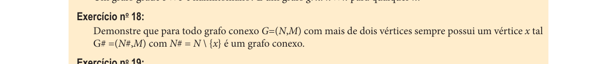

## Capítulo 4 - Exercício no 19

- Fonte: `livros/Goldbarg2012.pdf`, página 273.
- Assuntos relacionados: Hamilton.
- Tipo de entrada: texto, imagem/tabela.
- Dependências incluídas: sim.

Enunciado:

```text
Exercício no 19:
Demonstre que o grafo 1 do exercício é hamiltoniano, enquanto o grafo 2 é não hamiltoniano.
Grafo 1
Grafo 2
```

Imagens / dados gráficos:

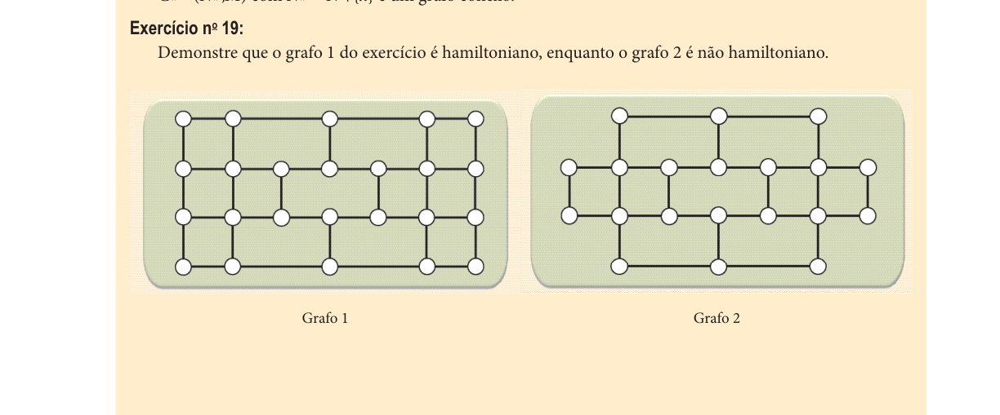

## Capítulo 5 - Exercício no 9

- Fonte: `livros/Goldbarg2012.pdf`, página 362.
- Assuntos relacionados: Emparelhamento, matching perfeito.
- Tipo de entrada: texto, imagem/tabela.
- Dependências incluídas: sim.

Enunciado:

```text
Exercício no 9
Considere um grafo G = (N,M) onde |N| = 2k, k > 1, e  i, i  N, d(i) ≥ k. Mostre que G tem um matching
perfeito.
```

Imagens / dados gráficos:


## Capítulo 5 - Exercício no 10

- Fonte: `livros/Goldbarg2012.pdf`, página 362.
- Assuntos relacionados: Emparelhamento, casamento estável.
- Tipo de entrada: texto, imagem/tabela.
- Dependências incluídas: sim.

Enunciado:

```text
Exercício no 10
Uma agência matrimonial tem cadastrado um conjunto de n homens e outro de n mulheres que desejam se
casar. Cada homem fez uma lista de preferências ordenando as n mulheres em ordem decrescente de prefe-
rência. Cada mulher fez o mesmo em relação aos homens. O agente fará uma indicação de casais e deseja que
a chance de esses casais permanecerem estáveis seja a maior possível. Para isto, é necessário que não exista
nenhum par homem h e mulher m tal que h e m tenham um pelo outro preferência maior do que a que eles
têm pelos seus pares. No caso de h e m terem preferência um pelo outro maior do que pelos seus pares, h e m
terão a tendência de romper seus casamentos para se unir. Se tal casal não existir, a agência pode considerar
f
t ib i ã
tá
l C
t
bl
d
d l d
f
? A
t
l
it
```

Imagens / dados gráficos:

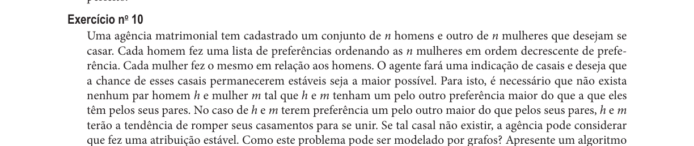

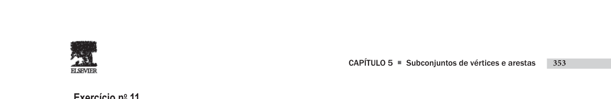

## Capítulo 5 - Exercício no 11

- Fonte: `livros/Goldbarg2012.pdf`, página 363.
- Assuntos relacionados: Emparelhamento, matching perfeito.
- Tipo de entrada: texto, imagem/tabela.
- Dependências incluídas: sim.

Enunciado:

```text
Exercício no 11
Mostre quantos matchings perfeitos possui um grafo completo com 2n vértices.
```

Imagens / dados gráficos:


## Capítulo 7 - Exercício no 1

- Fonte: `livros/Goldbarg2012.pdf`, página 480.
- Assuntos relacionados: Coloração, heurística gulosa.
- Tipo de entrada: texto, imagem/tabela, algoritmo.
- Dependências incluídas: sim.
- Referências internas detectadas: Algoritmo.

Enunciado:

```text
Exercício no 1:
Desenvolva um algoritmo heurístico para a solução do problema de coloração.
```

Imagens / dados gráficos:


## Capítulo 7 - Exercício no 2

- Fonte: `livros/Goldbarg2012.pdf`, página 480.
- Assuntos relacionados: Coloração mínima.
- Tipo de entrada: texto, imagem/tabela.
- Dependências incluídas: sim.

Enunciado:

```text
Exercício no 2:
Exiba um grafo com três colorações mínimas diferentes.
```

Imagens / dados gráficos:


## Capítulo 7 - Exercício no 3

- Fonte: `livros/Goldbarg2012.pdf`, página 480.
- Assuntos relacionados: Coloração, modelagem de incompatibilidades.
- Tipo de entrada: texto, imagem/tabela.
- Dependências incluídas: sim.

Enunciado:

```text
Exercício no 3:
Noé logo percebeu que sua política de alojar os animais em grandes espaços difi cilmente funcionaria a con-
tento (vários animais da primeira onda não puderam ser alojados imediatamente – ver o exercício resolvido
número 2 do Capítulo 5). Entendeu que deveria construir na Arca vários espaços de pequeno tamanho para
isolar as diversas classes de animais incompatíveis. Então Noé foi colocado diante do problema de saber quan-
tas divisões seria necessário criar dentro da Arca para separar os animais à medida que chegavam. Conside-
rando que os espaços da Arca estão lotados, qual foi o número mínimo de divisões (baias) que Noé construiu
na Arca para alojar os animais da tabela de incompatibilidades que se segue?
Rato
Cão
Leão
Boi
Cobra
Gato
Porco
Sabiá
Corvo
Zebra
Asno
Urso
Pato
Tatu
X
X
X
X
Rato
X
X
X
Cão
X
X
X
X
X
Leão
X
X
X
X
X
Boi
X
X
X
Cobra
X
X
X
X
X
X
X
X
Gato
X
X
X
X
Porco
X
Sabiá
X
X
Corvo
Zebra
X
Asno
X
Urso
X
Pato
```

Imagens / dados gráficos:

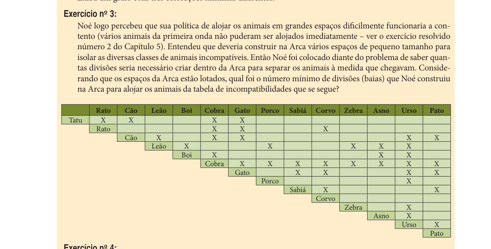

## Capítulo 7 - Exercício no 4

- Fonte: `livros/Goldbarg2012.pdf`, página 480.
- Assuntos relacionados: Coloração.
- Tipo de entrada: texto, imagem/tabela.
- Dependências incluídas: sim.

Enunciado:

```text
Exercício no 4:
Apresente uma coloração harmoniosa exata para o grafo da fi gura do exercício:
Grafo do exercício 4
```

Imagens / dados gráficos:

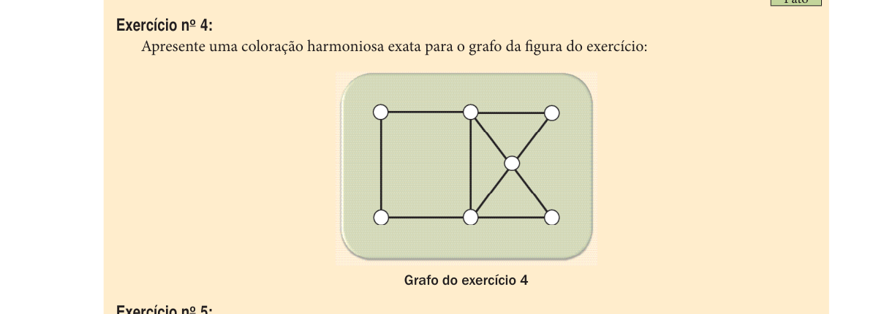

## Capítulo 7 - Exercício no 5

- Fonte: `livros/Goldbarg2012.pdf`, página 480.
- Assuntos relacionados: Coloração.
- Tipo de entrada: texto, imagem/tabela.
- Dependências incluídas: sim.
- Referências internas detectadas: Figura.

Enunciado:

```text
Exercício no 5:
Apresente uma coloração completa para os grafos das fi guras do exercício.


Figura do exercício 5: grafo 1
Figura do exercício 5: grafo 2
```

Imagens / dados gráficos:


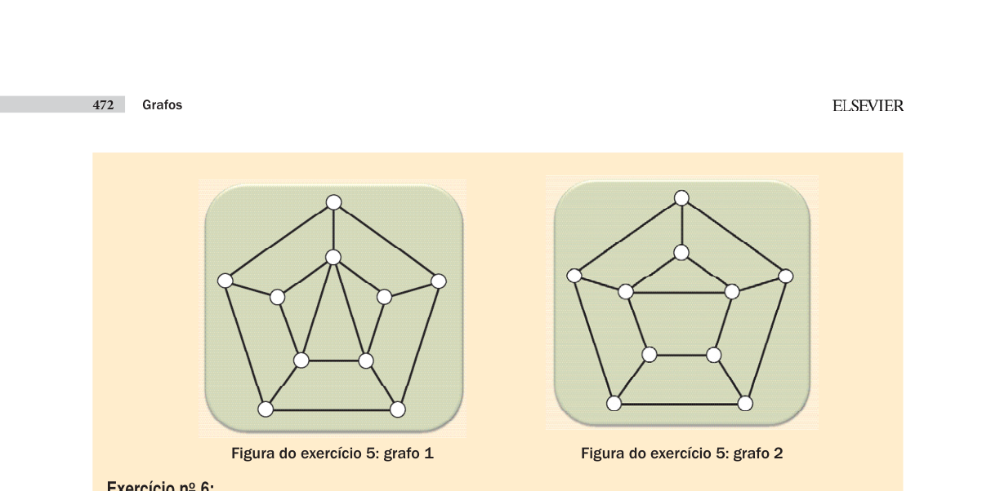

## Capítulo 7 - Exercício no 6

- Fonte: `livros/Goldbarg2012.pdf`, página 481.
- Assuntos relacionados: Coloração.
- Tipo de entrada: texto, imagem/tabela.
- Dependências incluídas: sim.
- Referências internas detectadas: Figura.

Enunciado:

```text
Exercício no 6:
Determine o número T-cromático do grafo de interferência do exercício, considerando que o conjunto
T = {0,1,2,4}.
Figura do exercício 6: grafo de interferência
```

Imagens / dados gráficos:

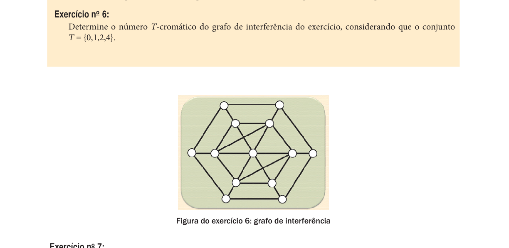

## Capítulo 7 - Exercício no 7

- Fonte: `livros/Goldbarg2012.pdf`, página 481.
- Assuntos relacionados: Coloração.
- Tipo de entrada: texto, imagem/tabela.
- Dependências incluídas: sim.

Enunciado:

```text
Exercício no 7:
Determine uma coloração acíclica para o grafo da fi gura do exercício.
Grafo do exercício 7
```

Imagens / dados gráficos:


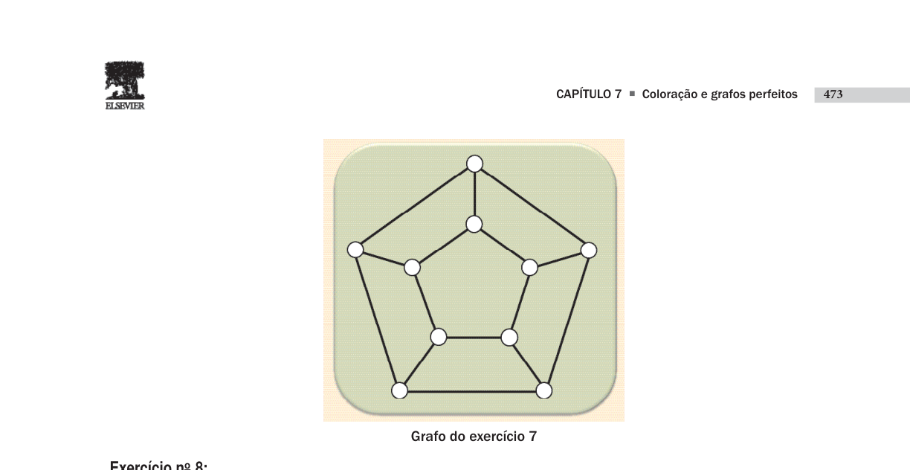

## Capítulo 7 - Exercício no 8

- Fonte: `livros/Goldbarg2012.pdf`, página 482.
- Assuntos relacionados: Coloração, grafos planares.
- Tipo de entrada: texto, imagem/tabela.
- Dependências incluídas: sim.

Enunciado:

```text
Exercício no 8:
Prove que em qualquer grafo planar há pelo menos um vértice com grau menor ou igual a 5.
```

Imagens / dados gráficos:


## Capítulo 7 - Exercício no 9

- Fonte: `livros/Goldbarg2012.pdf`, página 482.
- Assuntos relacionados: Coloração, modelagem de incompatibilidades.
- Tipo de entrada: texto, imagem/tabela.
- Dependências incluídas: sim.

Enunciado:

```text
Exercício no 9:
Uma liga de escolas de samba com 10 escolas afi liadas possui uma grande área de ofi cinas e distribui uma
instalação para cada escola afi liada, de forma que seja possível as escolas montarem seus carros alegóricos e
estocarem fantasias dos destaques. Na área de desfi le, cada uma das escolas recebe também da liga uma área
para ativar um posto de serviços e para apoio ao desfi le. Visando organizar e caracterizar cada instalação das
escolas (ofi cinas e postos de serviços), a liga resolve que nenhuma ofi cina ou posto de serviço vizinho poderá
ter uma cor parecida. Obviamente, as ofi cinas e postos de apoio de cada escola devem ter a mesma cor – a
cor da escola. Os grafos do exercício exibem os esquemas de vizinhança das ofi cinas (grafo 1) e dos postos de
apoio (grafo 2).
1.  Considerando que três escolas afi liadas possuem as mesmas cores básicas como representativa das agre-
miações (e não querem abrir mão de suas cores tradicionais), será possível distribuir as cores das insta-
lações de forma que não exista possibilidade de confusão nas cores das instalações vizinhas como a liga
deseja?
2.  Se, além das três escolas anteriormente referidas, mais duas escolas exigirem manter a mesma variação de
cor para suas instalações (sendo essa segunda variante de cor diferente de qualquer outra cor de outras es-
colas do grupo da liga), seria possível atender a tradição das cinco escolas e, mesmo assim, manter a regra
da liga?


Grafo 1 – Vizinhança nas ofi cinas
Grafo 2 – Vizinhança na área de desfi le
```

Imagens / dados gráficos:

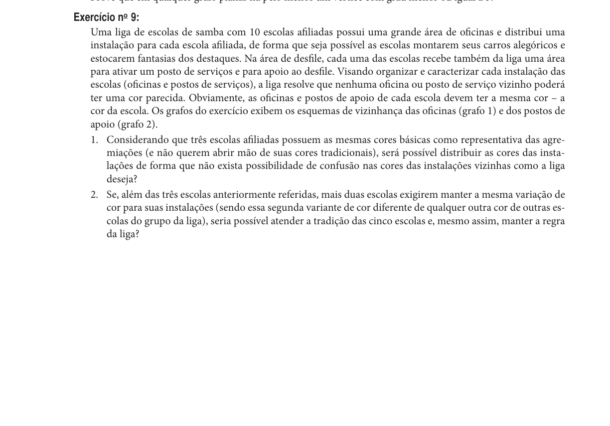

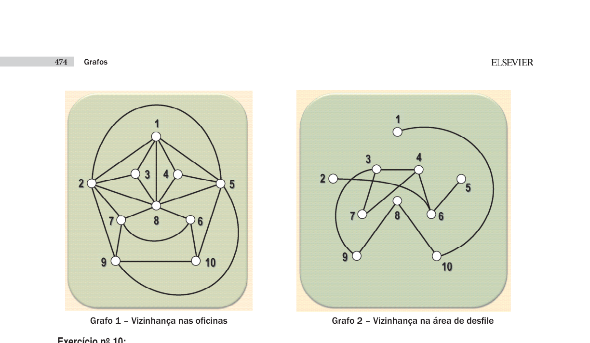

## Capítulo 7 - Exercício no 10

- Fonte: `livros/Goldbarg2012.pdf`, página 483.
- Assuntos relacionados: Coloração, modelagem lógica.
- Tipo de entrada: texto, imagem/tabela.
- Dependências incluídas: sim.

Enunciado:

```text
Exercício no 10:
Sabe-se que João, Antônio e Pedro torcem cada um para um diferente time de futebol, que pode ser Palmeiras,
Internacional e Grêmio. Sabe-se que João é médico. Pedro não visita nem recebe visita de torcedor do Grêmio.
João atende Pedro e Antônio quando eles fi cam doentes. Antônio usa qualquer roupa, desde que não seja ver-
melha. Pedro não gosta de verde.
```

Imagens / dados gráficos:

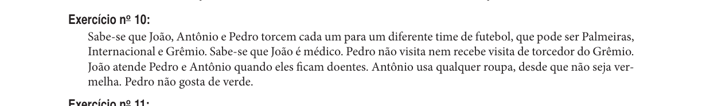

## Capítulo 7 - Exercício no 11

- Fonte: `livros/Goldbarg2012.pdf`, página 483.
- Assuntos relacionados: Coloração, heurística Welsh-Powell.
- Tipo de entrada: texto, imagem/tabela, algoritmo.
- Dependências incluídas: sim.
- Referências internas detectadas: Algoritmo.

Enunciado:

```text
Exercício no 11:
Dada uma heurística H para um problema de minimização P, defi ne-se a razão de desempenho r no pior caso
de H para P, como:
r = inf {valorH(I)/valorO(I), I, I é um exemplar de P}
onde valorH(I) denota o resultado obtido por H quando aplicado a I e valorO(I) denota o valor ótimo para I.
Uma heurística H é dita arbitrariamente ruim para um problema P de minimização, se existir um caso I de
P para o qual a razão de desempenho valorH(I)/valorO(I) tenda a infi nito. Mostre que o algoritmo de Welsh e
Powell (exercício resolvido 1) é arbitrariamente ruim para o problema da coloração.
```

Imagens / dados gráficos:

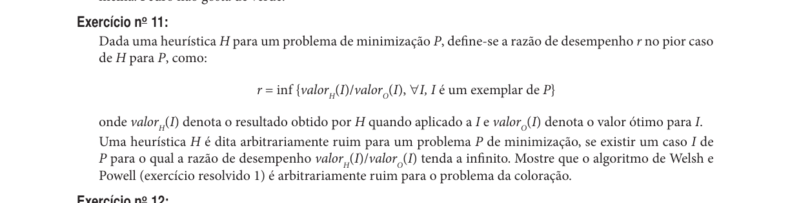

## Capítulo 7 - Exercício no 12

- Fonte: `livros/Goldbarg2012.pdf`, página 483.
- Assuntos relacionados: Coloração.
- Tipo de entrada: texto, imagem/tabela.
- Dependências incluídas: sim.

Enunciado:

```text
Exercício no 12:
Exiba uma 5-coloração completa para o grafo de Grötzsch (grafo na fi gura do exercício proposto 7.6).
```

Imagens / dados gráficos:


## Capítulo 7 - Exercício no 13

- Fonte: `livros/Goldbarg2012.pdf`, página 483.
- Assuntos relacionados: Coloração.
- Tipo de entrada: texto, imagem/tabela.
- Dependências incluídas: sim.

Enunciado:

```text
Exercício no 13:
Mostre um grafo vértice-crítico que não é aresta-crítico.
```

Imagens / dados gráficos:


## Capítulo 7 - Exercício no 14

- Fonte: `livros/Goldbarg2012.pdf`, página 483.
- Assuntos relacionados: Coloração, grafos de intervalo.
- Tipo de entrada: texto, imagem/tabela.
- Dependências incluídas: sim.

Enunciado:

```text
Exercício no 14:
O exercício proposto é conhecido na literatura como o mistério de Berge. Seis professores entraram em uma
biblioteca exatamente no dia em que um tratado raro foi roubado. Todos entraram e saíram somente uma vez
na biblioteca. Se dois professores estavam na biblioteca simultaneamente, então pelo menos um deles viu o
outro. Os detetives interrogaram os professores e obtiveram as seguintes informações:
Alberto disse que viu Beto e Eduardo.
Beto disse que viu Alberto e Ida.
Cristina disse que viu Dênis e Ida.
Dênis disse que viu Alberto e Ida.
Eduardo disse que viu Beto e Cristina.
Ida disse que viu Cristina e Eduardo.
```

Imagens / dados gráficos:

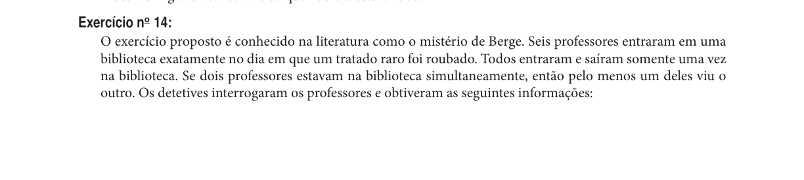

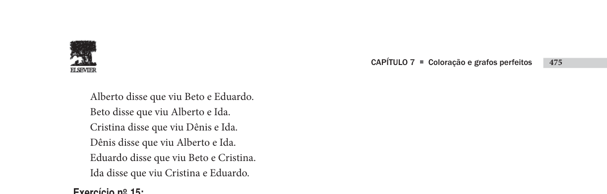

## Capítulo 7 - Exercício no 15

- Fonte: `livros/Goldbarg2012.pdf`, página 484.
- Assuntos relacionados: Coloração, grafos de intervalo.
- Tipo de entrada: texto, imagem/tabela.
- Dependências incluídas: sim.

Enunciado:

```text
Exercício no 15:
Determine os grafos interseção associados aos intervalos das fi guras que se seguem:


1o conjunto de intervalos
2o conjunto de intervalos
```

Imagens / dados gráficos:

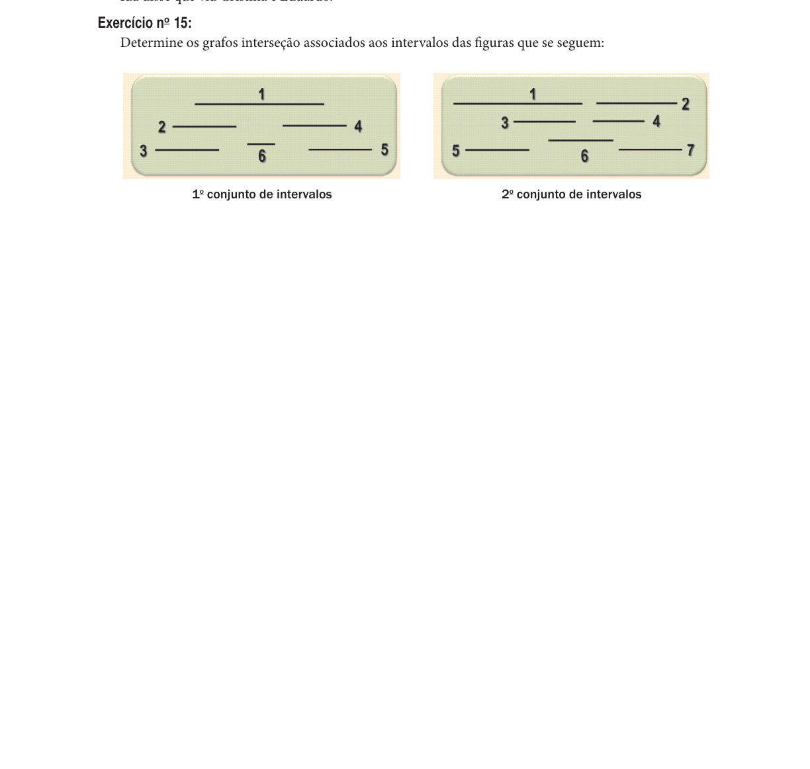

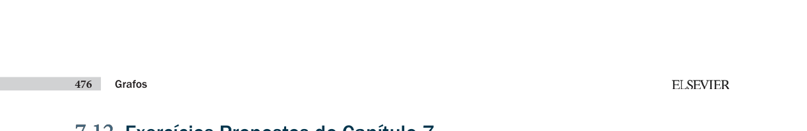

## Capítulo 9 - Exercício no 1

- Fonte: `livros/Goldbarg2012.pdf`, página 613.
- Assuntos relacionados: TSP, custo de tours.
- Tipo de entrada: texto, imagem/tabela, algoritmo.
- Dependências incluídas: sim.

Enunciado:

```text
Exercício no 1:
Desenvolver a heurística Swap na solução do grafo do exercício com base no ciclo 1-2-3-4-5-6.
15
2
2
20
7
14
16
5
10
4 1
8
8
1
25
3
3
4
1
6
5
Grafo do exercício 1
```

Imagens / dados gráficos:

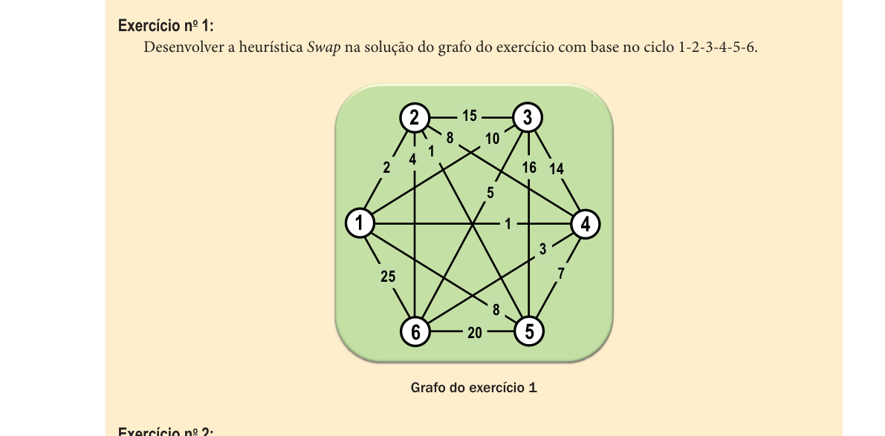

## Capítulo 9 - Exercício no 2

- Fonte: `livros/Goldbarg2012.pdf`, página 613.
- Assuntos relacionados: TSP, heurísticas.
- Tipo de entrada: texto, imagem/tabela, algoritmo.
- Dependências incluídas: sim.

Enunciado:

```text
Exercício no 2:
Exemplifi que o funcionamento da heurística 2-Opt para o grafo da fi gura do exercício anterior consideran-
do a confi guração inicial 1-2-3-4-5-6.
```

Imagens / dados gráficos:


## Validação

### Exercícios descartados

- Capítulo 1, exercício no 2, página 81: fora da curadoria UND2.
- Capítulo 1, exercício no 4, página 82: fora da curadoria UND2.
- Capítulo 1, exercício no 5, página 82: fora da curadoria UND2.
- Capítulo 1, exercício no 6, página 83: fora da curadoria UND2.
- Capítulo 1, exercício no 7, página 83: fora da curadoria UND2.
- Capítulo 1, exercício no 8, página 83: fora da curadoria UND2.
- Capítulo 1, exercício no 9, página 83: fora da curadoria UND2.
- Capítulo 1, exercício no 11, página 83: fora da curadoria UND2.
- Capítulo 1, exercício no 12, página 84: fora da curadoria UND2.
- Capítulo 1, exercício no 13, página 84: fora da curadoria UND2.
- Capítulo 1, exercício no 14, página 84: fora da curadoria UND2.
- Capítulo 4, exercício no 2, página 269: fora da curadoria UND2.
- Capítulo 4, exercício no 4, página 270: fora da curadoria UND2.
- Capítulo 4, exercício no 11, página 271: fora da curadoria UND2.
- Capítulo 4, exercício no 12, página 271: fora da curadoria UND2.
- Capítulo 4, exercício no 13, página 271: fora da curadoria UND2.
- Capítulo 4, exercício no 14, página 272: fora da curadoria UND2.
- Capítulo 4, exercício no 15, página 272: fora da curadoria UND2.
- Capítulo 5, exercício no 1, página 358: fora da curadoria UND2.
- Capítulo 5, exercício no 2, página 358: fora da curadoria UND2.
- Capítulo 5, exercício no 3, página 358: fora da curadoria UND2.
- Capítulo 5, exercício no 4, página 359: fora da curadoria UND2.
- Capítulo 5, exercício no 5, página 359: fora da curadoria UND2.
- Capítulo 5, exercício no 6, página 359: fora da curadoria UND2.
- Capítulo 5, exercício no 7, página 361: fora da curadoria UND2.
- Capítulo 5, exercício no 8, página 361: fora da curadoria UND2.
- Capítulo 5, exercício no 12, página 363: fora da curadoria UND2.
- Capítulo 5, exercício no 13, página 363: fora da curadoria UND2.
- Capítulo 5, exercício no 14, página 363: fora da curadoria UND2.
- Capítulo 5, exercício no 15, página 363: fora da curadoria UND2.

### Referências pendentes

- Capítulo 1, exercício no 10, página 83: Algoritmo. Verificar se o crop do enunciado é suficiente.
- Capítulo 4, exercício no 5, página 270: Algoritmo. Verificar se o crop do enunciado é suficiente.
- Capítulo 4, exercício no 9, página 271: Algoritmo. Verificar se o crop do enunciado é suficiente.
- Capítulo 4, exercício no 16, página 273: Exemplo. Verificar se o crop do enunciado é suficiente.
- Capítulo 7, exercício no 1, página 480: Algoritmo. Verificar se o crop do enunciado é suficiente.
- Capítulo 7, exercício no 11, página 483: Algoritmo. Verificar se o crop do enunciado é suficiente.

### Imagens geradas

- `mat/exs/und2/imgs/goldbarg_cap1_ex01_p81_1.png`
- `mat/exs/und2/imgs/goldbarg_cap1_ex03_p82_1.png`
- `mat/exs/und2/imgs/goldbarg_cap1_ex10_p83_1.png`
- `mat/exs/und2/imgs/goldbarg_cap1_ex15_p85_1.png`
- `mat/exs/und2/imgs/goldbarg_cap1_ex16_p85_1.png`
- `mat/exs/und2/imgs/goldbarg_cap4_ex01_p269_1.png`
- `mat/exs/und2/imgs/goldbarg_cap4_ex03_p269_1.png`
- `mat/exs/und2/imgs/goldbarg_cap4_ex03_p270_2.png`
- `mat/exs/und2/imgs/goldbarg_cap4_ex05_p270_1.png`
- `mat/exs/und2/imgs/goldbarg_cap4_ex06_p270_1.png`
- `mat/exs/und2/imgs/goldbarg_cap4_ex07_p270_1.png`
- `mat/exs/und2/imgs/goldbarg_cap4_ex08_p270_1.png`
- `mat/exs/und2/imgs/goldbarg_cap4_ex08_p271_2.png`
- `mat/exs/und2/imgs/goldbarg_cap4_ex09_p271_1.png`
- `mat/exs/und2/imgs/goldbarg_cap4_ex10_p271_1.png`
- `mat/exs/und2/imgs/goldbarg_cap4_ex16_p273_1.png`
- `mat/exs/und2/imgs/goldbarg_cap4_ex17_p273_1.png`
- `mat/exs/und2/imgs/goldbarg_cap4_ex18_p273_1.png`
- `mat/exs/und2/imgs/goldbarg_cap4_ex19_p273_1.png`
- `mat/exs/und2/imgs/goldbarg_cap5_ex09_p362_1.png`
- `mat/exs/und2/imgs/goldbarg_cap5_ex10_p362_1.png`
- `mat/exs/und2/imgs/goldbarg_cap5_ex10_p363_2.png`
- `mat/exs/und2/imgs/goldbarg_cap5_ex11_p363_1.png`
- `mat/exs/und2/imgs/goldbarg_cap7_ex01_p480_1.png`
- `mat/exs/und2/imgs/goldbarg_cap7_ex02_p480_1.png`
- `mat/exs/und2/imgs/goldbarg_cap7_ex03_p480_1.png`
- `mat/exs/und2/imgs/goldbarg_cap7_ex04_p480_1.png`
- `mat/exs/und2/imgs/goldbarg_cap7_ex05_p480_1.png`
- `mat/exs/und2/imgs/goldbarg_cap7_ex05_p481_2.png`
- `mat/exs/und2/imgs/goldbarg_cap7_ex06_p481_1.png`
- `mat/exs/und2/imgs/goldbarg_cap7_ex07_p481_1.png`
- `mat/exs/und2/imgs/goldbarg_cap7_ex07_p482_2.png`
- `mat/exs/und2/imgs/goldbarg_cap7_ex08_p482_1.png`
- `mat/exs/und2/imgs/goldbarg_cap7_ex09_p482_1.png`
- `mat/exs/und2/imgs/goldbarg_cap7_ex09_p483_2.png`
- `mat/exs/und2/imgs/goldbarg_cap7_ex10_p483_1.png`
- `mat/exs/und2/imgs/goldbarg_cap7_ex11_p483_1.png`
- `mat/exs/und2/imgs/goldbarg_cap7_ex12_p483_1.png`
- `mat/exs/und2/imgs/goldbarg_cap7_ex13_p483_1.png`
- `mat/exs/und2/imgs/goldbarg_cap7_ex14_p483_1.png`
- `mat/exs/und2/imgs/goldbarg_cap7_ex14_p484_2.png`
- `mat/exs/und2/imgs/goldbarg_cap7_ex15_p484_1.png`
- `mat/exs/und2/imgs/goldbarg_cap7_ex15_p485_2.png`
- `mat/exs/und2/imgs/goldbarg_cap9_ex01_p613_1.png`
- `mat/exs/und2/imgs/goldbarg_cap9_ex02_p613_1.png`
