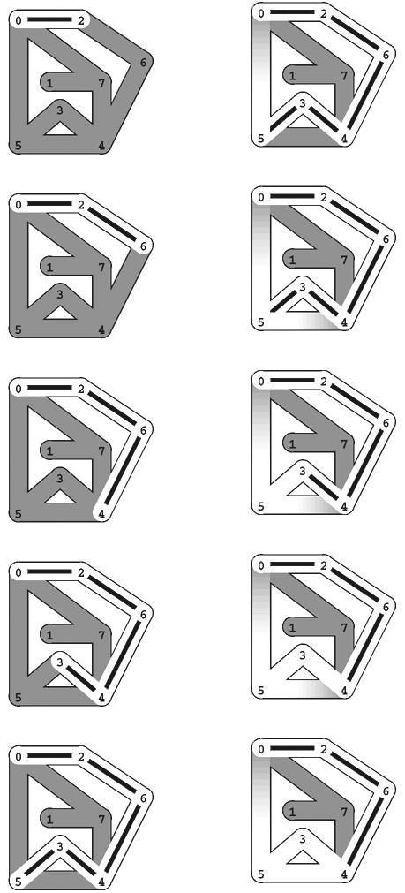
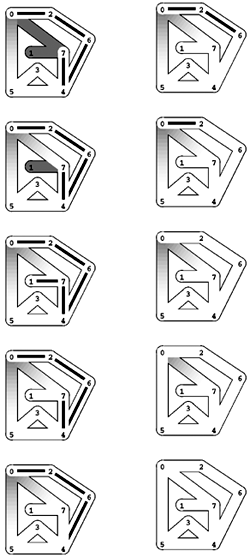
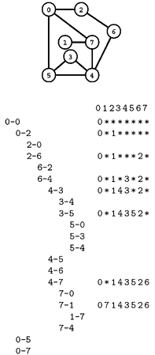
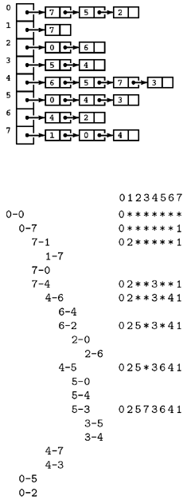
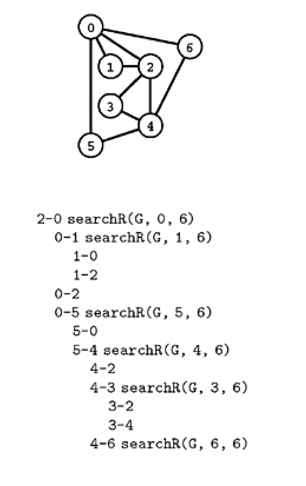
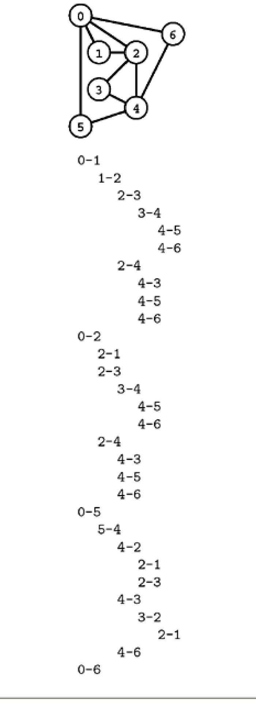

# Sedgewick Java - Selected Exercises from Chapters 17 and 18

Source: Robert Sedgewick, *Algorithms in Java, Third Edition, Part 5: Graph Algorithms*, Addison-Wesley Professional, 2003.

The exercises below are preserved in the original English. Figures and visual graph definitions required by the statements are included as extracted page crops.

## Exercises 17.85-17.107

### 17.85
Show, in the style of Figure 17.17, the trace of recursive invocations (and vertices that are skipped) when Program 17.16 finds a path from 0 to 5 in the graph

```text
3-7 1-4 7-8 0-5 5-2 3-8 2-9 0-6 4-9 2-6 6-4
```

### 17.86
Modify the recursive method in Program 17.16 to print out a trace like Figure 17.17, using a global variable as described in the text.

### 17.87
Do Exercise 17.86 by adding an argument to the recursive method to keep track of the depth.

### 17.88
Using the method described in the text, give an implementation of `GraphPath` that provides a public method that invokes a client-supplied method for each edge on a path from v to w, if any such path exists.

### 17.89
Modify Program 17.16 such that it takes a third argument d and tests the existence of a path connecting u and v of length greater than d. In particular, `search(v, v, 2)` should be nonzero if and only if v is on a cycle.

### • 17.90
Run experiments to determine empirically the probability that Program 17.16 finds a path between two randomly chosen vertices for various graphs (see Exercises 17.63-76) and to calculate the average length of the paths found for each type of graph.

### 17.91
Consider the graphs defined by the following four sets of edges:

```text
0-1 0-2 0-3 1-3 1-4 2-5 2-9 3-6 4-7 4-8 5-8 5-9 6-7 6-9 7-8
0-1 0-2 0-3 1-3 0-3 2-5 5-8 3-6 4-7 4-8 5-8 5-9 6-7 6-9 8-8
0-1 1-2 1-3 0-3 0-4 2-5 2-9 3-6 4-7 4-8 5-8 5-9 6-7 6-9 7-8
4-1 7-9 6-2 7-3 5-0 0-2 0-8 1-6 3-9 6-3 2-8 1-5 9-8 4-5 4-7
```

Which of these graphs have Euler tours? Which of them have Hamilton tours?

### 17.92
Give necessary and sufficient conditions for a directed graph to have a (directed) Euler tour.

### 17.93
Prove that every connected undirected graph has a two-way Euler tour.

### 17.94
Modify the proof of Property 17.4 to make it work for graphs with parallel edges and self-loops.

### 17.95
Show that adding one more bridge could give a solution to the bridges of Königsberg problem.

### • 17.96
Prove that a connected graph has an Euler path from v to w only if it has an edge incident on v whose removal does not disconnect the graph (except possibly by isolating v).

### • 17.97
Use Exercise 17.96 to develop an efficient recursive method for finding an Euler tour in a graph that has one. Beyond the basic graph ADT operations, you may use the classes from this chapter that can give vertex degrees (see Program 17.11) and test whether a path exists between two given vertices (see Program 17.16). Implement and test your program for both sparse and dense graphs.

### 17.98
Give an example where the graph remaining after the first invocation of `tour` in Program 17.19 is not connected (in a graph that has an Euler tour).

### 17.99
Describe how to modify Program 17.19 so that it can be used to detect whether or not a given graph has an Euler tour, in linear time.

### 17.100
Give a complete proof by induction that the linear-time Euler tour algorithm described in the text and implemented in Program 17.19 properly finds an Euler tour.

### 17.101
Find the number of V-vertex graphs that have an Euler tour, for as large a value of V as you can feasibly afford to do the computation.

### • 17.102
Run experiments to determine empirically the average length of the path found by the first invocation of `tour` in Program 17.19 for various graphs (see Exercises 17.63-76). Calculate the probability that this path is cyclic.

### 17.103
Write a program that computes a sequence of 2n + n - 1 bits in which no two pairs of n consecutive bits match. (For example, for n = 3, the sequence 0001110100 has this property.) Hint: Find an Euler tour in a de Bruijn digraph.

### 17.104
Show, in the style of Figure 17.19, the trace of recursive invocations (and vertices that are skipped), when Program 17.16 finds a Hamilton tour in the graph

```text
3-7 1-4 7-8 0-5 5-2 3-8 2-9 0-6 4-9 2-6 6-4
```

### 17.105
Modify Program 17.17 to print out the Hamilton tour if it finds one.

### • 17.106
Find a Hamilton tour of the graph

```text
1-2 5-2 4-2 2-6 0-8 3-0 1-3 3-6 1-0 1-4 4-0 4-6 6-5 2-6
6-9 9-0 3-1 4-3 9-2 4-9 6-9 7-9 5-0 9-7 7-3 4-5 0-5 7-8
```

or show that none exists.

### •• 17.107
Determine how many V-vertex graphs have a Hamilton tour, for as large a value of V as you can feasibly afford to do the computation.

## Additional Exercise

### 17.111
Find a way to assign three colors to the vertices of the graph

```text
3-7 1-4 7-8 0-5 5-2 3-0 2-9 0-6 4-9 2-6
6-4 1-5 8-2 9-0 8-3 4-5 2-3 1-6 3-5 7-6
```

such that no edge connects two vertices of the same color, or show that it is not possible to do so.

## Exercises 18.1-18.4, 18.6, 18.8, 18.9, 18.15, 18.16, and 18.28

### 18.1
Assume that intersections 6 and 7 (and all the hallways connected to them) are removed from the maze in Figures 18.2 and 18.3, and a hallway is added that connects 1 and 2. Show a Trémaux exploration of the resulting maze, in the style of Figures 18.2 and 18.3.

### 18.2
Which of the following could not be the order in which lights are turned on at the intersections during a Trémaux exploration of the maze depicted in Figures 18.2 and 18.3?

```text
0-7-4-5-3-1-6-2
0-2-6-4-3-7-1-5
0-5-3-4-7-1-6-2
0-7-4-6-2-1-3-5
```

### • 18.3
How many different ways are there to traverse the maze depicted in Figures 18.2 and 18.3 with a Trémaux exploration?

### 18.4
Add a method to Program 18.1 that returns the size of the connected component searched by the constructor.

### 18.6
Show, in the style of Figure 18.5, a trace of the recursive method calls made when an adjacency-matrix representation is used, for the graph

```text
0-2 0-5 1-2 3-4 4-5 3-5
```

Draw the corresponding DFS recursive-call tree.

### 18.8
Show, in the style of Figure 18.5, a trace of the recursive method calls made for a standard adjacency-matrix DFS of the graph

```text
0-2 0-5 1-2 3-4 4-5 3-5
```

### 18.9
Show, in the style of Figure 18.7, a trace of the recursive method calls made for a standard adjacency-lists DFS of the graph

```text
0-2 0-5 1-2 3-4 4-5 3-5
```

### 18.15
Draw the DFS forest that results from a standard adjacency-matrix DFS of the graph

```text
3-7 1-4 7-8 0-5 5-2 3-8 2-9 0-6 4-9 2-6 6-4
```

### 18.16
Draw the DFS forest that results from a standard adjacency-lists DFS of the graph

```text
3-7 1-4 7-8 0-5 5-2 3-8 2-9 0-6 4-9 2-6 6-4
```

### 18.28
Prove that a graph is two-colorable if and only if it contains no odd cycle. Hint: Prove by induction that Program 18.5 determines whether or not any given graph is two-colorable.

## Material de Apoio do Livro

### Figure 18.2 Trémaux maze exploration example

In this diagram, places that we have not visited are shaded (dark) and places that we have visited are white (light). The figure depicts the beginning of a Trémaux exploration of the sample maze.



### Figure 18.3 Trémaux maze exploration example (continued)

This figure continues the Trémaux exploration of the sample maze and is referenced by Exercises 18.1, 18.2, and 18.3.



### Program 18.1 Depth-first search of a connected component

This DFS class corresponds to Trémaux exploration. The constructor marks as visited all vertices in the same connected component as `v` by calling the recursive `searchC`, which visits all vertices adjacent to `v` by checking them all and calling itself for each edge that leads from `v` to an unmarked vertex. Clients can use the `count` method to learn the number of vertices encountered and the `order` method to learn the order in which the search visited the vertices.

```java
class GraphDFSc
{
  private Graph G;
  private int cnt;
  private int[] ord;
  private void searchC(int v)
    {
      ord[v] = cnt++;
      AdjList A = G.getAdjList(v);
      for (int t = A.beg(); !A.end(); t = A.nxt())
        if (ord[t] == -1) searchC(t);
    }
  GraphDFSc(Graph G, int v)
    { this.G = G; cnt = 0;
      ord = new int[G.V()];
      for (int t = 0; t < G.V(); t++) ord[t] = -1;
      searchC(v);
    }
  int count()
    { return cnt; }
  int order(int v)
    { return ord[v]; }
}
```

### Figure 18.5 DFS trace

This trace shows the order in which DFS checks the edges and vertices for the adjacency-matrix representation of the graph corresponding to the example in Figures 18.2 and 18.3.



### Figure 18.7 DFS trace (adjacency lists)

This trace shows the order in which DFS checks the edges and vertices for the adjacency-lists representation of the same graph as in Figure 18.5.



### Program 18.2 Depth-first search

This class illustrates the manner in which we search in graphs that may not be connected. It is a DFS class that builds a spanning forest. The constructor builds a parent-link representation of the forest in `st` and of a preorder walk of the forest in `ord`.

```java
class GraphDFS
{ private Graph G;
  private int cnt;
  private int[] ord, st;
  private void searchC(Edge e)
    { int w = e.w;
      ord[w] = cnt++; st[e.w] = e.v;
      AdjList A = G.getAdjList(w);
      for (int t = A.beg(); !A.end(); t = A.nxt())
        if (ord[t] == -1) searchC(new Edge(w, t));
    }
  GraphDFS(Graph G, int v)
    { this.G = G; cnt = 0;
      ord = new int[G.V()]; st = new int[G.V()];
      for (int t = 0; t < G.V(); t++) ord[t] = -1;
      for (int t = 0; t < G.V(); t++)
        if (ord[t] == -1) searchC(new Edge(t, t));
    }
  int order(int v) { return ord[v]; }
  int ST(int v) { return st[v]; }
}
```

### Program 18.5 Two-colorability (bipartiteness)

The constructor in this DFS class sets `OK` to true if and only if it is able to assign the values 0 or 1 to the vertex-indexed array `vc` such that, for each graph edge `v-w`, `vc[v]` and `vc[w]` are different.

```java
class GraphBiCC
{ private Graph G;
  private boolean OK;
  private int[] vc;
  private boolean dfsR(int v, int c)
    {
      vc[v] = (c+1) % 2;
      AdjList A = G.getAdjList(v);
      for (int t = A.beg(); !A.end(); t = A.nxt())
        if (vc[t] == -1)
          { if (!dfsR(t, vc[v])) return false; }
        else if (vc[t] != c) return false;
      return true;
    }
  GraphBiCC(Graph G)
    { this.G = G; OK = true;
      vc = new int[G.V()];
      for (int t = 0; t < G.V(); t++) vc[t] = -1;
      for (int v = 0; v < G.V(); v++)
        if (vc[v] == -1)
          if (!dfsR(v, 0)) { OK = false; return; }
    }
  boolean bipartite() { return OK; }
  int color(int v) { return vc[v]; }
}
```

### Program 17.16 Simple path search

This class uses a recursive depth-first search method `searchR` to find a simple path connecting two given vertices in a graph and provides a method `exists` to allow clients to check path existence. The vertex-indexed array `visited` keeps the method from revisiting any vertex, so only simple paths are traversed.

```java
class GraphPath
{
  private Graph G;
  private boolean found;
  private boolean[] visited;
  private boolean searchR(int v, int w)
    {
      if (v == w) return true;
      visited[v] = true;
      AdjList A = G.getAdjList(v);
      for (int t = A.beg(); !A.end(); t = A.nxt())
        if (!visited[t])
          if (searchR(t, w)) return true;
      return false;
    }
  GraphPath(Graph G, int v, int w)
    { this.G = G; found = false;
      visited = new boolean[G.V()];
      found = searchR(v, w);
    }
  boolean exists()
    { return found; }
}
```

### Figure 17.17 Trace for simple path search

This trace shows the operation of the recursive method in Program 17.16 for the call `searchR(G, 2, 6)` to find a simple path from 2 to 6 in the graph shown at the top.



### Program 17.17 Hamilton path

This recursive method differs from the one in Program 17.16 in two respects: it takes the length of the path sought as its third parameter and returns successfully only if it finds a path of length V; it also resets the visited marker before returning unsuccessfully.

```java
private boolean searchR(int v, int w, int d)
  {
    if (v == w) return (d == 0);
    visited[v] = true;
    AdjList A = G.getAdjList(v);
    for (int t = A.beg(); !A.end(); t = A.nxt())
      if (!visited[t])
        if (searchR(t, w, d-1)) return true;
    visited[v] = false;
    return false;
  }
```

### Figure 17.19 Hamilton-tour-search trace

This trace shows the edges checked by Program 17.17 when discovering that the graph shown at the top has no Hamilton tour. For brevity, edges to marked vertices are omitted.



### Property 17.4

A graph has an Euler tour if and only if it is connected and all its vertices are of even degree.

### Program 17.19 Linear-time Euler path

This implementation of `show` for the class in Program 17.18 prints an Euler path between two given vertices, if one exists. This code destroys the graph representation by removing edges from it while printing the path.

```java
private intStack S;
private int tour(int v)
  {
    while (true)
      { AdjList A = G.AdjList(v);
        int w = A.beg(); if (A.end()) break;
        S.push(v);
        G.remove(new Edge(v, w));
        v = w;
      }
    return v;
  }
void show()
  {
    S = new intStack(G.E());
    if (nopath) return;
    while (tour(v) == v && !S.empty())
      { v = S.pop(); Out.print("-" + v); }
    Out.println("");
  }
```
